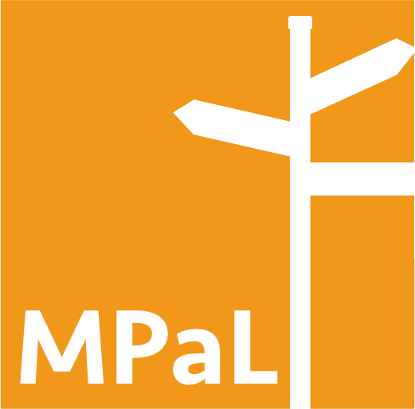

# Many Paths to Language Handbook

### *If you experience any (technical) problems during this conference, click [here](./mpal/troubleshooting) for help.*

Children show astonishing variation in the way they acquire their native language(s)—
each developmental milestone in both production and comprehension is marked by
meaningful individual differences. This 3-day workshop explores: (a) children’s
linguistic and cultural environments, their non-linguistic skills, and the structural
properties of the languages they are acquiring as possible sources of variation, alongside (b) the implications of this variation for the mechanisms that drive and support
native language acquisition. The workshop will also include some small-group sessions aimed at advancing interdisciplinary discussion and overcoming methodological
hurdles in documenting and interpreting variation in this context.

---

[Our invited speaker lineup](./mpal/invited-speakers)

---

## Program Overview

### Friday, 23 October 2020
09.00 &nbsp;&nbsp;&nbsp; Start program Day 1

09.10 &nbsp;&nbsp;&nbsp; First talk title, *first author(s)* [abstract](./mpal/abstracts#title-of-talk-one-day-one) - [video](./mpal/video)

10.10 &nbsp;&nbsp;&nbsp; Second talk title, *second author(s)* [abstract](./mpal/abstracts#title-of-talk-two-day-one) ; [video](./mpal/video)

11.00 &nbsp;&nbsp;&nbsp; Coffee break

11.30 &nbsp;&nbsp;&nbsp; Third talk title, *third author(s)* [abstract](./mpal/abstracts#title-of-talk-three-day-one) : [video](./mpal/video)

12.30 &nbsp;&nbsp;&nbsp; Lunch

13.30 &nbsp;&nbsp;&nbsp; [Posters](./mpal/poster-overview)

14.30 &nbsp;&nbsp;&nbsp; Fourth talk title, *fourth author(s)*, [abstract](./mpal/abstracts#title-of-talk-four-day-one), [video](./mpal/video)

18.00 &nbsp;&nbsp;&nbsp; End program Day 1

### Saturday, 24 October 2020
09.00 &nbsp;&nbsp;&nbsp; Start program Day 2

09.10 &nbsp;&nbsp;&nbsp; First talk title, *first author(s)* [abstract](./mpal/abstracts#title-of-talk-one-day-two) [video](./mpal/video)

10.10 &nbsp;&nbsp;&nbsp; Second talk title, *second author(s)* [abstract](./mpal/abstracts#title-of-talk-two-day-two) [video](./mpal/video)

11.00 &nbsp;&nbsp;&nbsp; Coffee break

11.30 &nbsp;&nbsp;&nbsp; Third talk title, *third author(s)* [abstract](./mpal/abstracts#title-of-talk-three-day-two) [video](./mpal/video)

12.30 &nbsp;&nbsp;&nbsp; Lunch

13.30 &nbsp;&nbsp;&nbsp; [Posters](./mpal/poster-overview)

14.30 &nbsp;&nbsp;&nbsp; Fourth talk title, *fourth author(s)* [abstract](./mpal/abstracts#title-of-talk-four-day-two) [video](./mpal/video)

18.00 &nbsp;&nbsp;&nbsp; End program Day 2

### Sunday, 25 October 2020
09.00 &nbsp;&nbsp;&nbsp; Start program Day 3

09.10 &nbsp;&nbsp;&nbsp; First talk title, *first author(s)* [abstract](./mpal/abstracts#title-of-talk-one-day-three) [video](./mpal/video)

10.10 &nbsp;&nbsp;&nbsp; Second talk title, *second author(s)* [abstract](./mpal/abstracts#title-of-talk-two-day-three) [video](./mpal/video)

11.00 &nbsp;&nbsp;&nbsp; Coffee break

11.30 &nbsp;&nbsp;&nbsp; Third talk title, *third author(s)* [abstract](./mpal/abstracts#title-of-talk-three-day-three) [video](./mpal/video)

12.30 &nbsp;&nbsp;&nbsp; Lunch

13.30 &nbsp;&nbsp;&nbsp; [Posters](./mpal/poster-overview)

14.30 &nbsp;&nbsp;&nbsp; Fourth talk title, *fourth author(s)* [abstract](./mpal/abstracts#title-of-talk-four-day-three) [video](./mpal/video)

18.00 &nbsp;&nbsp;&nbsp; End program Day 3

---

## Acknowledgements

Insert text here

