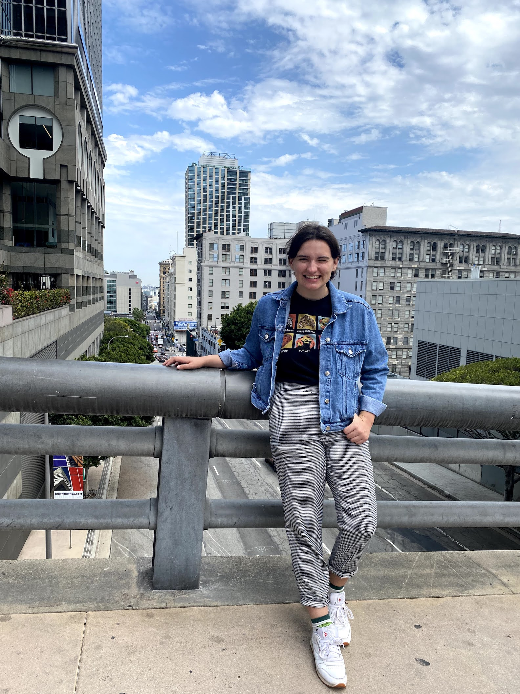

## Mara Duquette (they/them/theirs)

### About me

I am a second-year undergraduate student double majoring in Linguistics and Global Studies. I recently joined the chatter lab as a research assistant in September 2021. Currently, I am assisting with a project focused on object-centered learning in childhood language acquisition. Broadly speaking, I am interested in linguistic diversity and accessibility.

### Contact 
Email: duquettemara@uchicago.edu
