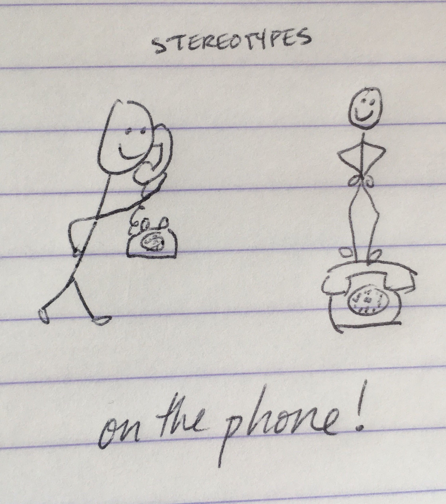
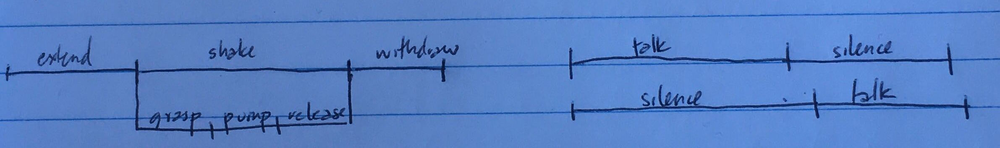

# Levinson, S. C. (1995). Interactional biases in human thinking. In E. N. Goody (Ed.), Social intelligence and interaction (pp. 221-260). Cambridge, UK: Cambridge University Press.
### 30 March 2020

### The thesis
As nicely laid out up front:

1. Communication is impossible in the sense of logical signal encoding/decoding
2. Despite this, humans communicate effectively all the time
3. To do so they must use non-logical heuristics and some kinds of special reasoning
4. For communication to work so well so often humans also need to keep these heuristics and modes of reasoning at the front of their minds at all times
5. The consequence of which is that the same heuristics/reasoning affect cognition in non-communicative contexts (think, e.g., Tversky & Kahneman)

### Part 1. Interactional intelligence, coordination, and communication
* There is a sort of **intellect for interaction**: Human interactional abilities are robust to wide variation in sociocultural and neurophysiological states, and while there is some evidence for specialization as a socialized species (e.g., face recognition, very early incipient interactional skills) as well as some sub-populations for whom (neurotypical) interactional behaviors are not as readily implemented (e.g., those on the autism spectrum), interaction requires cognitive means that cross-cut any modularizable set of skills or experiences.
    * Relevant question becomes _"what are the underlying conceptual abilities that make social interaction possible"_ (p. 225)?
* Computationally, interaction feels impossible
    * Adults can fairly easily coordinate with extremely little information shared between them (e.g., where to meet when, given no other prompt in Schelling-type experiments); their ability to do so relies on the salience of certain shared information and their ability to recognize and act on mutually salient information. In this sense, conceiving of interaction as a game of payoffs, in the sense of game theory, is (depending on your view) either intractable or trivial; cooperation and coordination are at the forefront of success rather than some pre-formulated benefit to the signal producer (in other words, the preferences of the participants are not independent).
    * Another way to think about this is that, because cooperation implicitly and at all times requires mutual consideration, and because communication is never guaranteed, it is computationally more complex to engage in effectively. 
    * The work around this, at least from the addressee's perspective has focused on the "mind reading" part of the problem, often referred to as **intention attribution**. We can go down many philosophical rabbit holes here, but the key problem involves at least (1) recognizing that a signal was produced with communicative intent and (2) using the first piece of information to infer what the communicative intent was. More or less, this is just **Gricean** inference, to which can be added other information and heuristics. Levinson focuses on two types for the rest of section 1.
        * **stereotyped thinking** (e.g., Goody, 1978): in the broadest sense this is a reflection of what is likely given past experience with people, objects, and actions in the world (e.g., the later example of what can be expected at the service counter in the train station)
        * **sequence organization** (e.g., Schegloff, 2007): the use of interactional contingency to restrict the relevance of possible prompts and answers at any given point in interaction
    * Tricky computational issues that arise when we take interaction seriously include:
        1. Computations aren't done over propositions per-se but states of propositional belief in the addressee and as shared between interactants, which may themselves be 'as-if' or may not have internatl consistency
        2. Establishing mutual belief is infinitely regressive without some intervention/heuristic (e.g., ... A believes that B believes that A believes that B believes that A believes that B believes that A intended p by saying u)
        3. A parallel problem arises with the Gricean framework with respect to A intends that B recognize that A intends that B recognize that A ...
        4. Whereas mutually salient concepts are critical for interactional success, defining how it arises and how concepts are differentially relevantly activated is a big puzzle
        5. Human logic isn't rational in any obvious sense: it can be overly specific, display one-to-many input/output relations, is computed with respect to context, and can't be reverse computed (see p. 230--232 for examples), which makes it feel impossible to descriptively encapsulate in a framework of rational communication
* BUT WAIT, ISN'T INTENTION JUST EXPRESSED VIA LINGUSTIC CODES? THAT'S WHAT LANGUAGE IS FOR!(?) Not precisely. Three things to consider:
    * Linguistic codes (i.e., lexical semantics + morphosyntax) certainly have an important role to play, but are far too ambiguous to, on their own, live up to the specificity of conveyed information. The example here is with, e.g., "at" in "the man is at the door", "the car is at the door" and "the man is at work"---consider the differing spatial imagery and scenario-specific relevant information pulled up by those different examples.
    * In natural conversation, much of the language use is neither direct nor literal (see examples from 235--237), but interlocutors still manage to coordinate quickly (the balance of giving relatively little information seems sufficient most of the time, i.e., when coordination is already well underway). Consider, e.g., "where'd you put the thingamajig?"---"over there." Remember, this kind of language use is arguably our normal way of doing things, particularly across human society and deep into human history. A really important part of this point is that interaction is live! So the ability to get feedback in real-time may be critical to the design of this system. 
    * Communication is not just possible but often equally fluent with non-conventional and non-linguistic signaling (see more work from Herb Clark on this point)
* So while linguistic codes can and do hugely help this process along (e.g., by pointing to intended referents, by conventional marking certain sequence initiators like wh-questions), they are not strictly necessary for successful communication and are too flexible to be depended on as a primary source of intentional meaning in many ordinary circumstances. Or as Levinson says, _"we think specifically, we talk generally. I can't say what I mean in some absolute sense: I have to take into account what you think I will mean by it."_ (p. 232).
* Big picture claim: this is really where enculturation and language meet. In other words, his hypothesis is that "culture" as a body of concepts largely overlaps with the set of heuristics for intention attribution---the very same ones we used to relate speaker action with speaker intent during language use. in other words the "computational miracle" of communication breaks down to our mutual access to what is normal on average, what is likely in the current circumstances, and how one can use those sources of information to design communicative acts.

### Part 2. Biases in human thinking: Psychological studies
[Note that this part is quite interesting but less relevant to my core questions, so notes here will be a bit sparser.]

* This section reviews work on human decision making and (lack of) rationality, primarily focusing on the work of Tversky and Kahneman and the work on Dörner (similar basic questions, but the latter uses complex systems and compares performance within sample while the former use more simple systems and compare performance to an ideal rational thinker model).
* T&K's work demonstrate that adults have a penchant for thinking that does not reflect the stochastic qualities of the world but would pontentially benefit interaction, including:
    * **representativeness/teleology**: the assumption that, even within small samples and in the case of truly random data, objects/actions will follow typical patterns (relevant examples from the paper/lit: categorically = likelihood of a shy person being a librarian; sequentially = getting a tails after three heads). This is quite similar to the linguistic notion of prototypicality of category members (think Eleanor Rosch), but applied at a cognitively more general scope.
    * **availability**: more or less the assumption that salient things are more normal/typical (relevant example: the impression that there are more words starting with 'r' than words with 'r' as the third letter). The link to interaction here is mutual salience as a heuristic for pointing to likely speaker meanings.
    * **determinism/overconfidence/presumption of causality**: this tendency leads people to make unlicensed causal inferences (i.e., to generally look for meaning, even when meaning is not part of any possible "design" in the signal) and isn't expanded upon much; the link to interactive behavior, I presume is through the deterministic-feeling reconstruction of intentions during interactional sequences. Some of this may also relate to the idea of _"single-solution"_ thinking---determine what the meaning is and act on it. In interaction this pays off because we are usually right and, when wrong, we can be alerted to this soon after.
    * There are also some points made about sequentiality, but I find these a little less convincing because they are different types of sequential processing from the shared sequential structure at issue in conversation (e.g., coin tosses, causes-outcomes).
    * The question raised by Levinson is whether these failings are justified by the help they provide for language comprehension. in other words, perhaps these adaptations are to facilitate human interaction, and just bleed into our other ways of thinking about the world.
*  This is followed up by a review of Dörner's work on similar problem solving, but with complex systems where there is no single rational response given the many factors at play (actually I'm not sure that's true, but certainly I can imagine that it's beyond practical computational reach, esp in 1995), in which adults showed many of the same failings, but in different forms. Of these the particular one focused on was a kind of stickiness to the initial solution, linking again to this idea of a quick overconfidence/determinism that is useful in interaction as well as a more tenuous link to the idea of losing face over a wrong solution. Also makes some links to a focus on one-at-a-time topic processing, but this is really quite far from something that obviously and specifically benefits interaction!
*  For both research paradigms (but more so for T&K), Levinson makes the case that interactive biases may be built into the tasks by the participants' meta-cognition about task relevance and the (real or imagined) experimenter's role as a recipient of their responses.

## Critical and clarificatory questions and ideas
- Levinson mentions the idea that, in coordination games, _"Both win if and only if each does what the other expects each to do; otherwise both lose [...] it doesn't matter much which action is taken as long as it matches the other's expectation"_ (p. 226--227) >> To me this seems more like the characterization of a pure opposite to antagonistic interaction rather than a characterization of typical human interaction, which may be more of a meld of cooperation and coercion; maybe the more appropriate view of conversation is one of mutual manipulation, which is not quite the same since I often have a very definite short-term goal for the interaction (e.g., getting this toddler to put her shoes on; making a decision about what to cook for lunch for a group).
- Part 1 ends with the claim that we (as addressees/interactional parsers) settle on an intended meaning with the experience of definiteness---definiteness that is revisable depending on what happens next in interaction. But how often is this certainty really achieved and, actually, why does it matter for the overall functioning of the model?

## Relation to my current projects
- Very little in here about children, but of course the basic question of how kids come into this system is one tackled by many people's work and not just my own. Interestingly there may be a divide between how children build up stochastic ideas about what is "normal" and truly normative/socialized ones that influence their in-the-moment actions during interaction.
- Relating to my Nepperlands study and future follow-up work in particular:
    - What assumptions do children bring to interactional settings?
    - How do they use (conventionalized) cues to sequence organization to bring themselves into linguistic and conceptual coordination?

## Associated phenomena to consider covering in class
- Schelling games
- Shannon model of communication
- Game theory
- Implicature

## Further reading
### Probably should have a look at
* Esther Goody's work on stereotypes (cited here as "1978a" but there's no refs-cited section!) and on **Anticipatory Interactive Planning (AIP)**.

### For funsies
* Frames of Mind (1986) by Howard Gardner. Reportedly on diversity of intelligence types, though probably very out of date by now!

## Overall impressions
A wonderfully written wide-ranging piece that cuts to the heart of issues that still plague how human language is studied. Blergh endnotes---I only skimmed them, and only after reading the rest of the chapter. But ANYHOW, I found the this text both fun to read and thought provoking. Still very relevant despite the fact that it's been 25 years since it was published!

----

# Clark, H. H. (1996). Joint Actions. In Using Language (pp. 59–91). Cambridge, UK: Cambridge University Press.
### 31 March 2020

* Note: Activities/actions/acts: the first two are done within some temporal space (i.e., they are enacted and dealt with as they unfold) and the last is done in a single moment and, more or less, without respect to a temporal space---at least that's what the term use here seems to imply!
* **Joint actions** are coordinated actions by 2+ prople, including what they (intend to) do ("content") and the resources they recruit to do so ("process").
* Joint action and language use are not equivalent because joint action is often done without recourse to linguistic resources and can even be conceived of within hierarchically related simultaneous actions.
    * Instead, we can think of most language use as a type of joint action that utilizes a system of shared linguistic conventions that are useful for doing things jointly.
* Terminological hierarchy goes as follows:
    * Intentional actions
        * Indivividual actions: only completable by individual people
            * Autonomous (i.e., no intended coordination with others)
            * Participatory (i.e., intended coordination with others)
        * Joint actions: only completable by ensembles of people, and performed by means of individual actions
* Side note: apparently coordinated behavior can also emerge as a consequence of **adaptive** or **deceptive** actions (e.g., a spy following their target or a player faking out their opponent, respectively), but we don't focus on these ways of realizing coordinated behavior right now
* **Schelling coordination problems** (e.g., Schelling, 1960) in these puzzles, participants reason backwards from a joint goal to a joint action. The tasks are characteristically explicit/meta-cognitive, discrete, and single-shot in nature, and the solution is defined by the inter-dependence of participants' thinking. Some classic examples include trying to come up with the same answer across participants for:
    * Heads or tails?
    * Pick a number between X and Y.
    * Where would you go when to meet someone in location Z?
    * Sensible answers to these prompts rely on people's ability to identify shared expectations. On its face, this task is about predicting what the other person will do, but prediction is underlain by the ability to recognize mutually salient signals which can serve as a **key** or **coordination device** to point to an answer.
        * **Coordination devices**
            * Are things that are (broadly construed) salient and functionally informative in present circumstances, which can mean concepts that are highlighted by explicit agreement, precedent, convention, perceptual/conceptual prominence/perspicuousness, etc..
            * The best coordination device is determined by the solution most salient with respect to common ground (_"principle of joint salience"_), such that the person and interactional context can hugely shape what the right (or at least sufficient) "key" is (e.g., the example Schelling tasks above with a randomly chosen adult from anywhere in the world vs. in Chicago; the number-choosing prompt after just having watched the film 28 Days Later, etc.).
* Coordination implies audience design, at some level >> participant joint action implies that interactional contributions will be formulated such that participants can jointly solve them, which Clark frames within two content premises and one process premise:
    * _Solvability premise:_ when a participant sets forth a coordination problem, co-participants can proceed with trying to find a solution knowing that the problem was chosen and posed ~for them~ with the belief that there is a solution that the participants can converge upon.
    * _Sufficiency premise:_ Problem prompts in the above ^^ sense include an assumption that all necessary information (taking common ground as also given) for finding a solution is included in the prompt.
    * _Immediacy premise:_ If participants are working within a sequence of time-constrained problems, they should go for immediate solutions (i.e., which are by-design sought after in this context).
* **Convention**: _"a community's solution to a recurrent coordination problem"_ (reformulated from Lewis, 1969; p. 70) defined here as:
    1. a regularity `r` in behavior that is
    2. (partly) arbitrary
    3. common ground in a given community, being
    4. used/usable as a **coordination device** that is
    5. specifically designed to address a recurrent coordination problem of `s`.
* Conventions include (all of) lexical and grammatical components of a language, but also things like greeting routines, expectations about personal space and public behavior, traffic systems, etc.
* **Signaling systems** rely on conventional or otherwise agreed-upon meanings to coordinate behavior and can be truly symbolic (e.g., human language/Python 3/traffic signs) or more on the ad-hoc side (e.g., placing a lost glove where it will garner the attention of its owner), or somewhere between (e.g., the sexton hanging lamps in the Paul Revere story, sending a bill to "the ham sandwich at table 9")
    * Signaling systems are HUGELY important for quickly coordinating complex behaviors, but are dependent on the more general interactional processes for coordinating (discussed here) and intention attribution (discussed here and in the Levinson reading this week). We need these skills for, e.g.,:
    * Dealing with errors and true ambiguities
        * Dr. Casillas (don't ask for medical advice!)
        * "criminal lawyer"
        * "she's more Levinsonian than Schegloffian"
        * "pulling a Clark"
        * "his Uncle Tony"
    * Efficiently conveying complex, multi-layered messages
        * Indexical signals to identity, community, specific personae, etc.: "pop", "noice", "Jiminy Cricket!"
        * Referential layering: "Khaaan!"
    * NOTE: This ability to not just deal with but play with ambiguity in language is one of the things that intuitively feels very special about it but is hard to formally capture and is also made possible by the fundamental interactional skills we discuss in this class. In Levinson's terms, this goes back to the idea of "thinking specifically but speaking generally".
* **Continuous coordination**: most coordination problems are continuous, meaning that the solutions bear out over some defined time scale and are formed by adaptive decisions that are made in the moment by participants.
    * Can be **periodic/regular** or **aperiodic** in when contributios are made
    * Can be **balanced** or **unbalanced** in who is leading the effort
    * Conversation is aperiodic and unbalanced (i.e., people talk one at a time for non-prescribed periods of time)
* Complex joint actions are typically made up of phases and subphases, which each have entry and exit times that ~themselves~ must be coordinated between participants in addition to the coordination of action content.
    * Note: for sequentially dependent acts, as in the handshake, the end of one phase is sometimes the signal to the start of th next one. 
    * Synchrony among these entry and exit times, together with the intended content for each subphase is the foundation for complex coordination (_the principle of synchrony_), and we as participants understand that more effort may mean more delay in designing and responding to interactional moves (_the principle of processing time_)
        * One implication of this is that information must be packaged such that entry and exit times are adequately marked, along with cues to alignable content; otherwise break down occurs or other strategies come into play. A great example from a conversational clip is shown on page 88.
* **Asynchronous joint actions** (that's us!! that's this!!) are characterized by a lack of synchrony at immediate time scales, but do not mean that the interaction is any less "joint"; rather the implication is just that audience design must be considered at a more comprehensive scale in order to achieve comparable communicative/coordination success
    * In other words, we're almost working our way back toward Schelling and his one-shot games :)

## Critical and clarificatory questions and ideas
- Some of these principles seems straightforwardly Gricean (e.g., saliency, solvability, sufficiency) and some derivable from cognitive constraints (e.g., immediacy from (working) memory) >> how should we think about these tenets? What aspects might be specially adapted for interaction?
- How do these notions of salience relate to those raised by the Levinson (1995) paper? We here rely more on the idea of common ground, but how categorical is that relation? Is it just a special case of more gradient and multi-dimentional mutual saliency? How would we get evidence that it is phenomenologically distinct?
- What are the developmental implications of coordination devices, particularly those that are conventionalized? Are there some "universally available" ones to (NT) humans?
- The idea of action hierarchies makes a lot of sense, but how are these supposed to be abstractly constructed, represented, updated, remembered, and detailed? What is required?
- How do people know when it's possible to use specific "codes" in their utterance design such that meaning is only accessible to some? Do they have to mark this via other means? If not, is the recovery process identical to this general one for resolving ambiguity and breakdown in interaction?

## Relation to my current projects
- As was the Levinson (1995) paper this week, this Clark chapter relates closely to my Nepperlands study and the development of language as a cue to interactional coordination (i.e., projecting that an answer is coming to a question)
- I was also reminded of the "jelly bean factory experiment" by the entry and exit coordination. This is a problem we'll deal with in more detail later on, but basically the idea of precise signals for ~exit~ points in particular is really difficult in practice, even with conventionalized symbols. This deserves more thought.

## Associated phenomena to consider covering in class
- Signal system evolution (in the lab and in the wild)
- Fillers and delay markers
- Conversational overlap and gap

## Further reading
### Probably should have a look at
* The chapter on common ground from this book---useful to review

### For funsies
* Lewis's (1969) original work on language as a coordination problem

## Overall impressions
Clear and engaging as always. This chapter provides lots of more concrete feeling conceptual "tools" for thinking about coordination, though some of these convenient shortcuts may have pretty heavy and more theoretically tricky embeddings when analyzed on, e.g., the psycholinguistic/cognitive processing level or at the larger scope of coordination and salience in humans and non-human animals. It'll be interesting to hear students' reactions!

----
