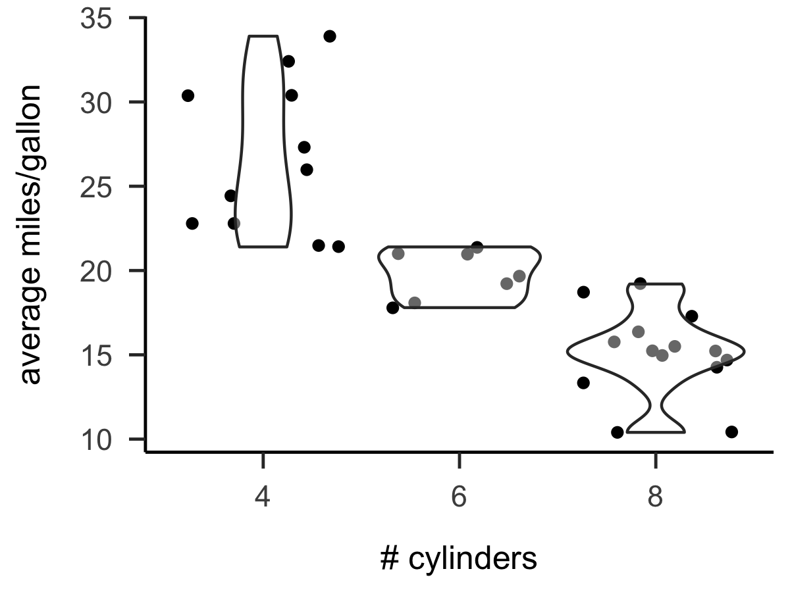
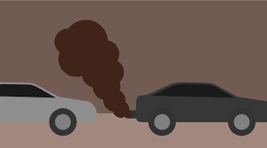
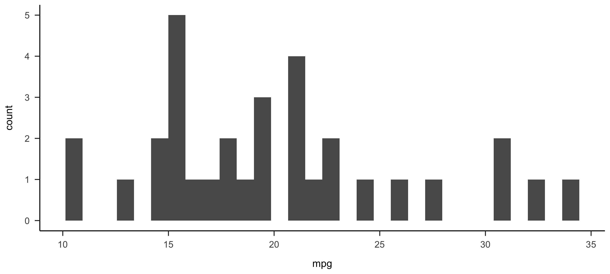

```{r setup, include = FALSE}
library(papaja)
library(tidyverse)
r_refs("r-references.bib")
mydata <- as_tibble(mtcars, rownames = "model")
```

```{r analysis-preferences}
# Seed for random number generation
set.seed(42)
knitr::opts_chunk$set(cache.extra = knitr::rand_seed)
```

Lorem ipsum dolor sit amet, consectetur adipiscing elit. Ut efficitur commodo est quis mattis. Curabitur egestas enim sed est consectetur, eget porta quam viverra. Vivamus elit nisl, egestas vel rutrum fermentum, tempor at neque. Cras eros ipsum, pharetra quis sodales non, dignissim nec nisl. Mauris at ante ex. Vestibulum ante ipsum primis in faucibus orci luctus et ultrices posuere cubilia curae; Aliquam porta massa accumsan, euismod tellus at, condimentum orci. Duis pulvinar, lorem eu feugiat ullamcorper, nisl ante tincidunt tellus, ac egestas nulla felis molestie dolor. Nunc porttitor imperdiet enim, ut auctor lorem fringilla at. Vivamus sollicitudin, justo ac blandit interdum, tellus turpis porta mauris, quis convallis massa ipsum quis lorem. Integer convallis pretium nisl sit amet vehicula. Mauris posuere ipsum ex.

Integer accumsan ligula odio, ac ornare lacus congue sed. Suspendisse dictum elementum mi, eu condimentum nulla mollis nec. Sed velit ex, interdum ac magna ut, ultrices viverra lacus. Etiam a sapien ullamcorper, blandit leo at, iaculis ex. Praesent tincidunt ornare nisl, vitae efficitur ipsum elementum vitae. Orci varius natoque penatibus et magnis dis parturient montes, nascetur ridiculus mus. Integer libero diam, pellentesque ac rutrum vel, tincidunt at orci. Etiam ornare euismod sem eget mattis. Suspendisse et massa justo. Nullam mollis diam dui, nec auctor elit venenatis ut. Proin eu risus a quam facilisis cursus sed congue lacus. Sed vel lacus in purus malesuada consequat ut ac odio.

Phasellus ac aliquet quam. Fusce at interdum eros. Morbi vel dignissim erat. Sed et ex a est bibendum ornare ut vel ipsum. Nam dapibus, ante euismod bibendum consequat, urna nulla dapibus lectus, in dignissim odio sapien a libero. Donec quis orci luctus felis viverra mattis. Sed diam leo, accumsan ornare auctor sit amet, ultricies eget tellus. Ut dignissim, risus et ornare laoreet, metus dui aliquet odio, quis fermentum elit ante ac lorem. Etiam venenatis consequat quam, vel convallis nisl varius sit amet. Pellentesque libero nulla, gravida nec feugiat sit amet, aliquet sed ex. Suspendisse nulla nibh, mollis a erat quis, pharetra semper nulla. Morbi blandit imperdiet mauris ut pellentesque. Lorem ipsum dolor sit amet, consectetur adipiscing elit. Vestibulum et elit diam. Nulla gravida faucibus ligula, eget consectetur ex aliquet vel. Sed finibus vestibulum nibh, at blandit velit faucibus vitae.

## Tables

```{r table-avgmpg-consolestyle}
mydata %>%
  group_by(cyl) %>%
  summarize(
    mean.mpg = mean(mpg),
    sd.mpg = sd(mpg),
    n.models = n()
  )
```


```{r table-avgmpg-kablestyle}
mydata %>%
  group_by(cyl) %>%
  summarize(
    mean.mpg = mean(mpg),
    sd.mpg = sd(mpg),
    n.models = n()
  ) %>%
  knitr::kable(caption = "mpg stats by number of cylinders")
```


```{r table-avgmpg-apastyle, results = 'asis'}
mytable <- mydata %>%
  group_by(cyl) %>%
  summarize(
    mean.mpg = mean(mpg),
    sd.mpg = sd(mpg),
    n.models = n()
  )

apa_table(mytable, caption = "mpg stats by number of cylinders")
```

Aliquam lacinia tortor in magna pellentesque tincidunt. Nunc pretium scelerisque lectus aliquet viverra. Nullam nec lacus lacinia, consectetur nisl ac, efficitur ante. Ut gravida ipsum eu augue posuere ullamcorper. Fusce sed nibh velit. Nulla sit amet viverra massa, at sodales purus. Aliquam erat volutpat. Quisque ipsum arcu, finibus sit amet commodo vel, interdum in magna. Vestibulum non diam tincidunt, sollicitudin lorem sed, suscipit ex. Maecenas placerat mi eget massa commodo fringilla. Pellentesque at lacinia neque, at porttitor leo. Morbi placerat orci vitae nisl condimentum, non tincidunt urna tempus. Quisque quis orci at ex porta consequat quis non quam. Ut ac eleifend ex, vel tincidunt ligula. Vestibulum vel massa at sapien tristique vehicula. Etiam finibus vulputate posuere.

Aenean lobortis libero a odio consectetur interdum ut ac ex. Sed posuere dapibus odio, id accumsan leo fermentum at. Etiam finibus tortor at mi rutrum varius. Sed sed turpis quis velit porta lobortis. Curabitur auctor nibh sed ligula elementum, in mollis mi placerat. Vivamus gravida risus ut lobortis molestie. Nulla et feugiat quam. Curabitur accumsan eleifend tincidunt. Vivamus dignissim turpis vel aliquam mollis.

## Figures and images

Phasellus finibus ac est vitae consectetur. Donec a condimentum nisi, ut accumsan leo. Praesent ut viverra est. Praesent sit amet posuere arcu, ac cursus sem. Cras volutpat ut urna et tincidunt. Ut leo ante, varius ut congue eget, maximus a eros. Fusce mollis luctus ligula et tristique. Nulla facilisi.

```{r fig-avgmpg, fig.cap = "distribution of mpg by number of cylinders (2, 4, or 6)"}
ggplot(mydata, aes(x = factor(cyl), y = mpg)) +
  geom_jitter() +
  geom_violin(alpha = 0.4) +
  labs(x = "# cylinders", y = "average miles/gallon")
```


<!--
Markdown and LaTeX syntax is not well supported in chunk options, such as fig.cap, or elsewhere inside a code chunk, e.g., in the caption argument of apa_table(). Specifically, Markdown formatting and citation syntax are ignored (rendered as-is) and, for example, \ and _ must be escaped to prevent errors in either R or LaTeX. None of these limitations apply to text references.
-->

(ref:fig-avgmpg-caption) distribution of mpg by number of cylinders (2, 4, or 6)

```{r fig-avgmpg-thmapa, fig.cap = "(ref:fig-avgmpg-caption)"}
ggplot(mydata, aes(x = factor(cyl), y = mpg)) +
  geom_jitter() +
  geom_violin(alpha = 0.4) +
  labs(x = "# cylinders", y = "average miles/gallon") +
  theme_apa()

```


(ref:fig-cyl-mpg-caption) now we can import the saved figure too

```{r fig-cyl-mpg, fig.cap = "(ref:fig-cyl-mpg-caption)"}
(ggplot(mydata, aes(x = factor(cyl), y = mpg)) +
  geom_jitter() +
  geom_violin(alpha = 0.4) +
  labs(x = "# cylinders", y = "average miles/gallon") +
  theme_apa()) %>%
  ggsave("numcyls.vs.mpg.png", ., width = 4, height = 3)


```

(ref:fig-smog-caption) yowza

```{r fig-smog, fig.cap = "(ref:fig-smog-caption)"}

```


```{r fig-BIGsmog, fig.cap = "(ref:fig-smog-caption)", out.width = "300%", fig.align = "center"}

```

(ref:fig-mpghist-caption) histogram of mpg values across all car models.

```{r fig-mpghist, fig.cap = "(ref:fig-mpghist-caption)", out.width = "75%", fig.align = "center"}
(ggplot(mydata, aes(x = mpg)) +
  geom_histogram() +
  theme_apa()) %>%
  ggsave(filename = "figures/mpg-histogram.png", device = "png", width = 10, units = "in")

```

Maecenas in fermentum enim. Sed elit diam, mollis rutrum turpis nec, pretium pellentesque massa. Aliquam nulla enim, venenatis eu mattis id, posuere sit amet lectus. Nullam auctor sit amet metus ut pharetra. Curabitur lorem libero, dignissim vitae dui ac, tristique hendrerit velit. Sed ac ultricies mi. Pellentesque sem tellus, blandit eget lacinia at, vehicula id sapien.

Curabitur finibus euismod nulla vel ornare. Morbi semper eros a placerat ullamcorper. Fusce rutrum ipsum vestibulum urna sodales, iaculis elementum massa rhoncus. Vestibulum at erat ut enim hendrerit tristique vitae non ex. Duis dapibus, ex at suscipit consequat, diam ipsum molestie nunc, id posuere dui est vitae odio. Orci varius natoque penatibus et magnis dis parturient montes, nascetur ridiculus mus. Nunc sed dictum arcu. Duis mattis vel urna ac ullamcorper. Vivamus eu elit nec mi iaculis rutrum eget quis metus. Aliquam molestie vehicula placerat. Etiam bibendum quis mi et malesuada. Mauris et imperdiet ligula, volutpat cursus orci. Aenean non dolor cursus, pretium nisl ac, porttitor neque. Donec consequat lorem leo, elementum sagittis eros molestie quis.

Donec sollicitudin sollicitudin ullamcorper. Quisque ac ultrices massa. In orci urna, sollicitudin sit amet eleifend eu, tincidunt quis urna. Nulla auctor iaculis nunc non accumsan. Sed a laoreet massa. Sed sit amet hendrerit nulla, in tempor urna. Maecenas tempor congue ante ac elementum. Etiam erat magna, suscipit in volutpat nec, vestibulum placerat neque. Sed sed mi leo. Vivamus bibendum dui quis ligula tempor, eu ultrices velit sodales. Aenean eu tincidunt odio. Vivamus ante massa, aliquet vitae sagittis non, pellentesque quis quam.

Suspendisse nunc sem, pellentesque non euismod sed, porttitor sit amet ante. Praesent feugiat erat a commodo lacinia. Morbi eleifend egestas ligula, nec blandit mi consectetur nec. Vivamus vestibulum diam eget mi venenatis facilisis. Mauris nec ligula et nisi iaculis ultricies ac a enim. Nullam congue risus in ex dapibus ullamcorper. Quisque pretium ex eget rhoncus convallis. Sed ante eros, semper euismod dignissim ut, consectetur rhoncus justo. Fusce lacinia metus ut sapien tincidunt posuere. Suspendisse malesuada, tellus ac tincidunt ornare, diam sapien porttitor leo, sed mollis dolor ante vitae orci. Aliquam nisi nisi, posuere eu lobortis sit amet, egestas eget massa.

Quisque posuere massa et augue finibus aliquam. Morbi iaculis accumsan metus, eget lobortis ligula facilisis vitae. Integer arcu turpis, consectetur luctus mollis eu, iaculis convallis arcu. Aenean at eros bibendum, tempus sapien ac, cursus eros. Suspendisse pretium neque sit amet erat maximus, vitae malesuada orci auctor. Nam nulla ligula, eleifend quis nibh ut, ornare mattis eros. Maecenas auctor diam at efficitur accumsan. In imperdiet elit vitae orci feugiat tristique eget ut dui. Morbi ut ipsum magna. Maecenas rhoncus non velit sit amet bibendum. Nullam sit amet risus sit amet velit mattis sagittis. Nunc id nisl tincidunt, laoreet felis quis, sagittis massa. Phasellus eu justo nec tortor molestie bibendum quis eu enim. Duis quis sagittis purus, vitae aliquet metus. Proin ex eros, pharetra ultrices quam quis, volutpat congue erat. Cras luctus sapien ipsum, vel suscipit libero dignissim a.

Proin elementum tempus sollicitudin. Nam bibendum consequat metus vitae gravida. Mauris consequat velit nibh, blandit blandit nunc viverra sit amet. Donec tincidunt elit sed lacus malesuada viverra. Nulla vel neque nisi. Cras mollis tortor id magna varius condimentum. Donec eu mauris pharetra risus sodales viverra. Nunc quis velit eleifend, porta arcu nec, tincidunt sapien. Donec at dolor massa. Nam blandit sollicitudin velit sit amet convallis. Vivamus at pretium tortor, ut pulvinar mi. Aenean vitae varius nulla. Sed sapien magna, porttitor quis urna sit amet, luctus iaculis tellus. Mauris vel sollicitudin quam, sed congue turpis. Pellentesque vitae ipsum a neque feugiat laoreet.

## Chunk references

The average miles per gallon across cars with different numbers of cylinders is shown in Figure\ \@ref(fig:fig-avgmpg-thmapa), as also summarized in Table\ \@ref(tab:table-avgmpg-apastyle). Carbon production (e.g., see Figure\ \@ref(fig:fig-BIGsmog) is an an extremely unfortunate side effect of human industry that has immense consequences for the sustainability on life on Earth. Cars vary in their gasoline efficiency (Figure\ \@ref(fig:fig-mpghist)).


Morbi ut nulla non justo imperdiet pellentesque a placerat odio. Nulla mattis diam dolor, ac lacinia ipsum aliquet non. Morbi ac malesuada quam. Ut vel venenatis quam. Morbi dapibus mi quis leo imperdiet, at tempor nunc porttitor. Cras et tortor posuere, pretium dolor vel, sodales justo. Duis condimentum varius eros, id accumsan felis laoreet ut. Etiam ex nunc, ullamcorper eget condimentum sit amet, commodo eu erat. Donec id lacinia erat. Quisque ultricies sit amet justo vitae malesuada.

Nullam at lectus nisl. Donec id nisl odio. Sed egestas orci nec eleifend rhoncus. Sed suscipit vel tellus blandit consectetur. Quisque eu nibh arcu. Proin non libero facilisis, accumsan velit vel, porttitor ex. Aliquam venenatis, diam et auctor aliquet, nisl tortor ullamcorper sem, sed elementum libero sem volutpat arcu. Maecenas pharetra justo eros, ac sodales sem maximus sed. Donec cursus varius libero a condimentum. In eleifend sollicitudin tellus, in gravida risus vulputate ut. Aliquam erat volutpat. Pellentesque finibus erat nec efficitur elementum.

Cras venenatis, augue non tempor interdum, libero tellus vestibulum metus, ac sollicitudin risus neque non nibh. Nunc ac magna nisl. Orci varius natoque penatibus et magnis dis parturient montes, nascetur ridiculus mus. Aenean mauris tellus, vulputate a dictum eu, ullamcorper in dui. Suspendisse tempor, justo eu dictum convallis, elit velit tempor mi, id feugiat est erat sit amet lectus. Aenean vel libero eu enim lacinia condimentum ac ac augue. Morbi in justo eu nisl porta porta. Nullam vitae ligula ac ipsum mollis lacinia. Sed vulputate eros vel odio viverra porttitor. Vestibulum fermentum placerat velit, a egestas turpis ultricies quis. Vivamus at purus semper, luctus diam ut, venenatis justo. Aliquam dignissim risus at ipsum pellentesque, in auctor felis vehicula. Duis quis fringilla enim.

Sed aliquam turpis interdum erat elementum, ac semper ipsum tempor. Vivamus nisi massa, pulvinar quis dapibus in, egestas faucibus lectus. Nam eleifend massa urna. Integer placerat, lacus id molestie maximus, tortor ante imperdiet ligula, id scelerisque arcu diam et erat. Aenean hendrerit nibh ullamcorper, consequat eros ultrices, fringilla libero. Morbi a metus non lacus imperdiet euismod. Duis a lectus nec purus maximus consectetur. Curabitur feugiat risus orci, ut consequat nulla facilisis at. Cras varius tincidunt placerat. Duis gravida odio sit amet sapien ultrices, vitae vulputate elit imperdiet. Pellentesque justo nulla, tincidunt id mauris sit amet, volutpat ornare sapien.

Quisque at elementum nisi, ut euismod dolor. Lorem ipsum dolor sit amet, consectetur adipiscing elit. Maecenas ultrices tempus sem, a finibus dui dignissim vel. Aliquam commodo maximus lectus id cursus. Class aptent taciti sociosqu ad litora torquent per conubia nostra, per inceptos himenaeos. Morbi vitae elit mi. Aliquam ultricies risus magna, id vestibulum justo pretium vitae. Class aptent taciti sociosqu ad litora torquent per conubia nostra, per inceptos himenaeos. Cras ornare ligula ligula, at vehicula magna laoreet vel. Donec semper quam vitae eros consequat, id auctor tellus aliquet. Aliquam eget vestibulum eros. Integer hendrerit in turpis eu elementum. Nunc eget elementum massa.

Nullam ultricies tortor auctor ultricies convallis. Phasellus eu ligula tincidunt, facilisis arcu ac, tincidunt mi. Maecenas gravida facilisis nisl nec pulvinar. Integer dui dui, dictum vel velit et, posuere tempus orci. Cras erat ex, venenatis eu nisi eu, congue aliquet dui. Pellentesque dignissim auctor mauris in suscipit. Vivamus convallis fringilla ante ac molestie. Ut pretium fringilla molestie. Nullam maximus elit id justo convallis cursus. Phasellus sagittis quam aliquam fermentum mollis. Orci varius natoque penatibus et magnis dis parturient montes, nascetur ridiculus mus. Phasellus vitae ultricies est. Quisque eleifend mauris enim. Sed sed egestas est. Donec pretium risus orci, non placerat elit tempus at.

Maecenas viverra nulla sed justo tincidunt porta. In non suscipit lacus. Duis sapien nulla, cursus nec turpis sed, faucibus imperdiet tortor. Sed euismod dictum diam nec pellentesque. Ut finibus eget mauris ac vulputate. Duis luctus cursus finibus. Vivamus ac purus tincidunt, interdum leo nec, ultrices ante. Suspendisse velit sem, tincidunt sit amet porta eu, commodo a ligula. Etiam quis ligula non purus sollicitudin faucibus at et massa. Praesent fringilla turpis et turpis convallis blandit. Curabitur et risus non sapien blandit commodo. Nulla sodales gravida erat, sed fringilla metus imperdiet ac. Sed interdum gravida leo vitae luctus.

Orci varius natoque penatibus et magnis dis parturient montes, nascetur ridiculus mus. Nam quam libero, porttitor ac elit sit amet, condimentum sagittis diam. Morbi luctus, diam posuere tempor imperdiet, nisl magna commodo orci, nec sagittis risus lacus eget purus. Sed vel neque feugiat, luctus turpis vitae, volutpat arcu. Nulla facilisi. Curabitur quis nunc fermentum tellus maximus bibendum. Quisque porttitor id arcu eu imperdiet.


\newpage

# References

\begingroup
\setlength{\parindent}{-0.5in}
\setlength{\leftskip}{0.5in}

<div id="refs" custom-style="Bibliography"></div>
\endgroup
