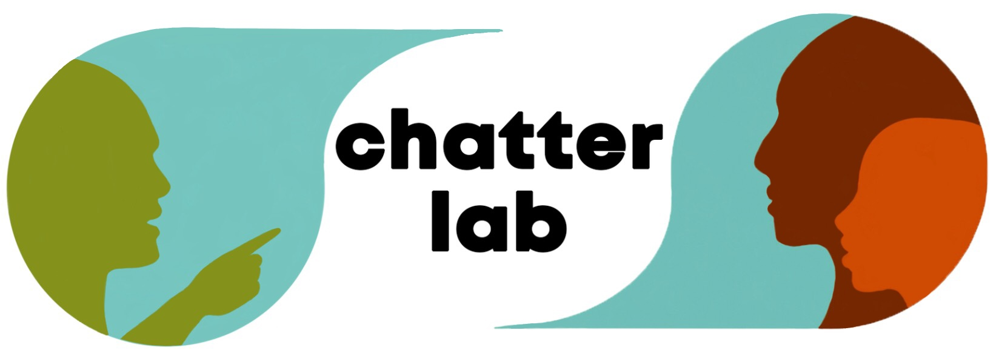

# 

The chatter lab investigates the cognition of everyday human language. We explore how communicative needs impact the ways in which language is learned and used by both children and adults. To that end, we employ experimental and observational methods in multiple sites around the world to analyze the production and comprehension of conversational language.

Principal Investigator: [Dr. Marisa Casillas](./people/marisa-aboutme.md)

The chatter lab is part of the [Comparative Human Development department](https://humdev.uchicago.edu/) at the University of Chicago.

[[People](./people.md)] [[Projects and methods](./projects.md)] [[Publications](./publications.md)] [[Positions](./positions.md)] [[Contact](./contact.md)]

## News

* **8 January 2022:** Bram Peute's paper with [Marisa Casillas](./people/marisa-aboutme.md) on language input and early consonant production in Tseltal and Yélî Dnye was accepted pending minor revisions at _Glossa_. The preprint is available [here](https://psyarxiv.com/5feju/).

* **15 December 2021:** The stellar [Kennedy Casey](https://marisacasillas.github.io/chatterlab/people/kennedy-aboutme.html)'s first journal publication is now online at _PLOS ONE_, charting the representation of female vs. male protagonists in 60 years of children's books. Double congratulations to Kennedy! Read it [here](https://journals.plos.org/plosone/article?id=10.1371/journal.pone.0260566).

* **2 December 2021:** [Marisa Casillas](./people/marisa-aboutme.md) (project lead), together with colleagues [Sharese King](https://www.drshareseking.com/), [Ruthe Foushee](https://ruthefoushee.com/), [Adriana Weisleder](https://childlanguagelab.northwestern.edu/people/), and [Annette D'Onofrio](https://faculty.wcas.northwestern.edu/~akd2621/) was awarded a Neubauer Collegium Faculty Research Fund for their project "Roots of Linguistic Identity". The project, which will begin in June 2022, will investigate how children from different dialect backgrounds across Chicago learn to recognize variability in the sounds and words of other dialects.

* **29 November 2021:** [Mary Elliott](https://marisacasillas.github.io/chatterlab/people/marye-aboutme.html) and [Marisa Casillas](./people/marisa-aboutme.md) submitted a paper tracking the frequency with which children under age four and adults handle all kinds of objects during everyday life in two communities: Tseltal Mayan and Rossel Papuan. Read the preprint [here](https://marisacasillas.github.io/chatterlab/publications.html).

* **25 November 2021:** [Alex Cristia](https://sites.google.com/site/acrsta/) and [Marisa Casillas](./people/marisa-aboutme.md) submitted a revision to their paper on non-word repetition in Yélî Dnye. Fingers crossed! Read the preprint [here](https://marisacasillas.github.io/chatterlab/lab-publications/Cristia_Casillas_underreview2_Nonword_repetition_in_children_learning_Yeli_Dnye_v20211125.pdf).

* **4 October 2021:** We officially kicked off a new project "Object handling and early word learning environments in three cultural contexts". Our new team of 5 undergraduates includes [Anapaula Silva](https://marisacasillas.github.io/chatterlab/people/anapaula-aboutme.html), [Mara Duquette](https://marisacasillas.github.io/chatterlab/people/mara-aboutme.html), [Will Fisher](https://marisacasillas.github.io/chatterlab/people/will-aboutme.html), [Lizzie Mickiewicz](https://marisacasillas.github.io/chatterlab/people/lizzie-aboutme.html), and [Kimberly Shorter](https://marisacasillas.github.io/chatterlab/people/kimberly-aboutme.html), as well as [Mary Elliott](https://marisacasillas.github.io/chatterlab/people/marye-aboutme.html) and [Kennedy Casey](https://marisacasillas.github.io/chatterlab/people/kennedy-aboutme.html). We will annotate many thousands of images taken from children's perspective during their days at home in three cultural contexts: Papuan, Mayan, and US. This project is made possible by generous funding from the Gianinno family.

### Interested in participating? [Check out our open positions](./positions.md) or [get in touch!](./contact.md)

----
The chatter lab is founded on the principle that diversity in everyday language use is key to the study of human language cognition. We welcome opportunities to work with scholars from all walks of life, and particularly encourage those coming from marginalized groups to reach out if interested in working with the lab.

Our lab at the University of Chicago is located on the traditional homelands of the Ojibwe, Odawa, and Potawatomi nations.
