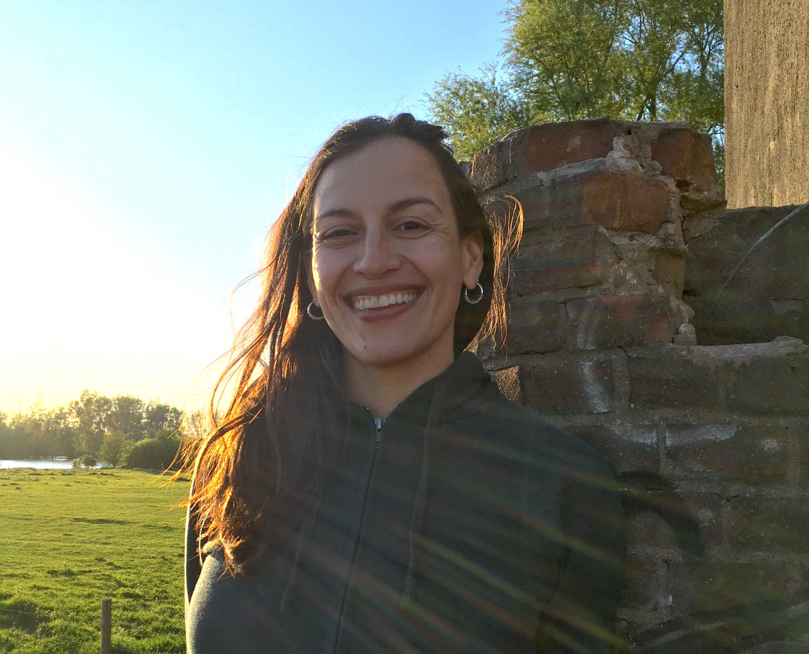

# chatter PI

## Dr. Marisa Casillas

### About

### Curriculum Vitae
You can find a recent CV [here](https://docs.google.com/document/d/1hWEHXhlJ_VYXOmvjuOQlSOqgiCmt_eeVc6TvExBpC80/edit?usp=sharing)

### Courses

[The Emergence of Communicative Competence](./Casillas-DevCommComp-Spring2020-Syllabus.md) (Spring 2020).

### Contact

Office: TBA

Phone: TBA

Email: mcasillas@uchicago.edu

Dr. Casillas in the Bemmelse Waard, Nijmegen, The Netherlands

----
The chatter lab is founded on the principle that diversity in everyday language use is key to the study of human language cognition. We welcome opportunities to work with scholars from all walks of life, and particularly encourage those coming from marginalized groups to reach out if interested in working with the lab.

Our lab at the University of Chicago is located on the traditional homelands of the Ojibwe, Odawa, and Potawatomi nations.