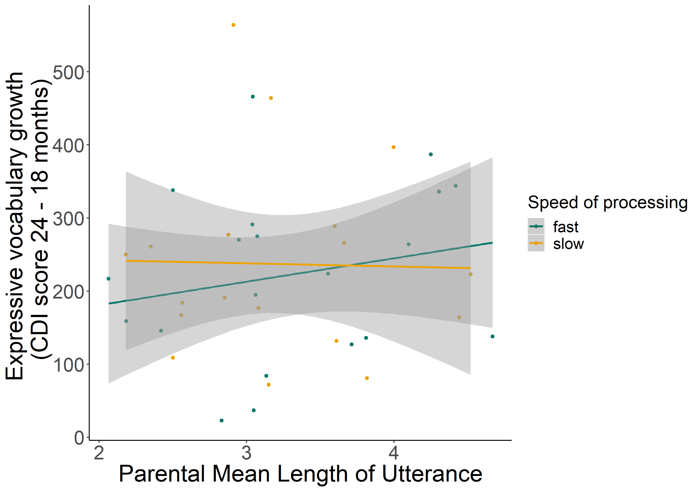

#### Investigating the interplay between parental speech input, speed of processing and vocabulary development

[*Julia Egger, Caroline Rowland, Christina Bergmann*](./authors.md)

julia.egger@mpi.nl

Infants show wide variability in their early language acquisition. Past research has linked parental speech input, both in terms of quantity and quality, to this variability. But not only the parental input, also the infant’s own abilities play an important role. Hurtado, Marchman and Fernald (2008) investigated the relationship between various measures of parental speech input (number of utterances, word tokens, word types and mean length of utterance) to the concurrent vocabulary size of 18-month-old infants and their vocabulary growth at 24 months (as measured by the CDI) as well as to the infants’ lexical processing speed. They showed that the way mothers talked to their child affects both the infants’ vocabulary growth as well as their individual speed of processing ability. Weisleder and Fernald (2013) took the investigations a step further and looked into how the amount of child-directed speech impacted vocabulary growth through speed of processing. Their results reveal that the effect of the speech input on vocabulary is mediated by the infants’ individual processing capabilities.

However, it is still unclear which aspects of the speech input influence the infant’s linguistic development and to which extent and how they then interact with individual speed of processing. 

Two of the aspects that Hurtado and colleagues studied were maternal (1) mean length of utterance (MLU) as an indicator of input complexity and (2) number of word types as an index of lexical diversity. While both of these are expected to play a major role in determining how children acquire language, we suggest that the impact they have on language development might be different for these factors. 

Parental MLU, indicating input complexity, might provide benefits for the children, but only if they can process these longer and more complex sentences. We therefore predict that the influence of parental input complexity on vocabulary development will be mediated through the infant’s individual speed of processing. We hypothesise concretely that fast processors will benefit from higher parental MLU as they can process more complex sentences, whereas slow processors may be hindered by regularly hearing such complex sentences in their input.

Regarding lexical diversity, we would not expect an influence on processing capabilities. Rich variety in lexical input aids the children in building their lexicon, which then in turn can affect their processing. Thus, we hypothesise that lexical diversity correlates with vocabulary and has no direct link to speed of processing, which might indirectly be affected through vocabulary growth.

In order to verify these predictions, we tested 60 18-month-old infants learning Dutch. We assessed their lexical speed of processing in a looking-while-listening paradigm and used the Dutch CDI to determine their concurrent vocabulary size and subsequent vocabulary growth at 24 and 30 months. Parental speech input was sampled during a lab-based play session at 18 months. We used CLAN to compute the parental mean length of utterance in morphemes and lexical diversity with VOCD. We are only able to include 38 infants, as we needed both valid speed of processing measures and filled in CDI questionnaires at 18 and 24 months for our analyses. 

To be able to both quantify support for the alternative and the null hypothesis, we use Bayesian mediation analyses to test our predictions. Preliminary results (n=25) reveal an inconclusive relationship between parental MLU and vocabulary development (BF01 =.609). However, they indicate that our prediction is borne out at least numerically that faster processors benefit more when exposed to more complex language input (see Figure 1). Regarding type diversity, we do find preliminary evidence for a relationship between diversity and vocabulary growth. Taken together, our results demonstrate how we can further elucidate the role of input and infants’ own processing skills in lexical development.

---

