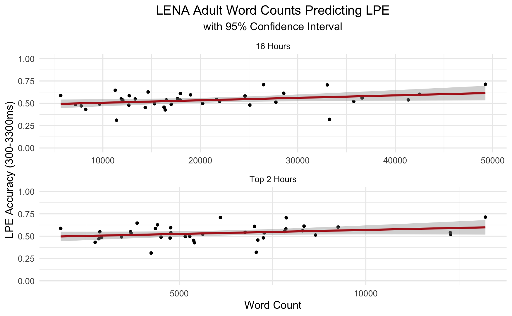
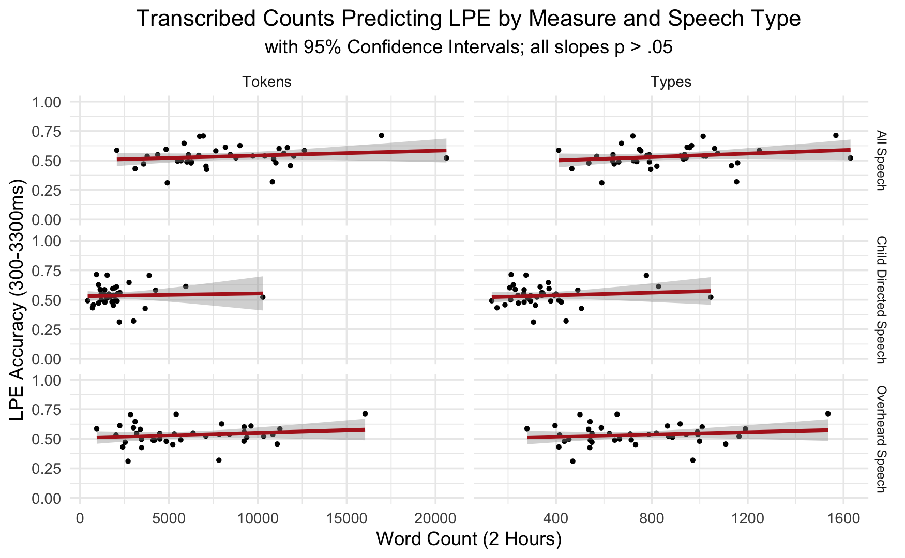

#### Predicting Lexical Processing Efficiency at 9 Months from the Home Language Environment: Child-Directed vs. Ambient Speech

[*Jayde E. Homer, Abbie Thompson, Jill Lany*](./authors)

jaydehomer@wustl.edu

By 18 months of age, lexical-processing efficiency (LPE), or the speed and accuracy with which infants comprehend familiar words, leverages subsequent gains in language development (Marchman & Fernald, 2008). At this age, LPE is more strongly driven by child-directed speech (CDS) than by the sheer quantity of words heard in the home (Weisleder & Fernald, 2013). While this suggests that only speech directed to children supports language development, the aspects of the language environment that matter most can change across development (Rowe, 2012). Infants begin to comprehend words by 6 months, likely supported by advances in speech-sound perception and word segmentation. Both speech-sound perception and word segmentation rely on extracting statistical regularities, and are likely to be impacted by experience with ambient speech. Thus, we asked whether the total amount of speech that young infants hear is relevant to their developing LPE. We assessed 38 infants (primarily White and learning American English) at 9 months of age on their home language environment (HLE) and LPE. HLE was assessed by collecting 16 hours of audio recordings via LENA devices. LENA software provides automatic estimates of adult-produced word counts (AWC16). We identified two non-consecutive hours containing the most speech an infant heard across the two days (AWC2). We transcribed all the audible speech within those segments and annotated each utterance as CDS or Overheard Speech (OHS). Using these codes, we computed specific measures of HLE: tokens (total word count), types (number of unique words), and the type-to-token ratio (TTR; reflects both the amount of speech and its repetitiveness) for total speech, CDS, and OHS. These common measures provided estimates of language input that go beyond counts by telling us whether infants hear many of the same words repeated, or instead hear a diverse set of words.

LPE was assessed using a looking-while-listening task, in which infants saw images of two familiar items taken from a set of four early-learned items (i.e., dog, kitty, milk, banana) and heard the label for one of them. Infants’ received an accuracy score reflecting the average proportion of time spent looking at the labelled item between 300ms and 3,300ms post label-onset. Replicating Bergelson and Swingley (2012), infants showed evidence of comprehension (M = .53, SD = .09) above chance (t(37) = 2.42, p < .05). Measures of the HLE revealed that the average AWC16 was 20395.03 words (SD = 10717.30), and AWC2 was 6080.66 words (SD = 2712.04), as shown in Figure 1. The word count of the transcribed two-hours recordings yielded slightly higher word counts than the LENA measures on that same sample (i.e. AWC2). In our transcriptions (Figure 2), infants heard 8213.79 words on average (SD = 3787.36), 26% of which was classified as CDS. Separate linear regressions revealed that AWC16 significantly predicted greater LPE (p < .05) while AWC2 did not. CDS tokens and types also did not significantly predict LPE (p = .78). In a multiple regression, AWC16 significantly predicted greater LPE (p < .05), while CDS tokens did not (p = .62). Thus, the only significant predictor was AWC16. Note that AWC16 was positively correlated (r = .38, p < .05) with maternal education (M = 16.42, SD = 2.57), while CDS token counts were not (p = .13). Maternal education was also correlated with LPE  (r = .41, p < .01), supporting the possibility that the AWC16 captures important variance that is associated with LPE. These results suggest that in the first year of life, the sheer amount of language infants hear may be more important to shaping lexical-processing skills than more fine-grained measures of smaller HLE samples, like CDS, or more specific features of the CDS, e.g. lexical diversity and repetitiveness. Thus, while CDS plays a stronger role in shaping toddlers’ language development, the importance of ambient speech in early language development should not be discounted.

---

