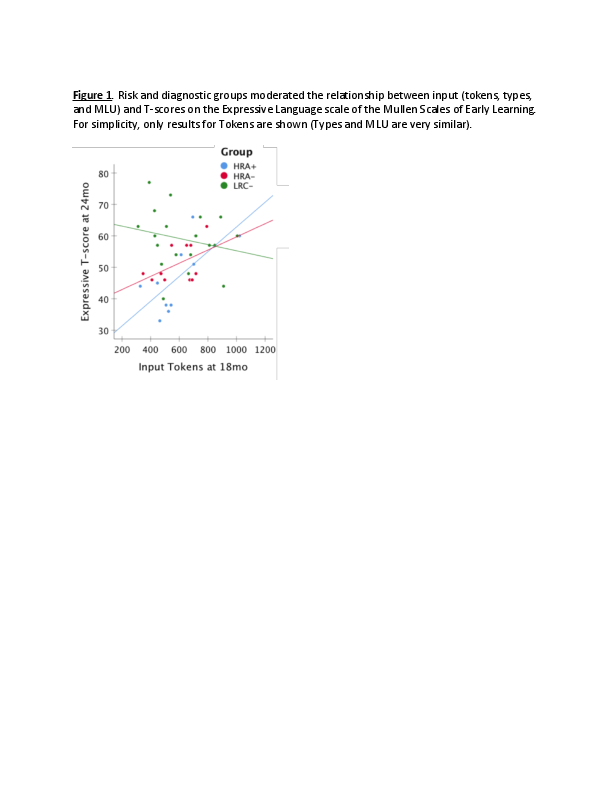
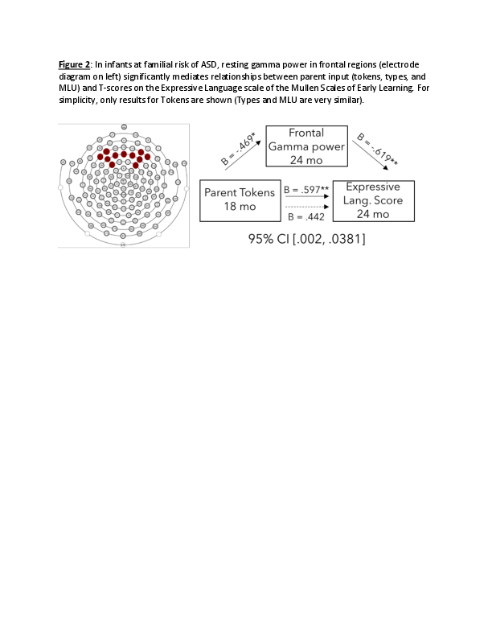

#### Varying relationships between parent input and the neural mechanisms of language development in infants at high and low risk for Autism

[*Rachel R. Romeo, April Boin Choi, Laurel J. Gabard-Durnam, Carol L. Wilkinson, April R. Levin, Helen Tager-Flusberg, Charles A. Nelson III*](./authors)

rachelromeo@gmail.com

Introduction: Autism Spectrum Disorder (ASD) is a neurodevelopmental disorder characterized by general impairments in social communication skills, though children with ASD vary greatly in the development of other receptive and expressive language skills. Because early language skills predict later functioning in individuals with ASD, it is critical to better understand factors that influence language development in this population, how this may differ from typically developing children, and the neurobiological mechanisms by which these factors influence early development. 

Methods: We investigated these questions in a subsample of infant-mother dyads from a longitudinal, prospective study of ASD biomarkers in 218 infants at either high familial risk of ASD (HRA) due to having an older sibling with ASD, or low risk controls (LRC) who have no family history of ASD. The present subsample (n=48) included 25 LRC and 23 HRA infants, of whom 12 received ASD diagnoses (HRA+, oversampled) and 11 did not (HRA-). At 18 months of age, dyads engaged in 10 minutes of free-play with a set of experimenter-provided toys. Videos were transcribed verbatim and three measures of parent language input were extracted, including quantitative measures (word tokens) and qualitative measures of lexical diversity (word types) and grammatical complexity (mean length of utterance [MLU] in morphemes). At 24 months, standardized assessments of receptive and expressive language skills (Mullen Scales of Early Learning) and high-density resting-state electroencephalography (EEG) were collected. The EEG measure of interest is power in the gamma band (30-50 Hz) over the frontal scalp region, which has previously been found to relate to children’s development of language and higher cognitive skills. 

Results: In the sample as a whole, all three input measures (types, tokens, and MLU) were positively correlated with expressive MSEL scores, indicating that infants exposed to greater quantity and quality of input at 18 months exhibited greater expressive language scores 6 months later. Only tokens correlated with receptive MSEL scores. A group-by-input interaction indicated that HRA infants showed stronger input-skill relationships than LRC infants, and within the HRA group, HRA+ infants showed stronger input-skill relationships than HRA- infants (Figure 1). Furthermore, in high risk infants, greater/higher quality input was correlated with lower baseline frontal gamma power, which significantly mediated relationships between input and later expressive language scores (Figure 2).

Conclusion: Results indicate frontal gamma power as a mechanism linking quantitative and qualitative measures of language input to language development in infants at elevated risk of ASD, and importantly, suggest that neural mechanisms underlying language input-output relationships vary depending on ASD risk and diagnosis. Furthermore, findings of a moderation by group suggest that infants at familial risk of ASD may be even more sensitive to the quantity and quality of their language environments. This has important implications for early intervention to support language development in high-risk children.

---

