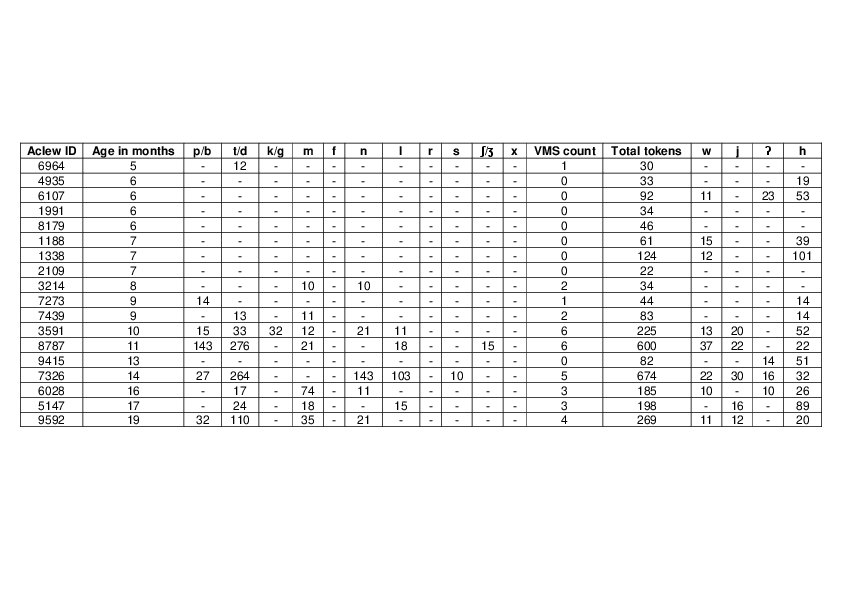

#### The Development of Consonants in Canonical Babble - Language Acquisition in Yélî Dnye and Tseltal

[*Abram A. K. Peute, Marisa Casillas*](./authors)

Bram.Peute@mpi.nl

Soon after children are born they start producing protophones, and after around 7 months they start to produce canonical babbles (Oller et al., 1998). Canonical babbling (henceforth CB) is defined as well-formed syllables often consisting of an reduplicated CV pattern, like “mama” or “da” (Lee et al., 2017), and is seen as a milestone in the motor development of the child. These rhythmic vocalizations relate to other motor development, and train the child in distinguishing and producing the phonemes of their home language(s) (McGillion et al, 2017). 

In the current study we investigate “vocal motor schemes” (henceforth VMS), a capacity for consistent phonetic patterning which manifests in CB. VMS provide the child with the means of producing “auditory approximations” to the target words produced by adults, without the child having to deduce the exact phonemes (Vihman, 1993), and VMS have been shown to predict children’s later lexical development (McCune & Vihman, 2001; McGillion et al., 2017).

We investigate VMS development in two communities with documented low rates of child-directed speech (CDS): Tseltal (Mayan; Casillas et al., 2019) and Yélî (Papuan; Casillas et al., in prep). Children in these communities have been shown to hit basic early vocal maturity milestones around the same age as has been found in communities with higher rates of CDS. The onset of canonical babbling – based on a vocal maturity measure - has been found to be highly robust cross-culturally and cross-linguistically, regardless of CDS (Oller et al., 1998). However, a measure that relates more closely to later lexical development, such as VMS, may be a more appropriate test of whether the lower rates of CDS impact the expected passage of linguistic milestones. We hypothesize that the average age of VMS acquisition by Yélî and Tseltal children will be comparable to the that of Western children; at least 2 VMS consonants between 9 and 14 months (McCune & Vihman, 2001), despite the fact that these children experience less CDS. Furthermore, we predict that the first consonants Yélî and Tseltal children consistently produce are labial or coronal consonants, or both (McCune & Vihman, 2001; de Boysson-Bardies & Vihman, 1991: Lee et al., 2010).

We made broad phonetic transcriptions of 18 Tseltal children’s spontaneous vocalizations over nine 5-minute randomly sampled clips from at-home daylong recordings. Adapting McCune and Vihman’s (2001) measure, if a child produced 10+ realizations of a consonant production within the total 45 randomly sampled minutes, then we considered the child to have acquired the VMS for this consonant. 

An analysis of the frequency of Tseltal consonant types can be seen in Figure 1, which shows that coronals and laryngeals, a phonetic super category containing glottal phonemes, are acquired the earliest; however, the occurrences of laryngeals diminish with age, likely because they are replaced with the other consonants. Interestingly, the dorsals are less often used by older children. The labials are used rather consistently over the course of development. The results largely coincide with our hypotheses, as 7 out of 9 Tseltal children between 9 and 14 months old acquired 2+ VMS, as shown in Table 1. A parallel analysis with Yélî recordings is in progress.

---

