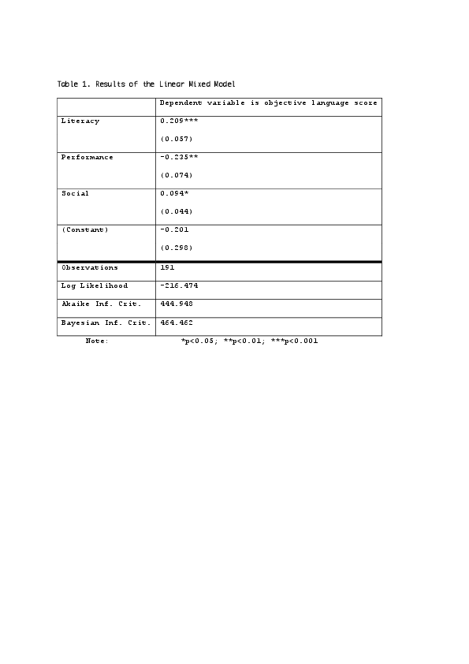

#### An online scale for the Assessment of Language in Adults using Self-reported Skills (ALASS)

[*Hannah Joyce, Javier Aguado-Orea*](./authors.md)

j.aguado-orea@shu.ac.uk

Introduction. There is a growing body of literature that highlights the persistent nature of Developmental Language Disorder (DLD) across the lifespan, yet little is known about the presentation of DLD in adults as diagnostic for adults is problematic. Previous research focuses on social outcomes and fails to understand the wider impact of DLD from the individual’s perspective. This study aims to tackle these issues, by developing an online screening tool for adults with language difficulties, incorporating objective language and self-perception measures to provide an in-depth understanding of the potential impact of language disorders beyond childhood (e.g. Conti-Ramsden et al., 2018).

Design. An online survey was partly developed by the researchers, comprising of four sections: two objective language tests, a subjective one, and demographic data including income level and academic achievement.

Participants were 192 adults (49 male, 141 female, 2 undisclosed) aged 18-73 years (M=25.3 years; SD=12.2 years), who were either currently studying (n=150), or had previously studied at university or college level (n=42). Of 192 participants, 13 had achieved post-graduate qualifications, 52 undergraduate qualifications and 127 A-level qualifications. Modal participant yearly earnings was <£10,000.

Materials and procedure. The study was run online using Psytoolkit (Stoet, 2010; 2017). The objective scales were [t1] a lexical test (partly based on LexTale, Lemhöfer & Broersma, 2012); [t2] a syntactic component developed by the researchers: participants were presented with sentences containing a non-word and asked to decide if they are acceptable in English. t1 and t2 were converted into z scores and averaged. The subjective measure [t3] was a questionnaire assessing self-reported language skills (the Assessment of Language in Adults using Self-reported Skills, ALASS), a 20-item questionnaire also developed by the researchers to provide a measure of perceived language ability, specifically in relation to academic and professional skills across the lifespan (Kemp and Seagraves, 1995). Participants were asked to rate skills from 1 (‘I am not very good’) to 10 (‘I am very good’). An average perception score for each participant at three key age points (before 6yrs; before 18yrs; at present) was produced. The initial set of 20 items was reduced into three components: literacy, performance and social, with a principal component analysis.

Results. A linear mixed model analysis was computed, entering the overall language score as criterion. The three ALASS components were entered as predictors (fixed effects) and the participant’s age was entered as random effects. Results of the model are reported in Table 1. The age of participants (range 18-73) is not a good predictor of the objective language scores, but all three ALASS components are significant predictors of the objective language scores.

Scores achieved in the objective tasks (t1 and t2) are good predictors of the self-perfection of competence in literacy (e.g. participants with a good language score tended to score high in items like “writing a story” or “understanding something I have read”) and social functioning (e.g. “speaking in public” or “talking on the telephone with someone you don’t know well”). In turn, language objective scores are a good inverse predictor of performance (e.g. “producing sentences’ or “understanding verbal instructions”), as shown in Figure 1.

Discussion. Language-related skills can be organized around three well-differentiated areas: literacy, language use (performance) and social functioning. Participants with good scores in the use of language at a lexical and syntactic level have a positive self-perception of their reading, writing and social competencies, and a negative self-perception of their linguistic performance. This is an interesting result, providing internal validity to the ALASS tool for adults.

---

