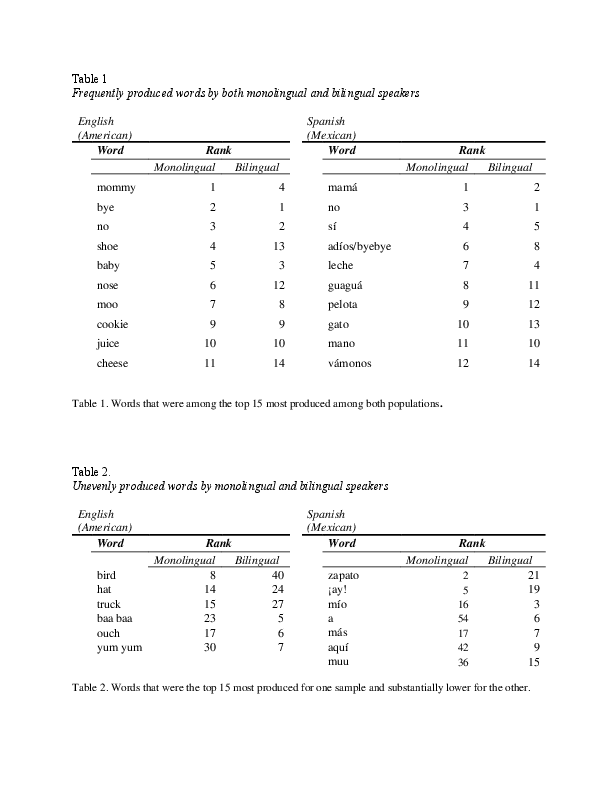

#### Exploring item-level variability in the Communicative Development Inventory (CDI) across monolingual and bilingual populations

[*Ancelma Vazquez, Helena Wippick, Elizabeth B. Miller, Caitlin F. Canfield, Daniel S. Shaw, Pamela A. Morris, Alan L. Mendelsohn, Adriana Weisleder*](./authors)

helenawippick@nyu.edu

Children's early language production is surprisingly similar across different languages and cultures but is not invariable (Braginsky et al., 2019). Previous research utilizing the Communicative Development Inventory (CDI), a parent-reported measure of children’s vocabulary comprehension and production, found considerable consistency in the first 10 words that children produced across three languages, English, Mandarin, and Cantonese (Tardiff et al., 2008). Using Wordbank, an open repository of CDI datasets (Frank et al., 2017), Frank and colleagues (2020) expanded these findings using data from 17 languages. They found that a third of the earliest produced words were the same across all languages, reflecting salient features of children’s environments such as words for family members, animals, household objects, and routines. However, there was also considerable variation in children’s emerging vocabularies, and as children matured their vocabularies became more culturally variant.  One outstanding question is whether the cross-linguistic variation in vocabulary development is the result of cultural differences in environmental input or linguistic features of the languages.

Importantly, much of this research is based on monolingual populations. Bilingual children are an interesting case study because, while the linguistic features of the languages they hear are minimally changed, the ecological context in which they hear these languages can differ significantly from that of monolinguals. Thus, bilingual children’s early learned words can provide additional clues as to the factors driving early lexical acquisition and cross-linguistic variation. 

The current study explores these topics by comparing item-level CDI performance of bilingual Latinx children in the US to monolingual English-speaking children and monolingual Spanish speaking children. We conducted a secondary analysis of data from an early parenting randomized control trial, Smart Beginnings, consisting of low-income families from two major US cities (see Roby et al., 2020). This study focuses on 64 English-Spanish bilingual children in New York City at child age 24 months. All participants were administered the English CDI-Short Form (SF) and the Mexican-Spanish CDI-SF. Monolingual samples were retrieved from Wordbank (Frank et al., 2017) and were from datasets containing either the US English CDI-Long form (LF) or Mexican-Spanish CDI-LF at 24 months. Analyses are restricted to words on the short forms. 

Our primary research questions are 1) are the words most frequently produced by Spanish-English bilingual children similar to those most frequently produced by Spanish- or English- monolingual children, 2) are there words that bilingual children are more or less likely to produce, and 3) do bilingual children produce particular word kinds (e.g. people, animal, sound words) in one of their languages versus the other. 

Our preliminary results are consistent with literature on emerging words (Tardif et al., 2008; Braginsky et al., 2019). There was substantial overlap in the most frequently produced words for bilingual children and monolingual children at 24 months, with 10 out of the top 15 words being in common across both comparisons (see Table 1). However, there were a number of items that varied across the populations (see Table 2). Particularly, bilingual children produced sound words (baa baa, yum yum, muu) in both languages more frequently than either of the monolingual groups, and may have a stronger bias towards shorter words. Analyses are ongoing, and forthcoming analyses will explore whether bilingual children prioritize particular kinds of words in one of their languages over the other. 

This work will extend previous research on cross-linguistic patterns of early language development by studying bilingual children and contributing to longstanding questions of the relative contributions of input, cultural variation, and linguistic features.

---

