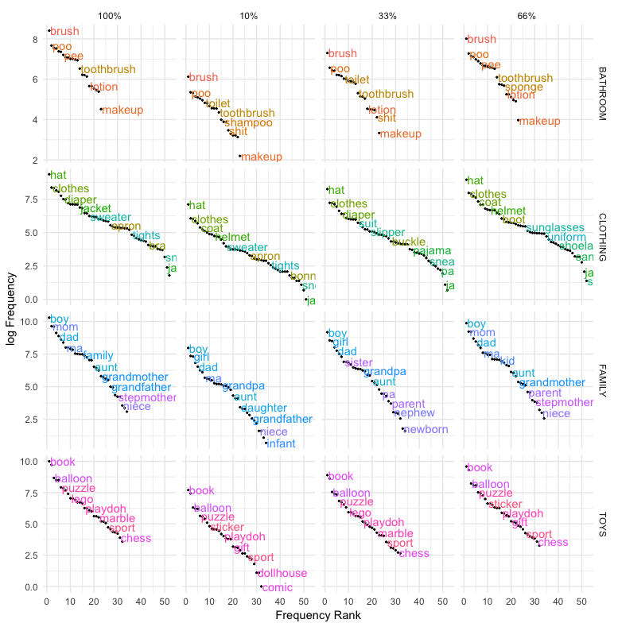

#### How the Empirical Distribution of Words Solves the Variability Problem in Child Directed Speech

[*Maja Linke, Michael Ramscar*](./authors.md)

maja.linke@uni-tuebingen.de

Numerous results have shown that children are sensitive to the probabilistic structure of the input they are exposed to, and this is often taken to imply that languages are themselves probabilistic systems. However, when take together with the complex probabilistic structure of languages (see e.g., Zipf, 1949), this presents a puzzle. While every individual speaker (e.g. a child versus an adult) will have experienced and learned from very different sample of their linguistic environment, the idea of a probabilistic implies in turn that users of the system share their models of its probabilities: how are any two language users whose experience differs dramatically nevertheless capable of converging on the same model of those parts of the system they have both been exposed to?

Children clearly learn to use the various parts of their languages in the contexts in which each is used. Recent results (Ramscar 2019, 2020) show that when word distributions are considered in the communicative contexts in which they occur, their probabilistic structure is geometric. A critical and unique property of geometric distributions is that they are memoryless, which means, in theory at least, their structure supports a transmission process impervious to sampling differences. That is, this suggests that even though word recurrence rates tend to be highly irregular, such that the probability of observing a word varies depending on the amount of time that has elapsed since the last time it was observed, the overall probability distributions of words in the contexts in which they will be encountered will experienced in remarkably constant fashion, and thus support the learning in models of the probabilities of those distributions that are largely independent of the sample an individual learner has been exposed to.

A key implication of this discovery is that it suggests that individual linguistic distributions in context are shaped by a process that somehow ensures that any random sample of a reasonable size will be sufficiently representative of that distributions overall, thereby guaranteeing that speakers exposed to different samples of different sizes at different rates will nevertheless learn probabilistic models that allow them to establish and maintain similar linguistic expectations. Previous analyses have shown that the distributions defined by context in conversational English satisfy this requirement at multiple levels of description (Linke & Ramscar, 2020), and simulation studies have shown that in contrast to other word distributions, random samples drawn from word categories that have geometric distributions do succeed in yielding representative subsamples.

To examine whether support for this model of probabilistic alignment could also be found in child language learning, we conducted a simulation study to examine the sampling properties of a set of high-frequency nouns selected from a corpus of child/caregiver speech (CHILDES; MacWhinney, 2000). The results of these simulations confirm that the distribution of nouns in speech produced by children and directed at children are geometric and that random subsamples drawn from these speech samples yield identical geometric distributions, while maintaining stable relationships between word probabilities independent of the subsample size. 

The results of these analyses show how the distributions of forms in child/caregiver speech solve the problem of random variance in the sampling process. Moreover, the distributions observed in the sample provide further support for the suggestion that human communicative codes are structured in a way that maintains alignment between speakers independent of the time and the rate at which they are exposed to speech (Figure 1).

---

