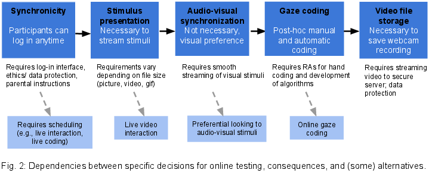
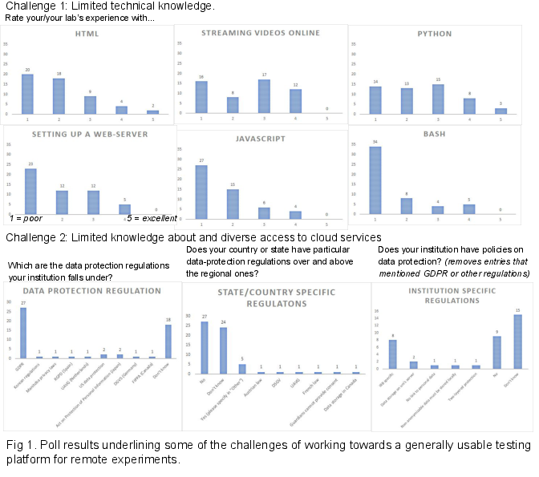

#### Towards a large-scale collaboration for infant online testing: Introducing ManyBabies-AtHome

[*Christina Bergmann, Helen Buckler, Rhodri Cusack, Sho Tsuji, Lorijn Zaadnoordijk, The Manybabies-AtHome Consortium*](./authors)

christina.bergmann@mpi.nl

How do we study individual infants on their way to language? In addition to recording their own output and asking parents about vocabulary skills, laboratory studies are a cornerstone of individual differences research. A key dependent measure in assessing different levels of linguistic skills, from language and vowel discrimination over the processing speed of words to processing syntactic structures, are measures of gaze. The dependent variable, often looking times to a specific region on the screen or to the screen itself, can be measured by approaches such as offline and online video coding, and more recently by automated eye-tracking using infant-friendly remote eye-trackers.

Classically, such experiments are conducted under - at least per lab - highly standardized conditions with regard to relevant factors such as distance between participants and screens, lighting, and ambient noise. However, as online testing for adults has become ever more accessible, there have been several promising initiatives to move these types of experiments online to allow caregivers to participate from their home environments (e.g., https://lookit.mit.edu/, Scott & Schulz, 2017; https://www.onlinebabylab.com/, Libertus & Violo, 2016; Semmelmann, Hönekopp, & Weigelt, 2017). 

Online testing holds great promise for individual differences research, because the samples that can potentially be reached are larger and more diverse. Further, in addition to reduced variability in the testing protocol due to its codified, automatic nature, the fact that infants are tested in a familiar environment and without the additional burden of a lab visit and associated travel, might yield a clearer signal and/or allow for testing the same infants across multiple time points more easily. 

Despite tremendous advances in at-home testing, there are significant obstacles, especially when aiming to increase accessibility. For example, remote data collection of infant audio and video data poses ethical issues ranging from recruitment, consent and reimbursement, to privacy protection and data storage. Such issues are necessarily bound to institutional and national regulations. In addition, in order to be inclusive, any at-home solution should be able to accomodate a large variation in home environments, including lighting and type of digital device. This issue poses challenges from standardized stimulus display up to analysis of video data, especially when venturing into automatic gaze coding. 

To address these challenges, we introduce ManyBabies-AtHome. This project aims to collaboratively address the challenges of infant online testing by building on knowledge and tools already present in the research community. We will develop a remote testing method that is robust across a range of home environments across the world, and in doing so we will also work towards best practices in procedure, documentation, standardization and analysis. All these measures will aim to increase the comparability of procedures across diverse locations and populations and support researchers who are just beginning to use this novel way of testing.  

In this presentation, we will address the conceptual, ethical, and practical challenges of online testing (see Figures 1 and 2) and present our proposed (working) solutions. The first steps have been taken: We have assessed the needs of the community, created platforms for knowledge exchange, and surveyed existing solutions. We are currently designing a first proof of concept study to assess the feasibility of our proposed workflow for asynchronous online testing (illustrated in Figure 2). This study will also yield a dataset that can be used for training and evaluating automatic methods for coding infant looking behaviour in the noisy home environment. Such methods are key for implementing gaze-contingent paradigms such as habituation and familiarization studies and will at the same time increase reliability of look coding.

---

