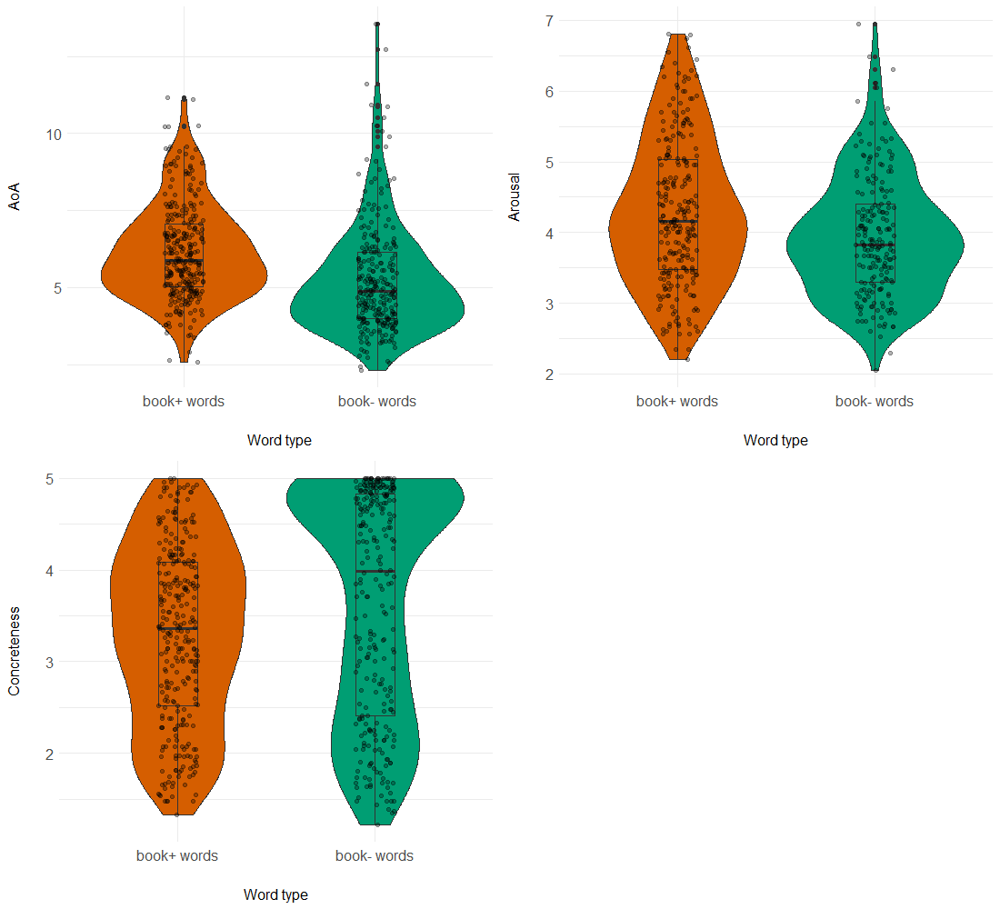

#### Characterising lexical richness in the language of children’s books

[*Nicola Dawson, Yaling Hsiao, Kate Nation*](./authors)

nicola.dawson@psy.ox.ac.uk

Children learn from the language they hear (e.g., Cameron-Faulkner et al., 2003). Evidence suggests that children who experience greater amounts of sophisticated and diverse child-directed talk develop larger vocabularies and better reading skills, and are at an advantage in early school achievement (Hart & Risley, 1995; Huttenlocher et al., 1991, 2010; Rowe, 2008, 2012). Access to the language of children’s books via shared reading may be a particularly rich source of linguistic input in the early years, but to understand how exposure to book language may support children’s learning, it is important to identify how book language differs to everyday conversation.

In this study, we compared the lexical properties of children’s picture books and child-directed speech. The picture book corpus comprised 160 texts commonly read to children aged 0-5 years (around 316,000 words), while the spoken language corpus comprised adult speech directed at children within a similar age range compiled from 10 corpora in the CHILDES UK database (around 3.8 million words). Our aims were to a) quantify how the language of children’s books differs from child-directed speech on measures of lexical richness (e.g., lexical diversity and lexical density), and b) identify the words occurring in children’s books that are most uniquely representative of book language, and examine how their lexical properties differ from words that occur more commonly in child-directed speech. 

Following Montag et al. (2015), we examined lexical diversity in each corpus by plotting the number of unique words (types) against the total number of words (tokens) at different sample sizes. These type-token ratio curves show that, at any given sample size, picture books contain a greater number of unique word types than child-directed speech, replicating the finding reported in Montag et al. (2015). Lexical density was calculated as the number of words in each corpus classed as ‘lexical’ relative to the total number of words. Lexical items comprised nouns (excluding proper nouns and pronouns), adjectives, verbs (excluding modal and auxiliary verbs) and adverbs derived from adjectives (e.g., ‘fast’ and ‘happily’). These analyses revealed that lexical density in the picture book corpus was 43%, compared to 29% in our sample of child-directed speech. 

To identify the words most unique to children’s picture books, we performed a keyword analysis with the picture book corpus as the target corpus, and the spoken language corpus as the reference corpus (Kilgarriff, 2009). This method produces a ‘keyness’ score for each entry in the target corpus which reflects frequency of occurrence in the target corpus relative to frequency of occurrence in the reference corpus. Words with higher keyness scores are more unique to book language, while words with keyness scores below 1 are more common in child-directed speech. We then selected the 300 words with the highest keyness scores and the 300 words with the lowest keyness scores and compared them on three lexical properties: age of acquisition, arousal, and concreteness. Our analyses indicated that the words most representative of children’s picture books are later acquired, more abstract, and more arousing than the words more commonly encountered in child-directed speech (Figure 1). 

Our analyses show that the language of children’s books is lexically denser and more lexically diverse than the language children hear via conversational spoken language. The words that are most unique to children’s books relative to everyday spoken conversation are more advanced, and represent the types of words children need to read, understand and use as they become independently literate. These findings have implications for children’s early language learning, as access to books via shared reading activities may help contribute to a richer, more sophisticated and more diverse linguistic environment.

---

