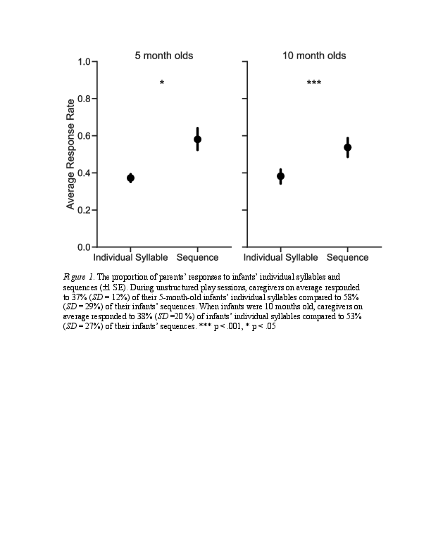
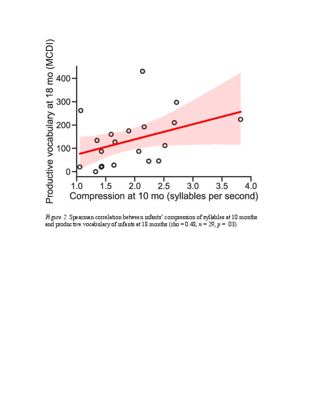

#### The function of infants’ prelinguistic vocal sequences: implications for early communication and language

[*Steven L. Elmlinger, Jennifer A. Schwade, Michael H. Goldstein*](./authors.md)

sle64@cornell.edu

What are the functions of infants’ sequential vocal production, in which prelinguistic vocalizations are tied together closely in time, one after another? Few studies have proposed developmental mechanisms for the emergence of infants’ vocal sequences. Vocal learning studies on humans (The Authors, 2019), songbirds (The Authors, 2020), and primates (Gultekin & Hage, 2018) show that adults who coordinate their vocalizations with those of their offspring create contingent social feedback that facilitates learning of more advanced vocal patterns. While previous work has focused on the timing of feedback to individual syllables, the present study investigates caregivers’ responses to babbling sequences to assess their sensitivity to sequential structure in vocal precursors. There is a strong acoustic continuity between infants’ individual syllable production and early word production (McCune, & Vihman, 2001). Does the appearance of sequential structure in infants’ babbling relate to the timing of their transition into spoken language?

30 caregiver-infant dyads participated when infants were 5 (M infant age = mo) and 10 months of age (M infant age = mo). Dyads engaged in 15-minute unstructured free-play sessions. Caregivers were asked to play as they normally would at home. Audio-visual recordings of infants’ vocalizations and caregivers’ speech during free-play were obtained. Infants’ vocalizations were segmented into vocal sequences if they were bounded by silent gaps longer than 1 second in duration. Vocal sequences all contained at least two infant syllables. For each infant vocalization, we determined whether it elicited a caregiver response. Caregiver responses were defined as any verbal behavior which occurred within 2 seconds after infants’ vocalizations. Caregivers completed the Communicative Development Inventory (CDI): Words and Gestures when infants were 18 months old to assess infants’ word production (Fenson et al., 1994). 

We found that caregivers were more likely to respond to infants’ sequential vocalizations compared to individual syllables at 5 and 10 months (5 mo: t(24)=-2.52, p < .05; 10 mo: t(29)=-5.02, p < .001) (Figure 1). Higher response rates to 5-month-old infants’ sequences could be caused by the longer duration of these vocalizations, as the mean duration of sequences that elicited a response was longer (M = 3.22 s, SD = 1.67 s) than those that did not elicit a response (M = 2.33 s, SD = 1.08 s, p < .05). However, the average duration of 10-month-old’s sequences which elicited a response (M = 2.12 s, SD = 1.07 s) was not different from the duration of sequences which did not elicit a response (M = 1.82 s, SD = .88 s, p > .05). The increase in responses that vocal sequences elicit from caregivers may drive infants to structure their vocalizations as sequences.

A potentially important characteristic of sequential babbling is the degree of vocal compression, measured in the number of syllables per second. Compression is a common strategy for species that communicate acoustically to efficiently incorporate more vocalizations into vocal bouts of similar durations. By adulthood, spoken utterances approach 5-6 syllables per second (Walker, Archibald, Cherniak & Fish, 1992). We analyzed the relation between infants' vocal compression at 10 months and their transition into spoken language at 18 months. The extent to which infants compress their vocal sequences at 10 months predicted productive vocabulary at 18 months (Figure 2). The link between early compression and later productive vocabulary provides further evidence that infants' prelinguistic vocal development serves as the foundation of early language learning and communicative development. By selectively responding to infants’ vocalizations that incorporate more mature speech characteristics, caregivers provide infants with additional sources of information which guide infants’ communicative development.

---

