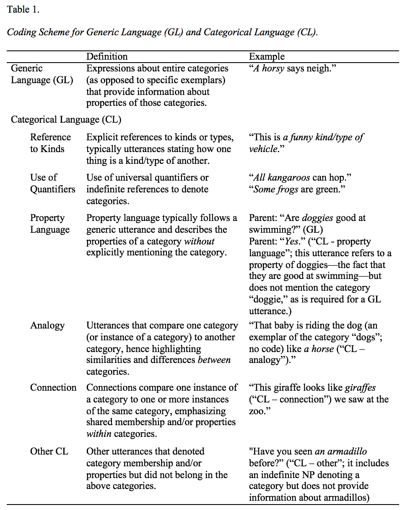

#### Parents’ Talk about Conceptual Categories with Infants: Stability, Variability, and Implications for Vocabulary Development

[*Ran Wei, Anna Kirby, Letitia Naigles, Meredith Rowe*](./authors.md)

ran_wei@g.harvard.edu

Word learning stands at the crossroads of children’s language and conceptual development and serves as a gateway to development in both domains (Waxman, 2007). Children’s developing understanding of conceptual categories plays a critical role in their vocabulary development. Further, converging evidence has suggested that parental input varies by parent education and robustly predicts children’s vocabulary development (Rowe & Goldin-Meadow, 2009). Thus, talk about conceptual categories is a potential mechanism through which parental input facilitates word learning. Regularities in linguistic input that highlight properties and boundaries of categories may support children’s acquisition of concepts and corresponding labels (Mervis, 1987). 

Previous studies find that adults’ use of generics (e.g., “Strawberries are delicious.”), one form of talk about categories, contributes to young children’s learning about categories and their properties (Gelman et al., 2014). However, it remains unknown whether and how parents use generics with infants. Further, we know little about other ways in which parents discuss categories with children or about associations between parents’ talk about categories and children’s vocabulary development.

The current study addresses the following questions: 

1.        Do parents discuss conceptual categories with infants, and if so how?

2.        Does parents’ input about conceptual categories vary by parent education?

3.        Does parents’ discussion of categories predict infants’ size of vocabulary?

Participants were 46 American parent-child dyads with varying levels of parental education, M = 15.6 years, SD = 2.14, range = 10 – 18. Semi-structured play sessions were recorded at child age 10, 12, 14, and 16 months. Recordings were transcribed and coded for parents’ talk about categories (see Table 1 for coding scheme), Cohen’s Kappas > 0.80. We calculated the raw frequency of parents’ generic language (GL), non-generic language about categories (CL), and total utterances about categories (GCL, including both GL and CL). To account for parents’ overall talkativeness, we also calculated the density of GL, CL, and GCL (i.e., frequency divided by the total number of parental utterances). We derived parents’ word types (i.e., the number of different words produced) from the transcripts as a control measure of parental vocabulary diversity. Parents reported children’s receptive and expressive vocabulary using the MB-CDI at each visit, and we used the Mullen Scales of Early Learning to assess children’s expressive language skills at 18 months. 

We found that individual differences in parent GL use were stable over time, whereas differences in CL use were more variable. That is, overall, parents who used more and denser GL at one visit also did so at other visits. Parents who had received more education produced more and denser GCL. The mean frequency and density of GL and GCL (averaged across the four visits), as well as the mean frequency (but not mean density) of CL, significantly predicted children’ vocabulary at 18 months, controlling for parent education, 10-month receptive vocabulary, treatment status*, and parent mean word types across visits (see Table 2 for OLS regression models). Further, controlling for covariates, the mean frequency of GCL mediated associations between parent education and children’s 18-month vocabulary. Our findings suggest that parents’ talk about categories varies by education and supports children’s vocabulary development. 

(* The current study uses data from a longitudinal training study aimed at increasing parents’ use of gestures with infants (Anonymized, 2019). Therefore, we included parents’ treatment status as a binary covariate, although treatment status was unassociated with children’s vocabulary measures or parents’ GL, CL, or GCL use at any visit, all ps > .1.)

---

