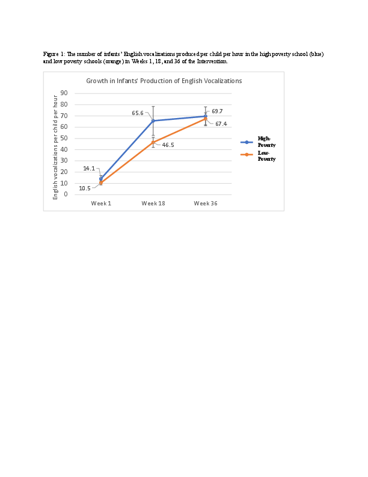

#### Bilingual Learning in Infant Education Centers in Madrid: The Effects of Poverty

[*Wenjun Ma, Patricia K. Kuhl, Naja Ferjan Ramirez*](./authors)

wenjum@uw.edu

Laboratory research shows that young the infant brain is adept at acquiring two languages, and infants who grow up in families where two languages are spoken can become native speakers of both. However, a key question is: Can infants from monolingual families become bilingual by experiencing another language through play in the context of an infant education center? How much and what kind of language input is necessary and sufficient to ignite bilingual learning? Does poverty in the infants’ home environment play a role in their language learning at school?  

In two recent studies conducted across multiple public infant education centers in Madrid, Spain we showed that Spanish infants’ (9-33 months of age) use of English productive vocabulary and early word combinations increased rapidly through a play-based, highly social and interactive intervention method and curriculum based on a theoretical model of infant language development. The present study examines the impact of poverty on infants’ production of English vocalizations in this context. 

Infants (n = 183) across four infant education centers (schools) received 36 weeks of English exposure through daily, 45-minute long, group sessions with native speaking tutors trained and certified to deliver the research-based method. The schools were public infant education centers that served families who lived in the schools’ neighborhoods. The neighborhoods varied in wealth from mid- to extremely low. In one of the centers, all children received free meals at the school, which means that their families’ per capita yearly income was below €4260. Many parents at this school were illiterate and dealt with issues of extreme poverty. Here we ask how infants’ English production at this school (“high poverty”) compares to the other three schools in the sample (“low poverty”). 

Infants’ English production was assessed using the LENA recorders placed in the pockets of vests that infants wore during the English sessions. The recordings were manually coded to determine the mean number of English vocalizations produced per child per hour in weeks 1, 18, and 36 of the Intervention. Over the first 18 weeks, infants at the high poverty school (n = 43) showed marginally faster growth in the production of English vocalizations compared to the infants in the low poverty centers (n = 140), p = 0.08. Over the second 18-week period, the growth in the high-poverty school slowed down, such that the production of infants’ English vocalizations in the high-poverty school was equivalent to that in the low-poverty schools in Week 36 (p > 0.1). Follow-up age analyses suggest that the differences in learning rates between high- and low-poverty schools were driven predominantly by older infants (18-33 months) in the sample, while younger infants learned at comparable rates across all four centers.    

Our previous research has shown that infants, across SES, have the capacity to begin acquiring two languages in the context of early education centers, if the environment is social and engages them through high-quality and quantity language input. The present findings extend our previous results to infants living in extreme poverty and support the idea of the overall robustness of infants’ ability to learn two languages if high-quality input is provided.

---

