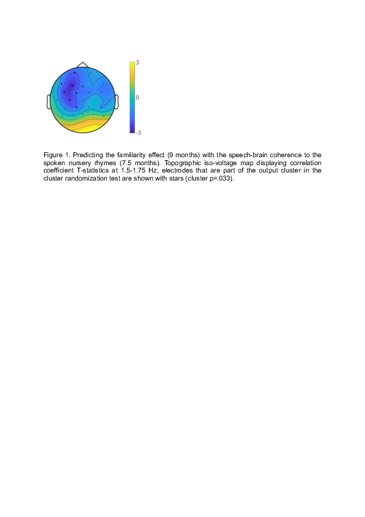

#### Individual variability in infants’ cortical tracking of speech rhythm relates to their word segmentation performance

[*Tineke M. Snijders*](./authors)

tineke.snijders@mpi.nl

Young infants are very sensitive to the rhythm of speech (Nazzi et al., 1998). Rhythmic cues help infants to identify words and phrases in continuous speech, which is necessary to start building a lexicon (Cutler, 1994). Neural oscillations in the adult brain track the rhythm of speech, synchronising with the incoming speech envelope to focus on salient aspects of the input (Lakatos et al., 2008, Giraud & Poeppel, 2012). This cortical tracking of speech might be a possible neural mechanism through which infants can effectively use rhythmic cues for early language learning. 

In the current study we related individual differences in infants' cortical tracking of rhythm to later word segmentation performance. 7.5-month-old Dutch-learning infants (N=108) participated in an EEG experiment, in which infants listened to stretches of speech (nursery rhymes), as well as to rhythmically regular (2.5 Hz) and irregular trains of complex tones (beeps). At 9 months the same 108 infants took part in a headturn-preference task assessing their word segmentation ability. Here infants were familiarised with passages containing a reoccurring bisyllabic trochaic pseudoword, and then in the test phase their listening times were assessed for familiar and novel word-lists. 

At 7.5 months the infant brains entrained to the rhythm of the regular beeps, as evidenced by a larger 2.5 Hz power over bilateral frontotemporal electrodes for regular compared to irregular beep trains (cluster p<.001; N=51 datasets with enough trials after artifact rejection). Speech-brain coherence to the nursery rhymes was assessed by looking at the consistency of the phase difference between the EEG signal and the speech amplitude envelope, for frequencies from 1-7 Hz (encompassing the frequencies of occurrence for stress patterns, words and syllables). We compared the observed speech-brain coherence to speech-brain coherence of randomised data (for which the speech envelope data was shuffled), and we used cluster randomisation to assess significance of speech-brain coherence for all electrodes and all frequencies in one test. The infants showed significant speech-brain coherence over all electrodes from 1-7 Hz (N=58; cluster p<.001). 

In a next step, both the entrainment to the 2.5 Hz beeps and the speech-brain coherence were related to the infants' familiarity effect in the word segmentation headturn experiment. While there was no relation for the non-linguistic beep entrainment, there was a correlation between the nursery-rhyme speech-brain coherence and the familiarity effect. Again cluster-randomisation was used to assess the correlation for all electrodes and all frequencies in one test. A large left-lateralised cluster was identified showing a negative correlation between the nursery-rhyme speech-brain coherence at 1.5-1.75 Hz and the familiarity effect (cluster p=.033; Figure 1; N=39 included in both experiments). The infants who showed speech-brain coherence at 1.5-1.75 Hz over left electrode sides more often had a novelty effect in the word segmentation task, meaning they listened longer to the novel compared to the familiar word-lists (see Figure 2).

To conclude, infant brains synchronise to the rhythm of both simple beeps and speech. Specifically for 1.5-1.75 Hz, which corresponds to the stress pattern rate in our stimuli, speech-brain coherence was related to the outcome of the word segmentation task. Tentatively the 7.5-month-old infants showing left-lateralised speech-brain coherence at this frequency are more equipped to start segmenting trochaic words from continuous speech, resulting in a more mature novelty response in the word segmentation task at 9 months. The current study gives evidence for the functional relevance of neural tracking of speech. Around 7-8 months of age for Dutch infants the cortical tracking of stress rhythm might be particularly important for starting to identify words in continuous speech.

---

