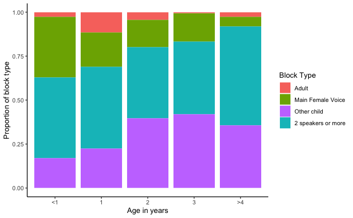

#### Exploring conversational exchanges and addressees among Tsimane forager-horticulturalists

[*Camila Scaff, Marisa Casillas, Jonathan Stieglitz, Alejandrina Cristia*](./authors)

camiscaff@hotmail.com

Parent-child conversations have been described as playing a substantial role in language acquisition (Snow, 1974; Hart and Risley 1995). The influence of conversational patterns (e.g. turn-taking, number of conversational partners) on language development in non-urban societies remains considerably understudied. We seek to fill this gap by examining the frequency of conversational turn-transitions by Tsimane forager-farmer children from the Bolivian Amazon.

We made day-long recordings of children's speech environments using child-friendly, wearable audio recorders with 25 children (aged 6-68 months; 28% female) from 15 families. For each recording, a trained phonetician annotated all vocalizations heard in one randomly selected minute per hour (mean= 13 coded minutes/child; range 4-16 min). Vocalizations were classified as originating from either the focal child, the "main female voice" (MFV, usually the mother), other female adults, other male adults, or other (i.e. nonfocal) children. 

We operationalized any vocalization preceding or following a focal child vocalization within -1 and 2 seconds as a contingent turn-transition (i.e., as prompts and responses to focal child speech, respectively).  We define as a "block" the time window surrounding the focal child vocalization (-1 and 2 seconds) characterized by the number and identity of other speakers' vocalizations.  For example, if during a block only the MFV interacts with the focal child then the block is labeled as a "MFV block" if another speaker is also present in the same time window, it is instead considered a "Multispeaker block". Four block types were identified: "Main Female Voice", "Adult", "Other child" and "Multispeaker". 

Children experience an average of 1.7 contingent responses per minute (range: 0.1- 5.2). Maternal contingent responses significantly decreased with child age whereas other children's responses increased (Figure 1). 

On average, 42% of all blocks were labeled as "Multispeaker" (i.e. two speakers or more). The majority (58%) of unique conversational partners (i.e. blocks exclusively between the focal child and another speaker) were fellow children. Thus, young Tsimane children experience mostly multiparty conversations and one-on-one conversations are more likely to occur between peers after 12 months of age. The accuracy and stability of these measures remain to be tested upon further data collection and analysis in the future. 

We conclude by discussing the implications of these findings in a broader cross-cultural context. If early conversational turns are mostly composed of third-party conversations, does this mean that exclusive infant-adult verbal interactions are less important than thought in this rural setting? Or are children raised in such contexts capable of focusing attention on multiple speakers simultaneously, as it has been described for other rural contexts (Rogoff, 1993)? These questions invite further study of children’s language experience in diverse socio-ecological settings.

Figure 1. The proportion of different block types as a function of the focal child's age

---

