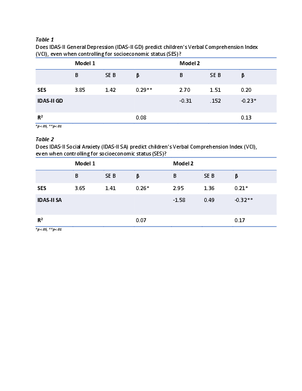

#### Parental Mental Health, Socioeconomic Status, and Children's Verbal Abilities

[*Francesca Scheiber, Allison Momany, Paige Nelson, Kelli Ryckman, Ece Demir-Lira*](./authors.md)

francesca-scheiber@uiowa.edu

Previous research has suggested that parental mental health disturbances and socioeconomic status (SES) may influence children’s outcomes, including children’s cognitive outcomes. Specifically, children of depressed parents and children of low-income parents tend to perform more poorly on measures of academically-relevant skills, like language and math, than their respective counterparts (Hart & Risley, 1995; Weisleder & Fernald, 2013; Pan et al., 2005; Yu & Wilcox-Gok, 2015). Research combining these two variables has suggested that affluence may act as a buffer against the negative effects of parental depression on children’s outcomes (Petterson & Albers, 2001). 

In the present study, we sought to extend the literature on the role of parental mental health and SES in children’s cognitive abilities in three ways. First, we examined whether prior findings could be replicated. Second, there is a paucity of research on parental mental health disturbances beyond maternal depression; we addressed this by both measuring anxiety in addition to depression and including fathers in our study. Third, little is known about the relationship between parental mental health, SES, and children’s outcomes beyond general cognitive ability and verbal abilities; we addressed this by analyzing visual-spatial abilities in addition to verbal abilities.

Participants included 102 children, between the ages of 3 and 5 years, and their parents. Overall, families in this study came from high-SES backgrounds; the average annual household income was $115,761, and 77% of parents had at least a bachelor’s degree. Children’s verbal and visual-spatial abilities were represented by the Verbal Comprehension Index (VCI) and Block Design subscale on the Wechsler Preschool and Primary Scale of Intelligence (WPPSI-IV), respectively. Parental depression and anxiety were represented by the General Depression and Social Anxiety subscales on the Inventory of Depression and Anxiety Symptoms (IDAS-II), respectively. SES was represented by a composite variable including parental education and family income. 

Results indicated that: 1) parental depression was negatively associated with children’s verbal abilities (r(82)= -.303, p = .005) but not visual-spatial abilities (r(86)= -.183, p = .088), 2) parental anxiety was negatively associated with children’s verbal abilities (r(89) = -.353, p = .001) but not visual-spatial abilities (r(93)= -.058, p = .579), 3) symptoms of depression predicted children’s verbal abilities, even when controlling for SES (Table 1), 4) symptoms of anxiety predicted children’s verbal abilities, even when controlling for SES (Table 2), 5) SES neither moderated the effect of symptoms of depression nor of anxiety on children’s verbal comprehension.

These results are consistent with previous findings that parental depression may influence children’s verbal abilities. This was true even within a relatively high-SES sample. These results also show that parental anxiety, in addition to depression, may influence children’s verbal abilities. Additionally, verbal abilities may be more sensitive to parental mental health symptoms than other cognitive domains. Future research should examine the mechanisms through which parental mental health may influence children’s cognitive abilities.

---

