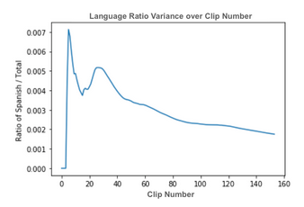
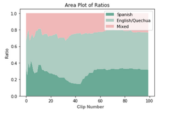

#### Efficient estimation of bilingual children’s language  exposure from daylong audio recordings

[*Margaret Cychosz, Anele Villanueva, Adriana Weisleder*](./authors)

mcychosz@umd.edu

The language that children hear early in life is associated with later vocabulary size (Hoff, 2003) and speech processing rate (Weisleder & Fernald, 2013). This research relies on naturalistic observations of children’s language input, often captured with daylong audio recordings. However, the large quantity of data that daylong recordings generate requires novel analytical tools to feasibly parse thousands of hours of naturalistic speech. 

This study outlines a workflow to efficiently process and sample from daylong audio recordings when estimating two key elements that define children’s early language environments: 1) quantity of child-directed speech and 2) dual language exposure. The automated tools currently available cannot differentiate between different languages or between child- and adult-directed speech, so this information must be captured through human annotation. In an attempt to minimize manual annotation, we employ a general sampling with replacement technique to annotate small portions of each recording. Previous work in the annotation of daylong recordings has consciously sampled from the recording, for example selecting portions from morning, afternoon, and night, that contain high, medium, and low amounts of speech (Orena et al., 2019; Weisleder & Fernald, 2013). We hypothesize that our selection criterion and workflow will result in less manual annotation to achieve similarly stable estimates.

Data from two daylong corpora of bilingual children (aged 0;6-1;0) are used: children acquiring Quechua and Spanish in southern Bolivia (n=5) and English and Spanish in the United States (n=3). Families completed a daylong audio recording (average duration: 13.24 hours; range 8.78-16) with a Language ENvironment Analysis recorder (Xu et al., 2009). Each child wore the recorder inside of a small pocket on the front of a researcher-provided garment. Caregivers were instructed to turn the recorder on once the child awoke and turn it off once the child went to bed, aiming for 12 hours per day. 

To annotate the data, each recording was first split into 30-second clips that contained human speech (as determined using a standard vocal activity detector [Usoltsev, 2015]). Then, clips were randomly drawn, with replacement, and presented to an annotator. The annotator determined the language spoken in the clip (Quechua/English, Spanish, Mixed, No speech, Unsure), the speaker (Target child, Adult, Other child, Unsure), and the addressee (e.g. target child, adult, other child). After each clip was annotated, a ratio of Quechua/English clips to Spanish clips, and variance in language assignment, was calculated for that child (Figure 1). Variance was measured over a moving window of 60 ratio estimates. 

Preliminary results show that an average of 175 30-second clips (range: 120-261) of manual annotation were required to reach a stable estimate of each child’s dual language exposure and proportion of child-directed speech (Figure 2). This is 60-131 total minutes, or just an average of 11.53% of each overall recording. Previous work estimated language dominance from 24 hours of audio, or 50% of three 16-hour recordings (Orena et al., 2019). We are currently validating the random sampling approach by annotating 50% of each daylong recording to compare with the random sampling results. 

Largescale audio recordings permit close observation of naturalistic language behavior. However, the careful sampling techniques employed in previous work require hours of manual annotation. So long as researchers continue to (understandably) find this time investment unreasonable, parental reports of language use will dominate developmental research (Kaushanskaya & Crespo, 2019). This study will outline how random sampling techniques can mitigate the time required to estimate characteristics of children’s language environments, perhaps making this a more feasible methodological tool in developmental science.

---

