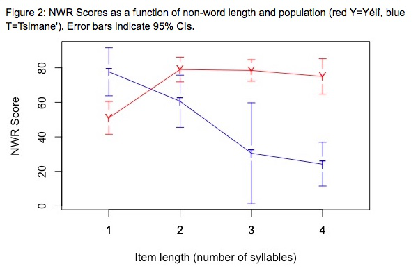
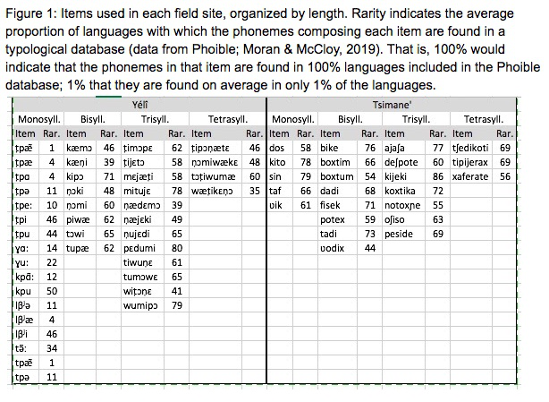

#### The role of experience in shaping language processing: Insights from non-industrial communities in Bolivia and Papua New Guinea

[*Alejandrina Cristia, Gianmatteo Farabolini, Camila Scaff, Naomi Havron, Jonathan Stieglitz, Marisa Casillas*](./authors.md)

alecristia@gmail.com

Childhood language input has been described as key for language processing: Infants who are more often directly verbally addressed develop larger vocabularies and process language faster. However, the evidence for this claim focuses on the lexicon, which is presumably among the most input-hungry language levels (Cristia, 2020). Additionally, most evidence for this input-output link comes from studies of socioeconomic variation in North American samples where these correlations may be confounded by covariation with resource access. The same systematic review of published data (Cristia, 2020) shows that socio-economic differences in infant-directed input are dwarfed in comparison to cultural variation (https://xcult.shinyapps.io/vocsr/).

We examined phonological processing in two subsistence-level communities where, compared to North American samples, wealth accumulation is relatively minimal and less variable, and infants are verbally addressed much less frequently: the forager-horticulturalist Tsimane' of lowland Bolivia and the subsistence-farming Yélî of Rossel Island, Papua New Guinea. Daylong audio recordings indicate that infants in these communities hear at least three times less directed input than infants in North America: 1–4 minutes per hour among Tsimane' (Cristia et al., 2019; Scaff et al., in prep), and 2–3 minutes per hour among Yélî (Casillas et al., und. rev.), versus 11 minutes per hour among North American infants (Bergelson et al., 2019).

 

We looked at phonological processing using a non-word repetition (NWR) task. In this task, participants hear phonotactically legal novel words and have to repeat them exactly. Previous work reports NWR scores above 50% among children 4 years and older, with even higher scores for mono- and bi-syllabic items, and for older children: Italian-speaking 4-year-olds score 75% for mono/bisyllabic items and 6-year-olds score 91% for longer items (Piazzalunga et al., 2019); Arabic-speaking 5-year-olds score 95% for short and 55% for long items (Jaber, 2018). 

 

NWR tasks have been used across multiple industrial settings, but have rarely been applied elsewhere; a secondary goal of the current project was to adapt this measure to two non-industrial contexts: the Tsimane' participants (N = 17; aged 1–12 years, although most data came from children over 4 years) performed the NWR task in a group setting in 2018, whereas Yélî participants (N = 42; aged 3–13 years) performed the NWR task individually in 2019. We also explored cross-linguistically rare sounds found in the extensive Yélî Dnye phonological inventory, including multiple monosyllabic targets with such rare sounds (Figure 1).

 

A mixed effects logistic regression revealed fixed effects of Word Length (B=-0.87, SE=0.29) and Population (B=-2.80, SE=0.77), as well as an interaction between Word Length and Population (B=1.58, SE=0.31) on the probability of correct repetition for a given trial. Child Age was not a significant predictor, nor did age interact with Word Length. We therefore collapse across ages to better portray the other effects. Yélî children's NWR scores were high and stable for items 2–4 syllables in length, with lower scores for monosyllables, whereas Tsimane' children showed a strong NWR score decline with item length (Figure 2). The lower performance for Yélî monosyllables could be related to how we constructed those stimuli: the phones we used for those items were typologically rarer (Figure 1).

 

Integrating across studies is difficult as any divergence in results may relate to the way in which NWR was administered, differences in the phonological structure of the items, or other differences across the sites or languages. Nevertheless, current results are not clearly compatible with a hypothesis that infant-directed input determines phonological processing, with two populations where infants receive similar levels of infant-directed speech showing divergent NWR patterns.

---

