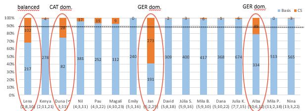

#### Not all simultaneous bilinguals are dominant in the community language and not all code-mix: Catalan as a heritage language in Hamburg

[*Laia Arnaus, Amelia Jiménez-Gaspar*](./authors.md)

amelia.jimenez@uib.es

Recent studies have focused on studying minority languages in different linguistic contact situations, as it is for Catalan within the Catalan speaking regions in Spain and beyond its borders. Some of these studies have concentrated on the early simultaneous acquisition of Catalan together with English (Juan-Garau & Pérez-Vidal 2001; Pérez-Vidal & Juan-Garau 2002) or Hungarian in Catalonia (Biró 2017); Others have focused in the study of Catalan as a heritage language (HL) in a monolingual German environment (Arnaus Gil 2013, Arnaus Gil & Müller 2015, Jiménez-Gaspar et al. 2020, Sivakumar et al. 2020). The aim of these studies differs significantly. Some are interested in analyzing different linguistic phenomena that can be vulnerable to cross-linguistic influence; Others focus on the (internal and external) factors that promote a high competence in Catalan. The empirical study of Arnaus Gil & Müller (2020) and Sivakumar et al. (2020) examine the linguistic competence of 16 simultaneous trilingual and multilingual (i.e., acquire more than three languages) children between 3;3 and 7;9 who are raised with Catalan, Spanish and German/French in a Catalan-speaking region in Spain (Palma de Mallorca) or in several cities in Germany (Hamburg, Berlin, Cologne). The results show a high competence in Catalan, independently from the number of languages acquired and the language of the community (Spanish or German). Furthermore, this study concludes that the presence or absence of Catalan at home does not influence the Catalan linguistic competence for those children being raised in Palma de Mallorca. 

Poeste et al. (2019) investigate the use of Code-Mixing (CM) in 122 bi-, tri- and multilingual children, 16 of them are the ones investigated in Arnaus Gil & Müller (2020) and Sivakumar et al. (2020). The authors observe that children do not often code-mix, and they do not find any relation between CM and language dominance. Another relevant aspect of this study is that trilinguals seem to use CM, especially when they speak Catalan (98,53%). This trend might be due to the asymmetric societal bilingualism in the Catalan speaking regions (Boix-Fuster & Sanz 2008). Other studies to CM in bilingual children, such as the work done by Patuto et al. (2014) or Juan-Garau & Pérez-Vidal (2001), indicate that the intersentential CM-rates (Müller et al. 2015) in the heritage or minority language is higher than in the community language. 

We conducted a pilot study with sixteen bi- and trilingual children (mean age 5;7), being raised at the city of Hamburg, who acquire simultaneously (at least) Catalan and German. The study consists of a 30-minutes recording in every child’s L1s in a spontaneous game situation. Moreover, we administered a questionnaire of linguistic input based on the work by Torregrossa & Bongartz (2018) to examine internal and external factors that might contribute to the linguistic competence of the HL. For linguistic competence in both the heritage and community language, measured in terms of MLU (Brown 1973), there is a steady increase, the older the children are (cf. Figure 1). In terms of language dominance, we observe an even distribution of balanced (N = 7) and German dominant (N = 6) children, and this distribution does not correlate with age (r = .428, p > .05). We also examined the variable language strategy (LS1=OPOL, LS2=OPOL with extra community language, LS3=bilingual parent – mixed languages, cf. Arnaus Gil et al. 2020), and no significant effects were observed (x2 (4, N = 16) = 7.68, p >.05). For the results on CM, bi- and trilinguals behave monolingually in 90.4% of the cases, and thus CM only represents 9.6% of the data. Interestingly, we noticed that not all children present CM (cf. Figure 2): Those four children, who do code-mix, do so significantly more than 10%, all of them belong to LS1, show different language dominance patterns, belong to different age groups and use intersentential CM the most.

---

