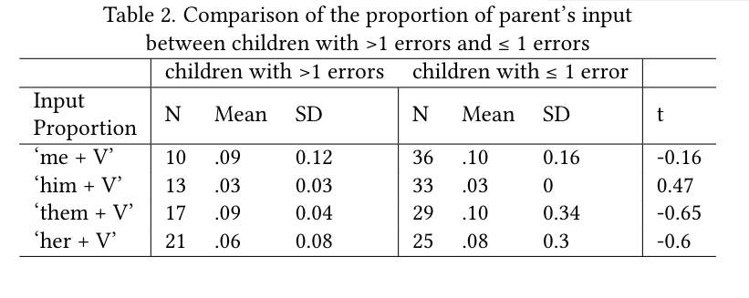
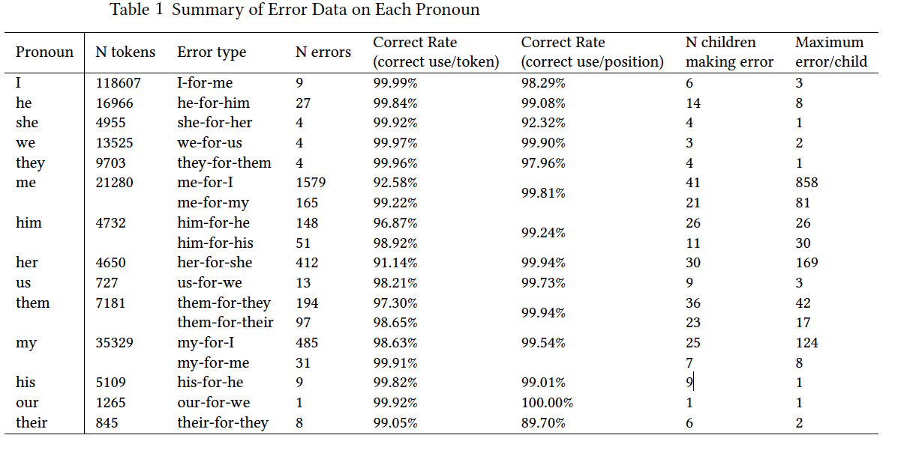

#### Revisiting Children's Pronoun Case Errors: A Comprehensive Corpus Analysis

[*Xiaomeng Ma, Virginia Valian, Martin Chodorow*](./authors)

xma3@gradcenter.cuny.edu

Between 2-4, English-speaking children reportedly make pronoun case errors such as

‘me go’. For more than 40 years, researchers have categorized such errors as systematic, characteristic, and frequent (e.g. Huxley, 1970; Pelham 2011).  Few studies, however, have reported error counts or error rates for all pronouns, so the frequencies and distributions of such errors are still unknown. Estimates confined to first person subjects show 92%-94% correct use of ’I’ (Rispoli, 1998; Kirjavainen et al, 2009).  Here we describe a comprehensive corpus analysis of pronoun case, across all persons and numbers, to assess the prevalence and distribution of case errors and input as a possible source of errors. 

We extracted first and third person singular and plural pronouns from longitudinal data of 46 monolingual English-speaking children from ages 2 to 4 in CHILDES.  Any misuses of nominative, accusative, or genitive case were counted as errors. Candidate errors were located using the NLTK python package and were hand-checked by two annotators. As shown in Table 1, of 244,874 total pronouns, we found 3421 errors. There were five types of errors: accusative case used as a subject or a possessive, genitive case used as a subject or an object, and nominative case used as an object. All pronouns but ‘me’ (93%) and ‘her’ (91%) were used correctly over 95% of the time. In addition, most positions (subject, object, or possessive) were filled with a correct pronoun over 95% of the time.  The two exceptions were ‘she’, which only filled 92% of subject positions that required a third person singular female pronoun, and ‘their’, which only filled 90% of determiner positions that required a third-person plural pronoun. 

Most children made few errors: 43 of the 46 children have an error rate less than 5%; 21 children have an error rate less than 1%.  Children made no errors on most pronouns.  Errors are concentrated in four types: using accusative case as a subject, including ‘me-for-I’, ‘them-for-they’, ‘her-for-she’ and ‘him-for-he’.  The low number we document is not due to small sample size.

To test if parental input, such as ‘Let her open it’, could be responsible for overuse of the accusative form (Tomasello, 2000), we extracted all child and parent utterances containing ‘me/her/him/them +V’ in the corpus.  We also extracted all the ‘NOM + V’ sequences in children’s and parents’ utterances in order to determine the proportion of ‘ACC + V’ sequences.  Children make ‘ACC + V’ errors (e.g. ‘them want it’), along with correct ‘ACC + V’ utterances (e.g., ‘help her find it’). There is no significant correlation between the proportion of ‘ACC + V’ errors in children’s utterances and the proportional use of ‘ACC + V’ sequences in parents’ input for ‘me’ (r = 0.10), ‘him’ (r = 0.07), ‘her’ (r = -0.21) or ‘them (r =0.01). Since not all the children made ‘ACC + V’ errors, we further calculated the correlations limited to children who made at least 2 ‘ACC + V’ errors for each pronoun. Even so, there is still no significant correlation between the proportion of ‘ACC + V’ errors and the proportion of ‘ACC + V’ in parents’ input: ‘me’ (r = 0.13), ‘him’ (r = 0.34), ‘her’ (r = 0.24), or ‘them’ (r = 0.02).  In addition, we compared the mean proportion of ‘ACC + V’ in parents’ input for children who made at least 2 errors with children who made 1 or 0 errors for each of the 4 pronouns. Parental examples ranged from .03 (him) to .10 (me and them), and did not differ for children who made more than 1 error and children who made 1 or 0 errors, as shown in Table 2. 

Children make few pronoun case errors.  There is considerable variability in error types and tokens, within a narrow range, from child to child.  We consider whether there is a substantial phenomenon to be explained:  children case most of their subjects and objects correctly, regardless of how many ‘ACC +V’ sequences parents produce.

---

