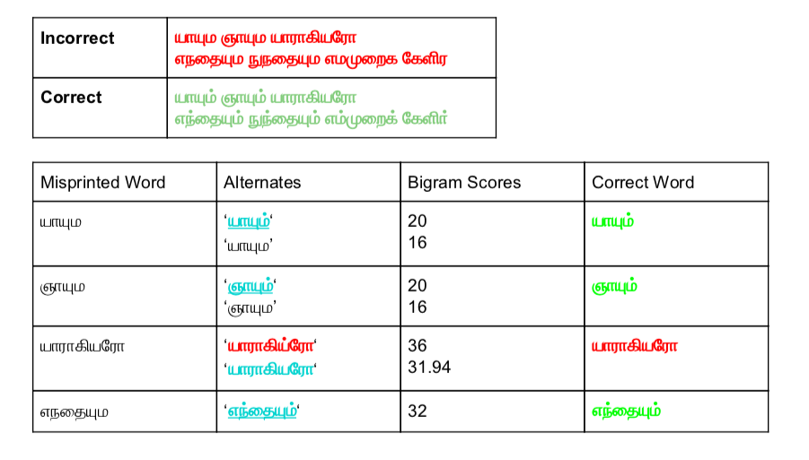

#### Algorithm to Correct Missing ​Pulli​-Signs in Printed Tamil Text

[*NA, *](./authors)

ezhillang@gmail.com

A common problem in digitizing Tamil texts is the missing consonant sign ​pulli ​(unicode u0BCD) which may be lost in the process of OCR, or absent by convention during printing of older texts. We propose a bigram statistics based combinatorial algorithm to correct such errors in text. We present a simple algorithm for correcting OCR ​induced missing consonant sign by combinatoric generation and filtering by bigram scoring. This approach is useful for advanced spelling correction on lines of our work in 2019.

---

