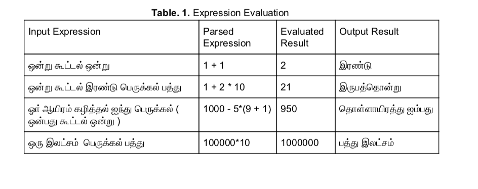
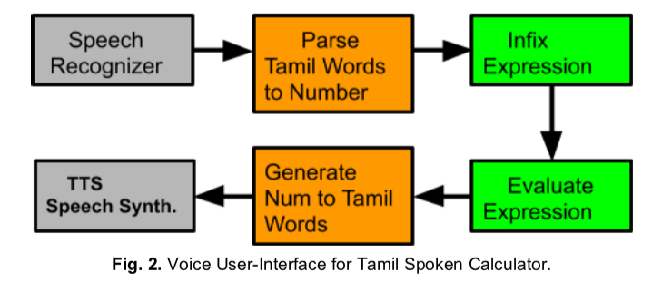

#### Generation and Parsing of Number to Words in Tamil

[*NA, *](./authors)

ezhillang@gmail.com

We discuss generation and parsing of Tamil words from and to numbers respectively. We show this task can be achieved in O(n) complexity and performs well for written text. We explore features of these algorithms within a voice user-interface based calculator; we also list some of the limitations. These algorithms are implemented in the Open-Tamil library.

This work presents, for the first time to our knowledge, a comprehensive account of generating and parsing Tamil number words. We show applications of our work to a future voice user-interface based spoken calculator, and even perhaps name-entity recognizers.

---

