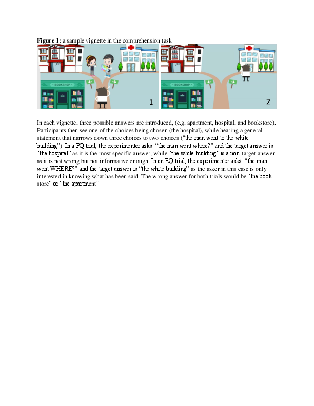

#### Testing syntactic simplicity: wh-in-situ vs. fronted wh-questions in L1 acquisition

[*An Nguyen, William Howe, Géraldine Legendre*](./authors.md)

an.nguyen@jhu.edu

A detailed examination of 10,000 English wh-questions from CHILDES reveals that the reported empirical picture of wh-question acquisition is incomplete: a type of wh-in-situ, probing questions (PQs), has been left out from most discussions despite its presence (>10%) in child-directed speech. Unlike wh-in-situ echo questions (EQs), PQs are used to request new information, and parents frequently use PQs and fronted information-seeking questions alternatively. An example from the Weist corpus is shown below:

FAT: if the dinosaur roars what's the baby gonna do? - CHI: it gonna roar [...]

FAT: but if the dinosaur roars the baby is gonna be what? - CHI:  scared.

The presence of PQs contradicts a popular claim that children never hear wh-in-situ questions in English (Yip and Matthews, 2007) or only hear them as EQs (Becker and Gotowski, 2015). Furthermore, the fact that PQs share the pragmatic space with fronted wh-questions while having fewer syntactic operations (no overt wh-movement or auxiliary inversion) allows us to test simplicity-based theories of syntax acquisition (e.g. Jakubowicz, 2011), which predict children’s preference for PQs. This experimental study seeks to (1) confirm that children accept PQs as information-seeking questions and (2) test the simplicity-based account’s prediction.

Nineteen native English-speaking children (M=4.01, 7 males) participated in a comprehension-production study. The comprehension task contained 12 vignettes. Children saw the stories on the screen while hearing true but under-informative statements (Figure 1). At the end of each vignette, children heard either a PQ or EQ (both have the same surface structure but differ prosodically, as EQs have a strong rising pitch while PQs have a flat/falling pitch). If they understand the pragmatics of EQs and PQs, they will repeat the under-informative statement given an EQ but provide the more specific answer given a PQ. Indeed, children gave new-information answers to PQs and repetition answers to EQs with an accuracy significantly above chance (t(147)=2.86, p=0.004), and provided twice as many target as non-target answers (Table 1). In the elicitation task, children were instructed to ask an alien several wh-questions. The experimenter first primed them by using both an in-situ and a fronted wh-structure in 2 practice trials. Children completed 10 additional trials. Despite the priming attempt, children only produced fronted wh-questions. 

The comprehension results confirm that children can use prosody to aid comprehension (Snedeker, 2008). Children differentiate PQs from EQs and understand that PQs request new information. This challenges the assumption that children only interpret English wh-in-situ as EQs. The elicitation results, however, do not support simplicity-based accounts (PQs were not produced). Two possible explanations are explored. First, children prefer to maximize the interrogative illocutionary force. This is supported by Pozzan and Valian (2016): despite 38% of non-inverted yes/no questions in child-directed speech, children never produce such structures when elicited. In their and our case, children choose to signal a question early by fronting the wh-word/auxiliary over a simpler syntactic structure. Second, in line with Schneider et al.’s (2019) proposal that children’s production has less variability than their input because they filter out low-frequency variants, English-speaking children may treat PQs as ‘noise’ and only regularize to higher-frequency fronted questions. However, frequency cannot be the sole determiner: despite having similar input frequencies of wh-in-situ, French-speaking children do produce this structure in elicitation tasks (Strik, 2007). Regularization may also be sensitive to the number of variants (types of wh-questions) as well as across-speakers variability within each type. French allows more wh- variants, and their wh-in-situ shows less prosodic variability than English.

---

