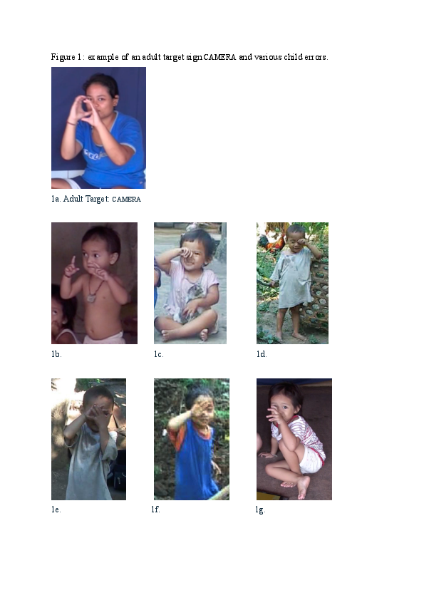

#### Universal and language-specific patterns in the acquisition of sign language phonology

[*Hannah Lutzenberger, Connie de Vos, Onno Crasborn, Paula Fikkert*](./authors)

h.lutzenberger@let.ru.nl

Children acquiring signed languages from birth parallel their speaking peers in linguistic milestones.[1] The acquisition of sign phonology brings extra hurdles: children learn to coordinate two articulators, i.e. two hands, and autofeedback is visual and/or tactile rather than auditory. This study is the first to investigate the acquisition of sign phonology in a non-WEIRD context: a Balinese village community. 

	Kata Kolok (KK) emerged spontaneously in a labour-intensive community with high congenital deafness. KK’s phonology is typologically distinct from WEIRD sign languages, with a larger signing space and fewer marked handshapes.[2] KK children receive signed input from birth, from many hearing and deaf signers. Thus, the acquisition setting is comparable to that of hearing children acquiring a spoken language, unlike the experience of most WEIRD deaf children [1]. 

	Case studies of WEIRD sign languages show that early signing is characterised by simplification and substitution of handshapes, locations and movements. Children omit, repeat, or proximalise movements, produce signs at bigger and more salient locations, and assimilate and replace marked by unmarked handshapes.[1,3] 

	Using longitudinal data, we examine universalities and differences in sign phonology acquisition. We predict cross-linguistic similarities in movement errors due to general motor development and differences in handshape and location errors due to KK’s typological profile.  

	We collected 1400 off-target signs produced by four deaf children (spanning 1;5-3;0 years) in a total of 75 hours of naturalistic recordings from the KK Child Signing Corpus. For each error, we analysed (i) attempted target signs, (ii) accuracy of handshape, movement, location, orientation, and body contact, and (iii) error types. Results are interpreted in the light of the literature and KK’s phonological system. 

	The errors in our data show similarities with patterns described for WEIRD sign languages; (i) handshape and location errors are most common and (ii) movement errors are rare and typically caused by omission or proximalisation. These commonalities may be linked to general motor development, suggesting universality in sign phonology acquisition. Critically, we also observe striking differences. Firstly, KK children substitute both marked and unmarked handshapes (Figure 1); this may be typologically grounded with fewer marked handshapes featuring in the KK lexicon. Secondly, KK children often increase or add body contact (Figure 1c-f). While a preference for fingertip contact has been mentioned in the literature, the role of contact has not been discussed extensively. Increased contact may be a typological feature of KK, but may also be more central to early signing: rather than increasing saliency of location, displacing signs might increase proprioception, providing more autofeedback.

	This is the first study to corroborate similarities and differences in child errors of KK and WEIRD sign languages, finding that acquisition of movement has universal tendencies, while handshape and location may be more susceptible to typological differences such as diverging phonologies and language ecologies.

References

1.	Chen-Pichler, D. (2012) Language acquisition. In R. Pfau, B. Woll and M. Steinbach (Eds.), Sign Language: An international handbook (pp. 647-686). Berlin: de Gruyter.

2.	Marsaja, G.I. (2008). Desa kolok: A deaf village and its sign language in Bali, Indonesia. Nijmegen: Ishara Press.

3.	Meier, R. (2005). The forms of early signs: explaining signing children’s articulatory development. In B. Schick, M. Marschark, and P. Spencer (Eds.), Advances in the Sign Language Development of Deaf and Hard-of-Hearing Children. Oxford University Press, 202–230.

---

