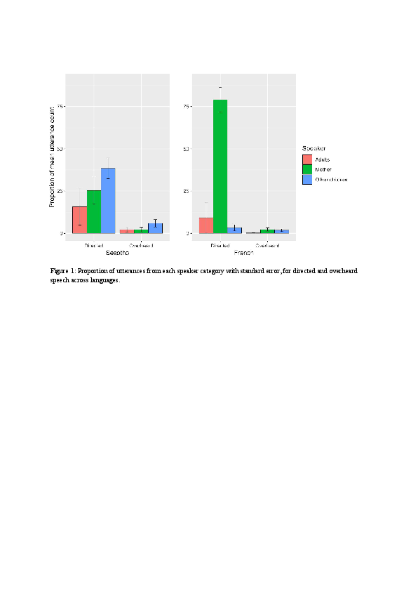

#### Amount and quality of input across speakers: analysing Sesotho and French corpora

[*Georgia Loukatou, Camila Scaff, Katherine Demuth, Alejandrina Cristia, Naomi Havron*](./authors.md)

georgialoukatou@gmail.com

Most language acquisition research is based on Western, Educated, Industrialised, Rich, Democratic (WEIRD) communities (Henrich, Heine & Norenzayan, 2010), where the primary caregiver is the mother. Mother-child dyad speech has long been the focus of early input studies, despite evidence suggesting that non-maternal input can be important for language outcomes (e.g. Demuth, 1986). Additionally, in many communities (particularly non-WEIRD ones), interaction occurs with multiple speakers rather than mostly the mother (e.g. Casillas, Brown & Levinson, 2019). Yet, few studies describe child-directed speech (CDS) from various speakers, and even fewer investigate this across cultures (see Shneidman & Goldin‐Meadow, 2012). 

In this study, we analyse speech produced around and to children by their mother, other children and adults, in two diverse cultures. We ask who produces the input, and how much of it is child-directed. We also ask whether different speakers vary in terms of utterance length, function (ratio of questions) and lexical diversity. To answer these questions, we annotated three corpora. The non-WEIRD Demuth corpus (Demuth, 1992) in the Sesotho language was recorded in non-industrial South African Lesotho. It contains input to three toddlers aged 2;1-3;3 years. We also annotated recordings from the WEIRD Lyon and Paris corpora (Demuth & Tremblay 2008; Leroy, Mathiot & Morgenstern, 2009) for three children- those with siblings, and the same age range as in the Demuth corpus.

More than 80% of input is child-directed for both French and Sesotho. On average, 79% of French CDS utterances comes from mothers, whereas in Sesotho only 25.3% does (Figure 1). Other children (siblings and peers) provide 3.3% of French CDS, when in Sesotho it corresponds to 10 times that proportion (38.5%). Other adults provide 9.2% of French CDS, versus 15.8% in Sesotho. We ran a mixed-effects linear regression predicting the relative amount of input from different speakers at each session, including a random intercept for target child. The independent variables were the speaker category (mother, children, adults), language (Sesotho, French) and their interaction. There were significant interactions; the ratio of speech from mothers was lower in Sesotho than French (β =-0.27, SE =.0.41, t=-6.31, p<.001), but that from other children was higher (β =0.19, SE =.0.48, t =3.91, p=.002). There were differences between languages in utterance length, function and lexical diversity of CDS, but no differences across speakers in utterance length and lexical diversity. However, children asked considerably less questions in both Sesotho and French (Figure 2).

Thus, CDS is significantly prevalent over overheard speech for both settings. However, the input composition is dramatically different; maternal input is more dominant in the WEIRD corpora compared to the non-WEIRD one. In the latter, other children's input is more prevalent than maternal input, consistent with previous non-WEIRD descriptions. Interestingly, in terms of speech quality, other children’s and adults’ CDS present similarities with maternal speech within each culture. These results invite further cross-cultural early input research, in order to check if these speech compositions and qualities are representative of WEIRD and non-WEIRD quantifiable distinctions, and the impact these might have for language development.

---

