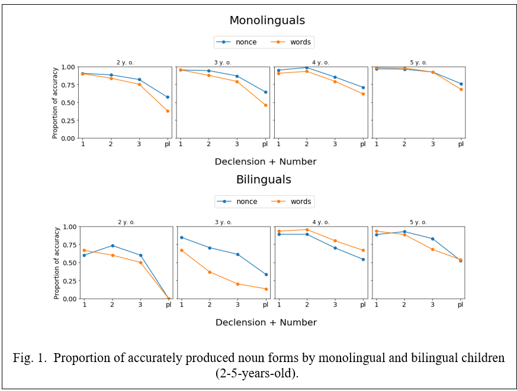

#### Acquisition of noun case inflections by Russian monolingual and Russian-English bilingual children

[*Ladinskaya N., Chrabaszcz A., Na Lopukhina*](./authors)

ladinskaya.ninaaa@gmail.com

Acquisition of case in Russian presents difficulties for both monolingual and bilingual children due to the syncretism, allomorphy of case forms, and a large number of cases (Gagarina and Voeikova 2009). We examined whether age-matched Russian monolingual children and Russian-English bilingual children follow the same timeline in the acquisition of Russian case inflections. For this purpose, we identified quantitative and qualitative differences in their case form productions for real and novel words (pseudowords). In the bilingual data of this language pair, it is interesting whether the rich inflectional Russian morphology system will be vulnerable to the influence of the poorer morphology of the English language. 

54 Russian monolingual children and 17 Russian-English bilingual children (age range 2 to 5 years old) have taken part in the study so far (data collection is in progress). In the first part of the experiment children named real objects corresponding to 24 real words (picture-naming task) then they completed the sentence (sentence-completion task) e.g., (trainNOM) “The children are riding the ... (trainPREP)”. For nonexistent objects, the experimenter named the object in isolation, e.g., (vomakaNOM), and asked the child to repeat it (repetition task) and then complete the sentence with the form of the pseudoword that s/he considered fit for the situation. Prompts were constructed to bias the children’s responses towards the use of a noun form in one of the five oblique Russian cases in singular and plural forms, across three declensions. The words denoted everyday objects and animals, AOA was by 2 years (based on Akinina et al. 2016).

Differences between monolinguals and bilinguals: 2-3-year-olds monolinguals substituted oblique case endings with the nominative case, and stopped to make such errors at 4-5-year-old. Bilingual children continued to make such substitutions even at 4-5 years of age. The effects in both monolingual and bilingual groups: the plural case forms presented more difficulty compared to singular forms (Fig. 1), in line with previous studies (e.g., Schwartz and Minkov 2014), 3rd declension (the rarest) presented the biggest challenge compared to other declensions, the instrumental case and genitive case were the most difficult. Also, we found that children tended to substitute zero inflections in plural forms with the more salient, transparent, and stressed –ov,-ev endings, supporting the idea of ‘inflectional imperialism’ (Slobin, 1966). 

The bilingual children tend to substitute oblique cases with nominative form even at 5 years and we can assume that bilinguals seek to simplify the morphological system under the influence of the English language. 

References 

Akinina Yu., Grabovskaya M., Vechkaeva A., Ignatyev G., Isaev D., Khanova, A. 2016. Biblioteka psiholingvisticheskih stimulov: novye dannye dlja russkogo i tatarskogo jazyka. In Yu. Aleksandrov & K. Anokhin (Eds.), The Seventh International Conference on Cognitive Science (pp. 93–95). Moscow: Institute of Psychology of Russian Academy of Sciences.

Gagarina N., Voeikova M. 2009. Acquisition of case and number in Russian. Development of nominal inflection in first language acquisition: A cross-linguistic perspective, 179-215.

Horst J. S., Hout M. C. 2016. The Novel Object and Unusual Name (NOUN) Database: A collection of novel images for use in experimental research. Behavior research methods, 48(4), 1393-1409.

Slobin D. I. 1966. Acquisition of Russian as a Native Language. In F. Smith & G. A. Miller (eds.), The Genesis of Language. A Psycholinguistic Approach. Proceedings of a Conference on Language Development in Children (Cambridge, MA, and London, MIT Press).

Schwartz M., Minkov M. 2014. Russian case system acquisition among russian–hebrew speaking children. Journal of Slavic Linguistics, 51-92.

---

