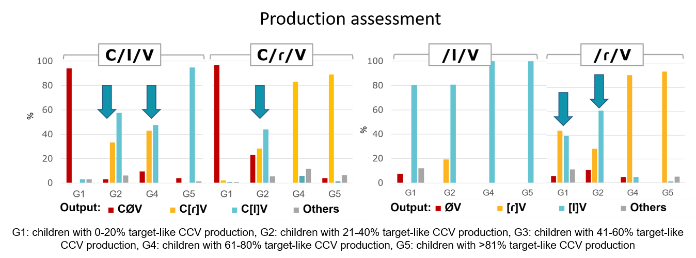
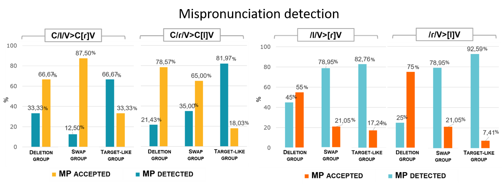

#### C[l]V is not a good enough C/ɾ/V, even if you say so: Asymmetric mispronunciation detection of liquids in Brazilian Portuguese

[*Andressa Toni*](./authors.md)

andressa.toni@usp.br

This study investigates the role of syllable structure on the production and perception of liquids by children learning Brazilian Portuguese (BP) as their first language. In BP, lateral /l/ and tap /ɾ/ are phonemes allowed in both simple (CV) and branching (CCV) onsets, as in /salada/ ‘salad’, /piɾata/ ‘pirate’, /plaka/ ‘signal’, /pɾato/ ‘plate’. However, there is a distribution bias in this language favoring laterals in simple onsets and taps in branching onsets, a tendency that could lead to a contrastive underspecification in CCV since no minimal pairs between /l/ and /ɾ/ occur in this syllabic position, and more than 85% of all CCV word types are /ɾ/-formed. Considering this asymmetry, our aim is to discuss whether liquids would have fully specified representations on children’s stored lexical forms throughout phonological development. We argue for developmental effects and syllable structure effects on the segmental (under)specification of the [lateral] feature that distinguishes /l/ and /ɾ/ in BP. To verify how this bias affects the child’s grammar, a mispronunciation detection task assessed if both CV and CCV would tolerate liquid substitutions, and if both substitution directions (/l/→[ɾ]; /ɾ/→[l]) would be equally detected by the child. 11 children (3-6 years old) were pre-tested in a word-repetition task and grouped according to their own productions (Graph1): Target-like Group (accurate liquid production in CCV/CV); Swap Group (CCV production with consistent liquid swaps in both directions; CV mostly adult-like); and Deletion Group (consistent non-adult liquids in CCV/CV). Results (Graph2) show that Target-like Group could detect mispronunciations in both CV/CCV contexts and liquid directions, as expected. Deletion Group accepted /ɾ/CV→[l]CV mispronunciations more than /l/CV→[ɾ]CV, but in CCV both mispronunciation directions were accepted. Swap Group children presented distinct production patterns, half of them tending to /ɾ/CCV→[l]CCV swaps (also affecting CV production) and half tending to /l/CCV→[ɾ]CCV (with adult-like CV production). Despite their opposite production tendencies, however, /ɾ/CCV→[l]CCV mispronunciations were detected more than /l/CCV→[ɾ]CCV, matching the input bias and pointing out that children’s mispronunciation detection is aligned with the input, not with their own outputs. In CV, liquid substitutions were also productively detected by this group, suggesting that different articulatory paths are not leading to (or are not driven by) different perceptual paths, both driving to the construction of similar phonological representations. Results from Swap Group and Deletion Group also suggest that the construction of these representations is influenced by syllable type and by the phonotactic development of the child: when production is unstable, mispronunciations on the unstable structure are accepted if they go towards the input bias. This pattern suggests a syllable effect on perception: CCV and CV present asymmetrical detection patterns, favoring different segment directions according to the input. The relation between unstable production and mispronunciation acceptance also suggests that the input’s dominant liquid for a syllable type (not the children’s own production tendencies) will compete with /l, ɾ/ for its detection while they are not licensed into the syllable. This competition supports the view that an underspecified liquid is first represented in lieu of the actual /l, ɾ/ segments, reflecting the most frequent segment in the input for CV and CCV syllables. On the other hand, the concrete liquid production in CV and CCV is individually variable, and the factors guiding this variability (such as segmental stability, coarticulatory difficulties, covert contrasts) are currently being investigated. We conclude that both syllable structure and syllable development play a role on the specification of the segmental properties of /l, ɾ/ on the phonotactic development of BP speaking children.

---

