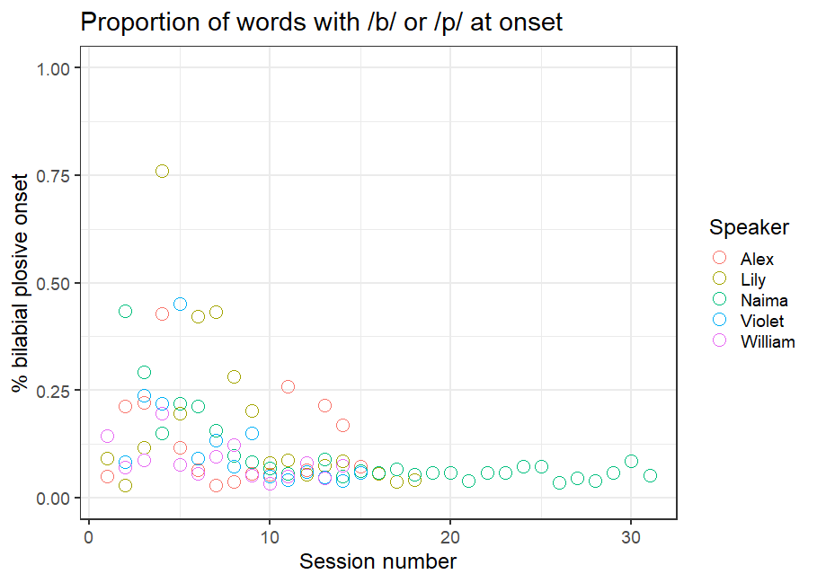
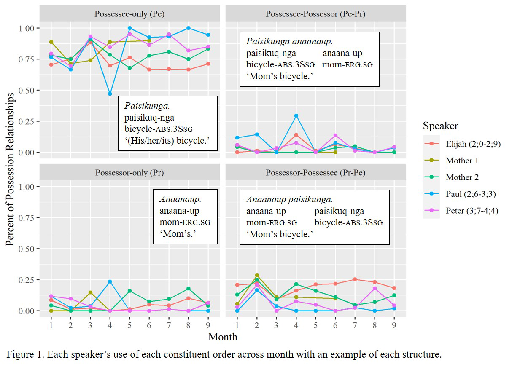

# For review only---DO NOT CITE

## Abstract 101

### Measuring phonological systematicity in infants’ early words

Early in development, infants’ words are often very simple in structure: Early productions are phonologically systematic (Laing, 2019; Vihman, 2016), and reliant on phonological structures that are simple to produce, such as consonant harmony (/beibi/ to represent baby) and open CV syllables (/da/ to represent dog). Furthermore, many of infants’ earliest words are phonologically similar: in data from their bilingual (English-Spanish) daughter’s early word acquisition, Deuchar and Quay (2000) show that 13 of her first 20 words are produced with a CV structure, and many words are phonologically identical: she produces car, clock, casa ‘house’ and cat as /ka/, and papa ‘daddy’, pájaro ‘bird’ and panda as /pa/. This points to continuity in the transition from babble to words; Vihman (2017) proposes that infants draw on what is most accessible to them in early word production, with earliest words matching the simple structures and stop consonants produced in babble. 

Here I analyse the phonological similarity of infants’ developing lexicon. Using data from the Providence corpus (Demuth et al., 2006), I analyse over 140,000 word productions from 5 infants (2 males) between ages 0;11 to 3;10. Measures of phonetic and phonological distance determine the similarity of each word in a recording session with each other word in the same session, and cluster analysis is used to identify clusters of phonologically- and segmentally-similar productions. A smaller number of larger clusters within a session suggests systematicity within that given session; this indicates that the infant is drawing on a smaller number of phonological resources (fewer consonant types, more similar phonological structures) in early word production. I hypothesise that systematicity will be higher in earlier sessions, as infants over-generalise well-rehearsed consonants and structures by adapting or simplifying target word forms to these. In later sessions, I expect to see a reduction in systematicity – indicated by more smaller clusters – as infants move towards a more target-like set of lexical items. 

Segmental and phonological distance is quantified using methods adopted from Monaghan and colleagues (2010), and analyses draw on variability-based neighbourhood clustering models (outlined by Gries and Stoll, 2009) and growth curve models. Preliminary models testing segmental and phonological systematicity over time show a significant effect for the kinds of consonants and structures in infants’ early words (Consonants: χ2(2)=12.25, p<.01; Structures: χ2(2)=112.76, p<.001; generated via nested model comparisons). Closer inspection of the results shows a significant decrease in the use of early-learned consonants such as /b/ over time (β=-6.78, t=-3.29; see Figure 1), and a significant increase in the production of closed syllables over time (β=.001, t=5.4). Findings reveal preliminary evidence towards early systematicity giving way to wider phonological variability in infants’ developing lexicons.

