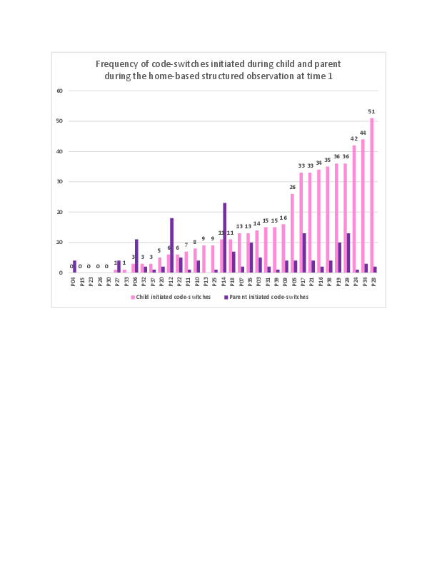

# For review only---DO NOT CITE

## Abstract 2

### Parental Responses to Child Code-Switching in 3 and 4-year-old Spanish-speaking Dual Language Learners

Increasing numbers of children around the world are dual language learners (DLLs) who are learning a minoritized language at home and a socially dominant language in school. Following school entry, DLLs tend to shift towards majority language dominance and often experience declining skills in their minoritized home language (Castilla-Earls et al., 2019; Honig & Xu, 2012). However, the wide individual variability among DLLs’ home language proficiency raises the question of whether specific parental language practices can contribute to sustained growth in a minority home language. Seminal case studies of early bilingual development have identified specific parental discourse strategies in response to children’s code-mixing (Döpke, 1992; Lanza, 1997). These range from what Döpke referred to as high-constraint strategies that require a verbal response from the child in the target language to low-constraint strategies that may model the target language but do not require a verbal response. In these case studies, high-constraint strategies were associated with greater active use of the target language by the child, but it remains to be seen if such strategies are used by a larger and more socioeconomically diverse group of families that speak a minoritized home language in the United States. 

     The current study examines the prevalence of these discourse strategies and other parental responses to child code-switching among Spanish-speaking parent-child dyads. It also explores the associations among particular parental responses and children’s expressive vocabulary skills in the minoritized language before and after children are enrolled in preschool. The data come from home-based observations of 35 Spanish-speaking parents and their 3 or 4-year-old child in the northeastern United States. Each dyad was observed interacting around a wordless picture book, a set of dollhouse furniture, and a puzzle. Children were assessed in Spanish using the CELF-P2 and the TVIP during the initial home visits. Thirty-two dyads participated in an additional online visit nine months later, during which the CELF-P2 expressive vocabulary subtest was administered in Spanish. Each observation was transcribed and coded for frequency and type of code-switches to English. 

     We found that children used a greater proportion of English tokens and initiated more switches to English than their parents (see Figure 1). We then developed a qualitative coding scheme based on prior literature and new categories that emerged from our data to describe the types and frequencies of parental responses to child-initiated code-switches. In this presentation, we will describe the relations among parental responses to code-switching and child Spanish skills at each time point. Our findings will contribute to our understanding of how parents can support their child’s maintenance of a minoritized home language during early childhood. 

References

Castilla-Earls, A., Francis, D., Iglesias, A., & Davidson, K. (2019). The impact of the Spanish-to-English proficiency shift on the grammaticality of English learners. Journal of Speech, Language, and Hearing Research, 1–16. https://doi.org/10.1044/2018_JSLHR-L-18-0324

Döpke, S. (1992). One parent, one language: An interactional approach. John Benjamins Publishing Company.

Honig, A. S., & Xu, Y. (2012). Chinese immigrant families and bilingualism among young children. NHSA Dialog, 15(4), 303–318. psyh. https://doi.org/10.1080/15240754.2012.721025

Lanza, E. (1997). Language mixing in infant bilingualism: A sociolinguistic perspective. 

Oxford University Press.

