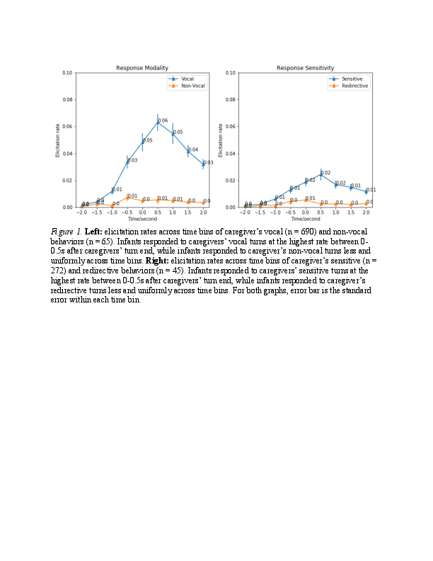

# For review only---DO NOT CITE

## Abstract 30

### Trivers-Willard hypothesis tested using daylong recordings

The amount of speech produced by adults varies between families, and its determinants are still poorly understood (Ellwood-Lowe et al., 2020). Speech quantity can be construed as a type of investment in children because 1. parents who talk more to their children are spending some effort on the child, and 2. the child can benefit from this effort, since studies have shown over the past years that children with more plentiful language environments subsequently show better language skills (Huttenlocher et. al. 1991; Rowe, 2006; Grantham-McGregor & Smith, 2016). Evolutionary biology, which has been trying to determine trends in parental investment for several decades, provides a novel perspective on the question of why some parents talk more to their child than others. Specifically, the Trivers-Willard hypothesis proposes differences in investment from parents to their sons and daughters as a function of the parental social status and resources. We test this hypothesis reusing data archived in Homebank (Warlaumont et. al.; 2016, Bergelson, 2017). We drew 14 measures of speech quantity and derived the first principal component as a measure of parental investment. The means of language investment were higher for higher SES compared to lower SES, regardless of the gender of the children (Figure 1). The mean difference between the language investment was larger for male children than for female children for higher SES, and was larger for female children than for male children for lower SES. Kruskal-Wallis test was significant (chi-squared = 13.273, p-value = 0.004), indicating that the repartition of the language investment across the sex-SES groups differ. The pairwise-wilcoxon test indicated one significant difference between higher SES males and lower SES males after correction for multiple comparisons (p-value = 0.001). These results align with Trivers-Willard's predictions. They were not pre-registered and remain preliminary because of small sample size, futur extensions with larger dataset and pre-registration could be necessary for further investigations.

