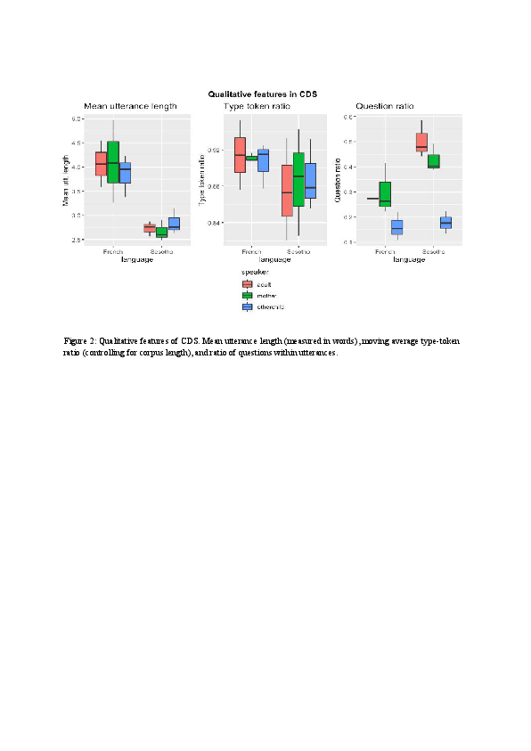

# For review only---DO NOT CITE

## Abstract 89

### The Relation between 9-month-olds' Neural Sensitivity to the Rhythm of Speech and their Word Segmentation ERP response

Infants use rhythmic information as one of the important cues in word segmentation (Jusczyk et al., 1999). However, little is known about the neural mechanisms behind this sensi-tivity to rhythm. Neuronal oscillations in the auditory cortex track the rhythm of the speech in-put, and synchronize with the incoming speech envelope (Giraud & Poeppel, 2012). In adults it has been found that this cortical tracking makes speech processing easier (Cason & Schön, 2012). Cortical tracking of the speech envelope is also present in infants, especially when lis-tening to infant-directed speech (Kalashnikova et al., 2018). It is unclear however what the re-lation is between infants’ neural sensitivity to the rhythm of speech and word segmentation. 

The current study aims to gain insight into the functional relevance of infants’ cortical tracking of speech for word segmentation. The following questions are investigated: Does the rhythm of the speech signal influence infants’ ability to segment words from continuous speech? Does infants’ speech-brain coherence differ between rhythmic and non-rhythmic speech? How is infants’ neural sensitivity to speech rhythm related to their word segmentation ERP responses? 

To answer these questions, 65 monolingual Dutch 9-month-old infants participated in a two-session experiment (one rhythmic and one non-rhythmic session) during which EEG-data was collected. Each session consisted of 20 blocks, with each block containing a familiariza-tion phase of eight sentences and a test phase of four words. The eight sentences each con-tained a repetition of a bi-syllabic low-frequent word with a strong/weak stress-pattern. In the test phase the familiarized target word and an unfamiliar word were presented each two times in isolation. To increase rhythmicity all sentences consisted of thirteen syllables with alternating strong/weak syllables. Stimuli were recorded with a metronome, resulting in a syllabic rate of 3.2 Hz. For the non-rhythmic sentences the syllable duration was manipulated by speeding up or slowing down the speech across several syllables. The fragment with the target word was not adjusted, to make sure its duration remained the same between conditions. 

Segmentation of the target words will be inferred by looking at the ERP word familiarity effect (Kooijman et al., 2005), comparing within the test phase the ERPs evoked by the isolat-ed target words with the ERPs evoked by the unfamiliar words. Speech-brain coherence during the familiarization phase will be assessed by looking at the consistency of the phase difference between the EEG signal and the speech amplitude envelope. We will specifically assess the frequencies of 3.2 Hz (syllabic rate) and 1.6 Hz (stress rate). It is expected that infants show enhanced word segmentation ability and have stronger speech-brain coherence in rhythmic compared to non-rhythmic speech. Additionally, it is expected that infants with a higher neural sensitivity to rhythm, especially for the stress rate, will show an enhanced word segmentation ERP response. Data for this study has been collected and the results will be presented at the meeting. The outcome will inform about the functional relevance of the cortical tracking of speech for infants’ word segmentation.

