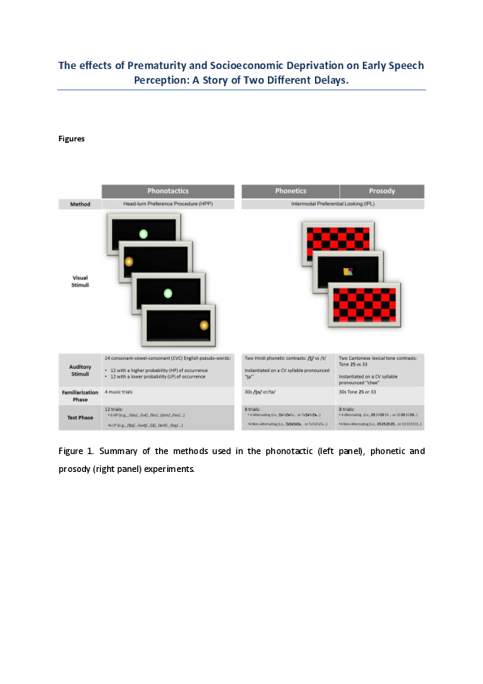

# For review only---DO NOT CITE

## Abstract 98

### How young children integrate information during word learning

Language is learned in complex social settings. Children can learn the meaning of novel words by reasoning about the speaker’s underlying intentions, that is, by making pragmatic inferences (Tomasello, 2003). Yet, pragmatic inferences require integrating multiple information from the social context of the utterance. While many studies have shown that children make pragmatic inferences based on a range of different information sources (see Bohn & Frank, 2019 for a review), the process by which information is integrated is rarely studied directly. Here we address this gap. 

We focus on three information sources that operate on different timescales: (1) expectations that speakers communicate in a cooperative and informative manner license inferences in the moment, (2) semantic knowledge which stores previously learned word-object mappings and continuously grows during early development and (3) common ground that is built up over the course of a social interaction. 

We present a formal theory of the integration process in the form of a Bayesian model of Gricean pragmatics from the rational Speech Act (RSA) framework. RSA models are characterized by their structure in which hypothetical interlocutors make inferences about the interpretation of literal utterances based on the assumption that partners communicate in an informative way (Goodman & Frank, 2016). We relate the three information sources to parameters in the model architecture and generate a priori model predictions for how they should be integrated in a word learning scenario. The model also presents an explicit theory of development. It assumes that, while children’s sensitivity to the individual information sources increases with age, the way integration proceeds remains constant.

We test the predictive and explanatory power of the model on the basis of new experimental data collected with two to five year old children (N = 368). Children were tested on a tablet in a US children’s museum. All experiments, models and analysis were pre-registered. The model predictions were closely aligned with childrens’ learning and the model explained 79% of the variance in the data. 

We also formalized a series of competitor models to test alternative hypotheses about information integration. First we considered a range of lesioned models according to which children follow the heuristic “ignore X” (with X being one of the information sources) when multiple information sources are presented together. Using Bayesian model comparison via marginal likelihood of the data, we found little support for the use of such heuristics. In fact, the data was several orders of magnitude more likely under the rational integration model compared to any of the lesioned models (Fig. 1). This result shows that children considered all available information sources. 

Next, we considered alternative hypotheses about the integration process itself. According to a biased integration model, children also consider all information sources (also in an age specific way), but they are biased towards some of them. Model comparison strongly favored the rational integration model. Finally, we considered a model that assumed that children are in fact biased towards some information sources, but that this bias changes with age. This presents an alternative view on the locus of development. The rational integration model assumes that childrens’ sensitivity to individual information sources changes with age but that the integration process itself remains constant. When directly compared, the rational integration model provided a much better explanation of the data and the underlying developmental process

This research shows that children flexibly integrate multiple information sources during language learning. To answer the question of how children integrate information, we presented a formal cognitive model that assumes that information sources are rationally integrated via Bayesian inference.

