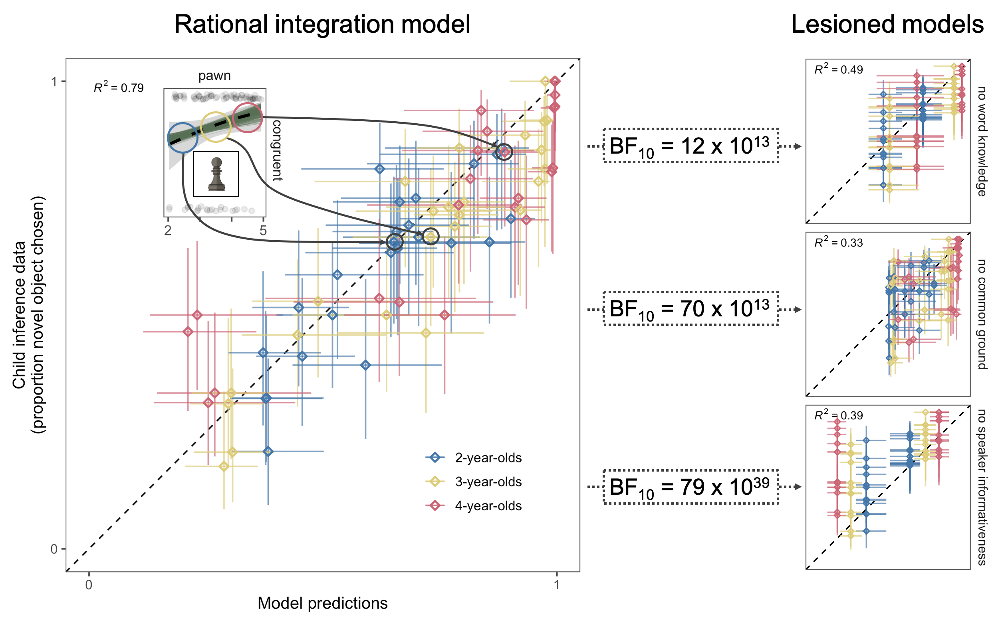
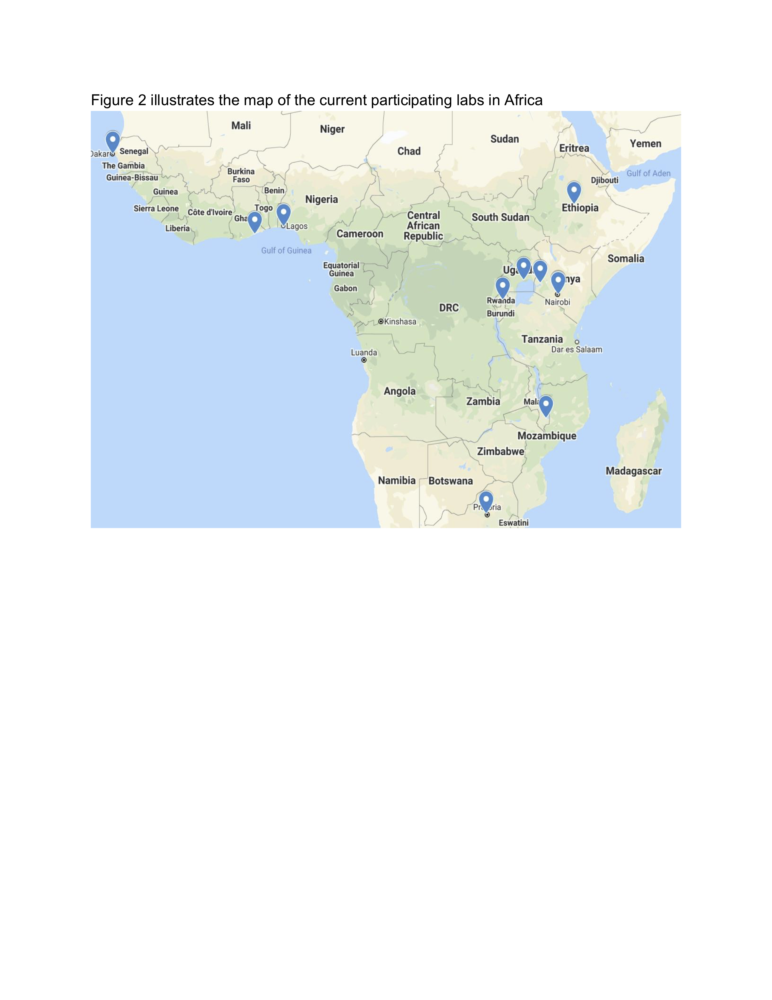

# For review only---DO NOT CITE

## Abstract 99

### Opportunities and challenges of setting up global large-scale replications: ManyBabies1-Africa

From early in life, infants show a preference for infant-directed speech (IDS) over adult-directed speech (ADS). Infants’ attention to IDS may be beneficial for their language development (e.g., Spinelli, Fasolo, & Mesman, 2017), pointing to the importance of examining infants’ IDS preference across different ages and language backgrounds. Indeed, many studies (including a recent large-scale multisite study – ManyBabies Consortium, 2020) have shown that infants of different ages and from various language backgrounds have a preference for (North-American) IDS over ADS. However, almost all past studies examined infants in Western, educated, industrialized, rich, and democratic (WEIRD) populations (e.g., North America), with minimal inclusion of infants from non-WEIRD populations, as defined by geography and/or socioeconomic status (Figure 1). To our knowledge, there is no study in the current literature examining infants’ IDS preference in any country in Africa, a continent home to over 4000 languages. Thus, we do not know whether infants across different cultures show the same IDS preference observed chiefly in WEIRD and almost exclusively in rich, industrialized societies. This sampling bias is a problem for applying theory and generalizing findings about infants’ IDS preference to infants growing up in different cultures and languages. Our study addresses this problem by extending the ManyBabies Consortium (2020) paradigm to understudied African populations.

We present a planned large-scale, multisite study that will investigate whether infants show a preference for IDS over ADS in Africa. We have experienced challenges that are specific to the diverse cultures and the populations (e.g., negative attitudes towards clinical populations in some parts of Africa), as well as challenges related to supporting researchers with lower resources and less experience in running experiments (e.g., lack of experimental equipment). By adapting our strategies to fit the cultures and resources, we successfully gathered a team of researchers in Africa, organized a multi-day training workshop in Kenya in Winter 2020, and worked with laboratories to set up the experimental paradigm. Currently, 11 labs in sub-Saharan Africa (Figure 2) have joined and are projected to collect data from over 300 infants in total. These labs cover regions in central-east (e.g., Kenya), the west (e.g., Senegal) and the south (e.g., South Africa). We will collect data across a number of diverse regions in Africa, and will explore whether variations in infants’ demographic factors within non-WEIRD societies may affect their IDS preferences. Further, with a larger sample size, our study can also provide a reliable estimate of the IDS preference effect size in Africa, enabling comparison of infants’ IDS preference in existing WEIRD (e..g, North America) and high-income non-WEIRD (e.g., Singapore) samples. 

In sum, this study will measure the generalizability of a key infancy finding – infants’ IDS preference – to more demographically diverse populations and will provide important insights into how variation in infant’s demographics in these societies may affect their IDS preference. This work represents the ManyBabies Consortium's goals and efforts to provide a more global and comprehensive picture of infancy research.

