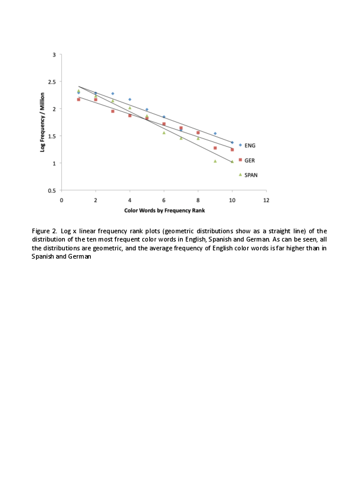
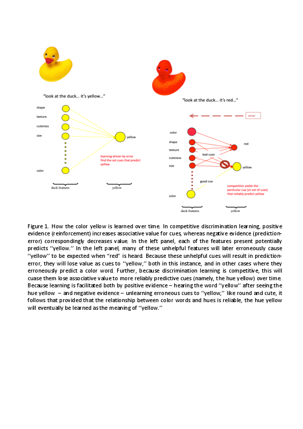

# For review only---DO NOT CITE

## Abstract 7

### Learning, Variation and Alignment: How Cross Linguistic Differences Reveal the Functions of Color Words

Color words are frequent, appearing early in children’s vocabularies. Yet although they are aware these words relate to colors, children struggle to learn the associations between color words and hues. From a learning perspective, this problem can be seen to stem from the ubiquity of color, which renders color words heard in isolation uninformative—in any multi-hued context, how is a child to learn which color present is “green”? Ramscar et al (2010) show that once children learn nouns, the properties of the objects they reference can serve as cues to color words, enabling children to use the systematic covariance of colors across objects and scenes to discriminate hue-color word associations (Fig 1). This model assumes objects serve as cues to words, allowing their features to compete as cues.  However, if this relationship is reversed (so words serve as cues), competition is eliminated. Experiments show this yields poorer discrimination learning, which is a problem for children learning English, where color words overwhelmingly precede nouns.  

Since an important question in communicative development is ‘what do children learn?’ it is worth emphasizing that the scenarios described above do not result in binary mappings between hues and color words, but rather systematic mappings between sets of features in context and set of contexts and labels. This has implications for our understanding of what words actually do. To help illustrate this point, we might ask, does it follow that children learn color words more easily in languages where adjectives occur post-nominally (e.g., Spanish “Casa Blanca,” vs.  English “White House”). 

To explore this, we collected distributional information for English and Spanish color words in several corpuses of adult and child-related speech and text. Analyses revealed that in each language, color words are geometrically distributed, such that a small set of basic color words accounts for the overwhelming majority of usage, and that English uses the set of most frequent color words between 25-50% more often than Spanish.

Note that from a learning perspective, what is important is not the frequency of these words but their relationships to events as signals unfold in real-time. Accordingly, we then examined the frequencies at which children will hear color words in positions useful to discriminating the cues relevant to color-word meaning, i..e., “the frog is green” etc., in English, or “la rana verde” in Spanish. This revealed that when it comes to the use of color words in ways that we might expect to help learning, the two languages are very much alike. 

This still leaves the question of what children actually learn about these words? The presence of gender in languages like Spanish and German makes nouns more predictable, and studies suggest that the distribution of pre-nominal adjectives in English serves a similar function (Dye et al, 2017; 2018). While Spanish largely eschews pre-nominal adjectives, German does not, and in a series of analysis of adult and child-directed speech we show that German color words are both less frequent that English color words (Fig 2), and that their use as pre-nominal modifiers is more formulaic, reflecting the information provided about nouns by the German gender system. 

These results thus offer a more nuanced view of both the learning of color words and their use, and underline the importance of studying cross-linguistic variance. While it is true that children struggle to learn the meaning of color words, this is not only because of their ubiquity (Ramscar et al, 2010), but also because their use is often grammatical rather than ‘semantic’ (they serve to make nouns predictable, rather than adding content). What the evidence seems to show is both that children master the grammatical function of color words quite rapidly, and also that this function has eluded most linguistic analyses to date.

