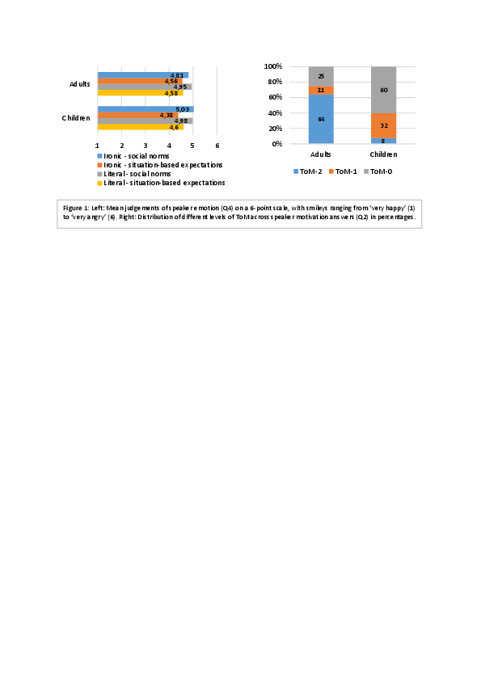
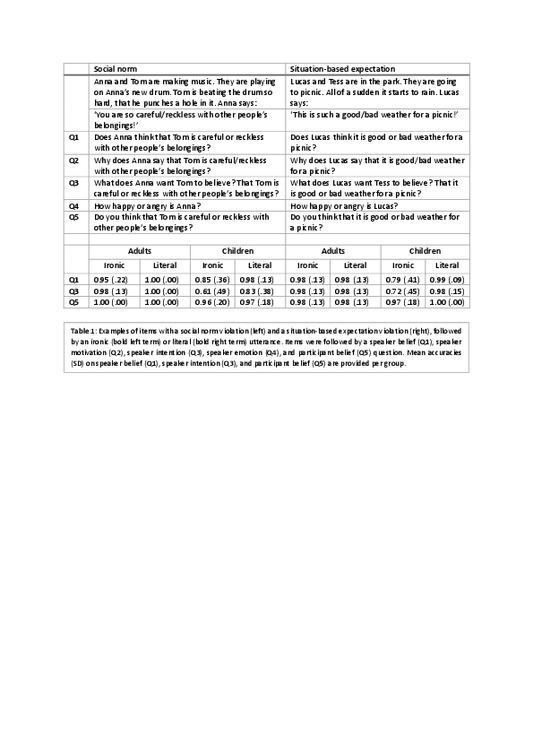

# For review only---DO NOT CITE

## Abstract 19

### Individual variability in children’s assessment of ironic speaker motivations

The ironic interpretation of an utterance such as “Great weather!” requires complex reasoning skills. That is, listeners need to reason about what the speaker believes (speaker belief), what the speaker intends the listener to believe (speaker intention), and what emotion towards the situation the speaker wants to convey (speaker attitude). Although children begin to understand irony around the age of 5, full mastery requires further cognitive development, including Theory of Mind (ToM; Filippova & Astington, 2008), as well as social development, including experience with situations in which irony occurs (Pexman & Glenwright, 2007). For example, irony often occurs in response to violations of certain norms that we live up to (e.g., not treating someone’s belongings with care), known as a normative bias (Wilson, 2013). As children know and enforce social norms already from the age of 3 (Schmidt & Tomasello, 2012), we hypothesize that this normative bias contributes to children’s understanding of irony. To test this hypothesis, we compared irony understanding in situations with social norm violations to situations with situation-based expectation violations (e.g., bad weather when having a picnic in the park). Since the latter are not based on social interactions and therefore lack the advantage of children’s knowledge of norms, we predict better irony understanding in situations with social norm violations. As fully grasping an ironic utterance’s meaning requires children to understand why a speaker uses irony (speaker motivation), we investigated their interpretations of speaker motivations, using a ToM-based categorization scheme, ranging from ToM-0 type answers (no reference to beliefs or intentions) to ToM-2 type answers (a second-order reference to beliefs or intentions).	

 	42 monolingual Dutch children (6;11-9;4, M=8;1) and 20 Dutch adults (20;8-29;3, M=22;8) participated in an irony comprehension task (Table 1) with a 2x2 design with the factors ‘utterance’ (ironic, literal) and ‘violation’ (social norm, situation-based expectation). Participants listened to twelve recorded stories including a violation of either a norm or an expectation, each followed by an ironic or a literal utterance. Participants answered questions tapping into speaker belief (Q1: ToM-1), speaker motivation (Q2), speaker intention (Q3: ToM-2), speaker emotion (Q4), and participant belief (Q5: ToM-0) as control question. 	

 	Results on the binary questions Q1, Q3 and Q5 (Table 1) show lower accuracies for children compared to adults, but contrary to our prediction, no higher accuracy for social norm violations compared to situation-based expectation violations. Results on speaker emotion question Q4 (Figure 1) show that children (β=1.3188, p<.01) and adults (β=1.5933, p<.05) perceived emotions as more negative in situations violating social norms than in those violating expectations. Children also perceived emotions as more negative in literal utterances compared to ironic utterances (β=.5498, p<.05). Results on speaker motivation question Q2 (Figure 1) reveal a majority of ToM-2 answers for adults, a majority of ToM-0 answers for children, and individual variability in the quality of answers.

 	Children do not perform better on understanding irony based on social norm violations compared to situation-based expectation violations. However, social norm violations lead to more negative judgements of speaker emotions, indicating that social norms influence adults’ and children’s understanding of speaker attitudes. Children’s less negative emotion judgements in ironic utterances compared to literal utterances confirm an early sensitivity to the muting function of irony (Dews & Winner, 1995); its power to soften a criticism. Individual differences in speaker motivation interpretations raise the question which linguistic, cognitive, and social factors are of influence on children’s reasoning about speaker motivations.

