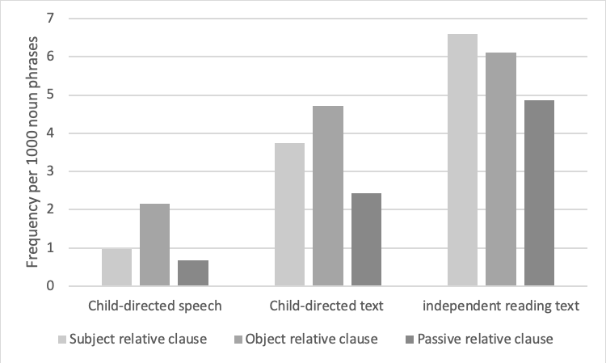

# For review only---DO NOT CITE

## Abstract 34

### The acquisition of optionality in Akan wh-questions

Previous research on the acquisition of wh-questions over the years suggests that children are constrained in the derivation of wh-questions as a consequence of complex syntactic movement operations. Hence, for languages that offer variations to its speakers (e.g. French), children may favour the less complex structure that is available in their input. In previous spontaneous speech analyses (Crisma, 19992; Hamann 2000, 2006) and experimental studies (see Zuckerman & Hulk, 2001; Hamann, 2006), it has been shown that children acquiring French use the in-situ wh-questions whereas wh-questions that require inversions and overt movement are initially absent. This indicates that children initially have a preference for in-situ wh-questions over ex-situ questions. These findings provide evidence for the role of the Derivational Complexity Hypothesis (DCH)/Derivational Complexity Metric (DCM) in the acquisition of French. The DCH (Jakubowicz, 2004) claims that during language development, less complex derivations are input convergent, that is, correctly spelled out or pronounced before more complex ones. The assumptions of the DCM (Jakubowicz, 2005) are that, merging αi n times gives rise to a less complex derivation than merging αi (n+1) times. Also, internal merging of α gives rise to a less complex derivation than internal merge of α+β. We tested the predictions of the DCH and the DCM in another language, Akan – a language spoken in Ghana belonging to the Kwa, Niger-Congo group - that offers variation in the formation of wh-questions. We tested 44 Akan-speaking children (ages 4;0 – 4;11, N=21, M: 53.24 months, SD=3.30 and 5;0 – 5;11, N=23, M=64.65 months, SD=3.64) and 22 adults in a sentence repetition task. Participants were asked to imitate grammatical and ungrammatical who, what and where-questions. Stimuli were presented auditorily by the researcher. The grammatical question condition included both ex-situ and in-situ questions. An ex-situ grammatical sentence has an obligatory morpheme na which occurs after the fronted wh-word. For ex-situ who-questions, there is always an overt pronoun (resumptive pronoun (RP)) that replaces the fronted wh-word at the extracted site. However, there is no such overt RP at the extracted site in ex-situ where and what-questions.  In-situ grammatical sentences followed the SVO word order of the Akan language. The wh-word remains in its canonical position (at sentence final) without any movement. In the ungrammatical sentence condition, we used only the ex-situ structure but left out the obligatory clitic morpheme and the resumptive pronoun. This made it possible for us to test whether children would switch from the more complex ex-situ structure to the less complex in-situ structure or whether they would maintain the provided structure and fill in the obligatory missing morphemes in their corrections in the ungrammatical questions. Our findings showed that 4-and 5-year-olds as well as adults preferred to maintain the more complex ex-situ structure and inserted the missing obligatory morphemes rather than switching to the less complex in-situ question structure. Both child groups and adults make a difference between grammatical and ungrammatical sentences. They produced more exact repetitions in the grammatical sentences than in the ungrammatical sentences. We discuss our findings in the light of the DCH and DCM.

Keywords: Acquisition, wh-questions, Akan, in-situ structure, ex-situ structure, Derivational complexity.

