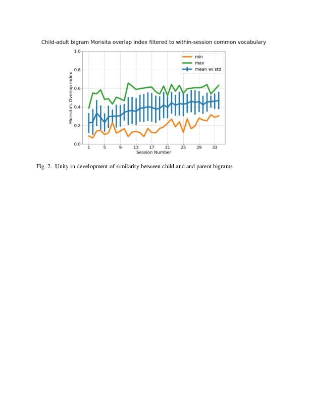

# For review only---DO NOT CITE

## Abstract 5

### Optimal Learning from Minimal Input: How Pirahã Infants Acquire Language

Recent trends in language acquisition research have focussed on the quantity of language spoken to children as a predictor of educational attainment and other cognitive measures. The so-called 30 million word gap controversy illustrates how researchers are seeking to show the precariousness of language development if not enough language is heard.  Other researchers have suggested that language learning is scaffolded with recasts and expansions of utterances that are indirect ways of correcting grammar, while others have suggested that joint attention is a crucial precursor to language learning.

Cross-cultural studies of language interactions between adults and young children have revealed several cultures where speaking to infants and children is rare. A recent systematic study by Schneidman and Goldin-Meadow (2012) showed that direct speech to Yucatec Mayan infants was relatively low (~ 55 utterances per hour on average), as compared to infants in the US, who heard a mean of 605 utterances per hour. In lieu of directed speech to infants and children, it has been suggested that overheard speech might serve as a substitute to directed speech.

The present study originated from naturalistic observations of everyday interactions of members of the Pirahã tribe who live on the Maici river in lowland Amazonia. The Pirahã live in a monolingual hunter-gatherer society that does not integrate with mainstream Brazilian culture. There is no system of writing, counting, representational art, or education. In studying and living with this tribe, it is informally apparent that adults almost never speak directly to preverbal infants, and only rarely to children who have acquired the early stages of language. Dan Everett has been working with the tribe for several decades, and Peter Gordon spent three summers working and living in Pirahã villages for up to 6 weeks at a time. On two visits, PG, set up video cameras to record naturalistic interactions within the village, and these videos are available on Databrary (2012). Filmed sessions recorded on six 2-hour tapes included spontaneous events -- when possible, the camera was left on a tripod unattended to capture naturalistic interactions. We used ELAN to systematically analyze adult-infant/child interactions and behaviors of the Pirahã villagers from these videos. We first coded situations as Opportunities to Interact (OTI), if two or more individuals were in close proximity within a scene. From the OTIs, we coded for direct speech, overheard speech, and instances of joint attention. We categorized non-adults into “preverbal infants” and “linguistically-fluent children” (approx. 4-10 years of age).

Of the 12 hours of video recording, there was only 38 minutes of talking -- the Pirahã spend large amounts of time sitting and not talking. Adult-to-infant directed speech occurred for only 16.876 seconds. For non-infant children, adult speech directed at them occurred for only 3.174 seconds. No utterances of direct speech appeared to be intended as ritualized language teaching - no conversational recasts or vocabulary expansion were found after translating these verbalizations. Also, in no cases was joint attention found as a precursor to direct speech. Since direct speech to infants and children was almost non-existent, their language input consisted almost entirely of indirect overheard speech or conversations between linguistically fluent children. The present data suggest that Pirahã speech of adults to infants is even more impoverished than previous studies of the Mayan Yucatec tribe or any previously documented group. These data suggest that systems of language learning vary considerably from culture to culture. Situations in which the source of input is almost entirely overheard speech have provided compelling evidence for infants’ and children’s almost optimal efficiency in mapping input language samples to developing internal representations of grammar.

