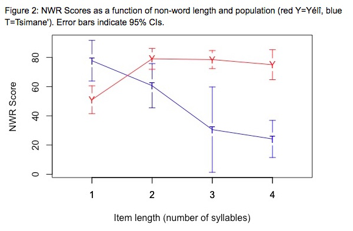

# For review only---DO NOT CITE

## Abstract 68

### Children’s linguistic environment and their use of sound symbolism in language acquisition

Sound symbolism is a non-arbitrary relationship between speech sounds and meaning and has been shown to help infants and toddlers learn words. Previous research has shown that monolingual children are sensitive to these sound symbolic features in the early stages of word acquisition but supersede this sensitivity between around two and four years of age by a preference for words (Thom & Sandhofer, 2014). Given the smaller vocabulary sizes in bilingual children, it has been hypothesized that bilingual children show a prolonged sensitivity for symbolic features, proposed as the wedge hypothesis (Petitto et al., 2012). With the current study we investigate the influence of different linguistic environments on sound symbolism at the age of 3 years to disentangle the factors of growing up with two languages vs. having smaller vocabulary. 

We tested 36 monolingual, 17 bidialectal and 23 bilingual children in a child-friendly adaptation of the guess meaning task (Dingemanse et al., 2016). Children guessed the meaning for ten auditory presented ideophones (words described as iconic) in Japanese, Korean, Semai, Siwu, and Ewe by choosing one of two visual meaning representations. Furthermore, parents filled in a questionnaire on their children’s label for 18 animals. Parents provided the percentages of children’s production of onomatopoetic sounds (“meow”) vs. common nouns (“cat”) for each animal.

Results revealed that monolingual children were less likely to choose the correct meaning for the ideophones compared to bidialectal and bilingual children (estimate = 0.374, SE = 0.175, p = 0.033) and that boys were more likely than girls (estimate = 0.506, SE = 0.177, p = 0.004). In the animal label questionnaire, we found that bilinguals used more animal sounds compared to monolinguals (estimate = 1.900, SE = 0.511, p < 0.001) and bidialectals used animal sounds comparable to monolinguals (estimate = - 0.562, SE = 0.525, p = 0.284). 

Taken together, the results confirm that being exposed to two very close languages results in a similar language acquisition as in monolinguals in the domain of animal labels (Bosch & Ramon-Casas, 2014). Beyond, they provide evidence that even a small variation in input as with two dialects and being a boy associated with smaller vocabulary prolongs the sensitivity to sound symbolism and goes hand in hand with a better guessing of ideophones at the age of three years. The findings indicate the assumption that smaller vocabulary and exposure to slightly different languages support symbolic flexibility.

