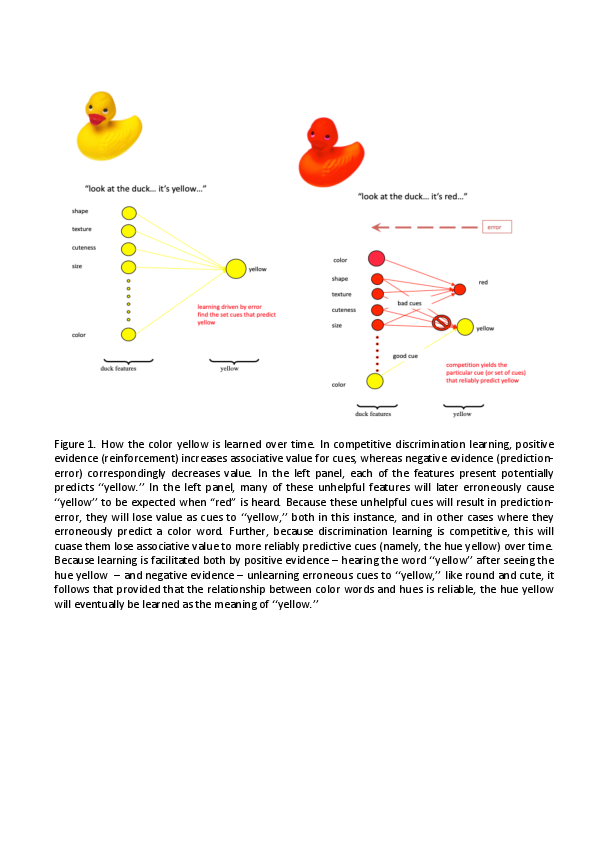

# For review only---DO NOT CITE

## Abstract 9

### Toddlers raised in multi-dialectal families learn words better in accented speech than those raised in monodialectal families

Many infants grow up in multi-accent environments, which offer rich but inconsistent language input, as words are produced differently across accents, providing no robust mapping between an acoustic signal and a word. For instance, in Oslo, 30% of population speak Norwegian as their second language, and among the remaining 70% of speakers, ~30% use a different dialect than the one spoken in Oslo area. Previous research has shown that brief exposure to multiple accents facilitates understanding of unfamiliar accents in infants with no prior multi-accent experience; yet, long-term exposure to accents (being raised in a bi-accent family) hinders word comprehension. 

The current study examined whether multi-accent variability affects infants’ ability to learn words and whether toddlers’ prior experience with accents modulates learning. To address these questions, we designed a child-friendly audiovisual tablet-based e-storybook ‘Krokko og Grynte på fisketur” and embedded four novel pseudowords into the story, each referring to a novel object. Two audio conditions were created: in the multi-accent condition, the audio narration was recorded in three distinct Norwegian accents, whereas in the single-accent condition, it was in one Norwegian accent. The e-book was presented, twice per day, to thirty 2.5-year-old Norwegian toddlers, in their kindergarten, for one week. Half of them were assigned to multi-accent and the other half to single-accent condition. Toddlers’ age, gender and vocabulary size were matched between groups. Word learning was assessed in a four-alternative forced-choice identification. 

The results revealed no differences between conditions, suggesting that multi-accent variability did not hinder toddlers’ word learning. Yet, in the multi-accent condition, toddlers exposed to dialects at home showed significantly larger improvements than toddlers growing up in uniformly-accented families, suggesting that accent exposure benefits learning in multi-accent environments, and thus revealing, for the first time, advantages of bi-accent home exposure on language development in an ecological setting.

