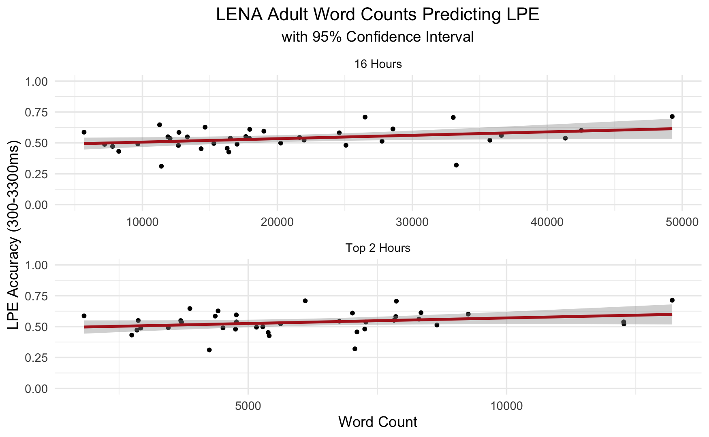

# For review only---DO NOT CITE

## Abstract 16

### Bilingual infants disengage faster and switch attention more frequently than monolingual infants

Infants adapt to the external world by sampling and modelling it. The more variable the environment, the more sampling (exploration) is required to build better models and make better predictions. Exposure to different environments may therefore result in different models and predictions. One variable in the infant’s environment is the number of languages that the child regularly hears. Infants who regularly hear two or more languages are necessarily exposed to more varied and less predictable language input than infants who regularly hear only one language (see, e.g., Bosch & Ramon-Casas, 2011). These ‘bilingual’ infants are also likely to receive less input from each language than ‘monolingual’ infants from their one language. Given these exogeneous sampling constraints, how does the bilingual infant keep pace (developmentally) with its monolingual peers? We propose that they do so by placing less weight on consolidating familiar information in order to orient sooner to (and sample) new stimuli. In other words, whereas monolingual infants are drawn to familiar stimuli so they can build detailed representations of their language environment, bilingual infants may err on the side of exploration and collect more samples from their more varied environments. Why might variation in language input affect attention? Building models of the external world may involve domain-general processes, including the integration of action, perception, and multisensory information processing.

Hypotheses

We hypothesised that infants exposed to bilingual environments would (1) more quickly abandon the visual processing of a stimulus to shift attention to a novel stimulus and (2) more frequently switch attention between two visual stimuli.

Methods and Results

We administered three eye tracking tasks to 7- to 9-month-old infants who were being raised in either bilingual (n = 51) or monolingual (n = 51) homes. Experiment 1 attempted to replicate the first (and one of only three studies) to find a bilingual advantage in infants (Kovacs & Mehler, 2009). Participants were presented with 9 pre-switch trials during which they learned to anticipate the appearance of a reward on one side of the screen, followed by 9 post-switch trials when the reward was presented on the other side. We could not replicate the finding: both bilinguals and monolinguals redirected their attention during the post-switch trials.

Experiment 2 tested the hypothesis that bilinguals would be faster at disengaging their attention by presenting infants with dynamic visual stimuli. The bilingual infants were faster at disengaging their attention from a central visual stimulus in order to shift it to a peripheral visual stimulus.

Experiment 3 measured switching frequency. Infants were presented with fifteen 5-second trials that each contained two visual stimuli. Linear mixed effects models demonstrate that the bilingual infants switched attention between the two stimuli more frequently than the monolingual infants (Fig.1), even when taking into account time spent looking at the stimuli (Fig.2).

Conclusion

In sum, we found that infants exposed to bilingual environments disengage attention faster and switch attention more frequently than infants exposed to a monolingual environment.

