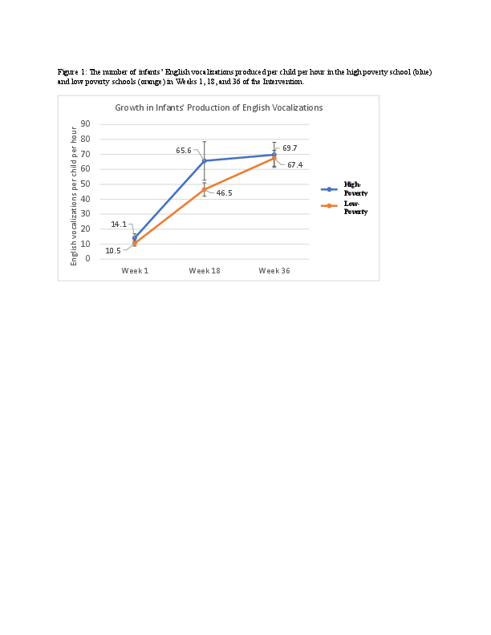

# For review only---DO NOT CITE

## Abstract 56

### Spot it and learn it!  A novel paradigm to examine word learning in school-aged children

Findings with monolingual and bilingual infants suggest that bilinguals outperform monolinguals when acquiring words in the context of increased phonetic variability (Mattock et al., 2010). Research with (pre)-school aged children shows that bilinguals surpass monolinguals in word learning tasks with unfamiliar referents (Menjivar & Akhtar, 2017) and are more accepting of phonological variations of words than monolinguals (Alt et al., 2019). 

Similarly to bilinguals, children growing up with more than one accent (regional and/or foreign) in their input might benefit from their experience with variability when learning unfamiliar words. We ask whether monolingual and bilingual school-aged children can learn new words in the context of accent variability, and whether experience with other languages and with regional and foreign accents enhances word learning from unfamiliarly accented speakers. 

Previous word-learning tasks have employed paired association tests, which correspond to word learning in a second language, or learning novel names for phantasy creatures, which are then recalled passively during picture selection tasks. While bilingualism has been shown to boost word-learning in tasks that resemble L2 acquisition (Kaushanskaya et al., 2014), it is unclear whether there is a bilingual advantage for word learning when the task involves mapping new words onto unfamiliar referents (Hill & Wagovich, 2020 vs. Menjivar & Akhtar, 2017). We present a novel game paradigm that resembles natural advanced lexical acquisition in the native language, where new words are mapped onto unfamiliar referents and have to be produced actively in peer-group interactions. 

We tested 36 monolingual and 45 bilingual German-speaking children (aged 7-11 years) on their acquisition of six unfamiliar German words (e.g. Amboss, ‘anvil’; Hippe, ‘pruning knife’). The children’s amount of experience with regional and foreign accents and with another language was measured via parental questionnaire. The bilingual children were speakers of various other languages in addition to German. 

While playing a computerized card game similar to ‘Spot it’ (Blanchot, Cottereau & Play Factory), subjects were required to find the one matching image among objects on two cards. Subjects took turns with six prerecorded child speakers, who had a Standard German accent, a Swiss accent in German or a Hebrew accent in German (the latter two were unfamiliar accents). Learning outcome was measured by the amount of correctly named target objects used by the subjects during the game and in a post-test. Preliminary results of 81 children show that children who had more experience with different types of accents (regional and foreign) learned more words from accented speakers than children with less accent experience (across conditions). Learning outcome was also affected by vocabulary size, age and short-term memory. We discuss how language background and accent experience affect word learning under variable input conditions. 

Alt, M., Arizmendi, G., Gray, S., Hogan, T., Green, S., & Cowan, N. (2019). Novel word learning in children who are bilingual: Comparison to monolingual peers. J. Speech Lang. Hear. Res. 62(7), 2332-2360.

Blanchot, D., Cottereau, J. & Play Factory (2009). Dobble (Spot It!). https://corporate.asmodee.com

Hill, M., & Wagovich, S. (2020). Word learning from context in school-age children: relations with language ability and executive function. J Child Lang. 1, 24.Kaushanskaya, M., Gross, M., & Buac, M. (2014). Effects of classroom bilingualism on task‐shifting, verbal memory, and word learning in children. Dev. Sc. 17(4), 564-583.

Mattock, K., Polka, L., Rvachew, S., & Krehm, M. (2010). The first steps in word learning

are easier when the shoes fit: Comparing monolingual and bilingual infants. Dev. Sc. 13(1), 229-243.

Menjivar, J., & Akhtar, N. (2017). Language experience and preschoolers' foreign word learning. Biling. Lang. Cogn. 20(3), 642-648.

