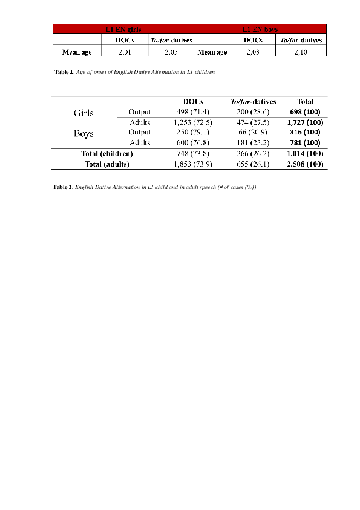

# For review only---DO NOT CITE

## Abstract 81

### A biological gender approach to English first language development of complex predicates

This study examines whether English monolingual girls differ from English monolingual boys in the acquisition of English dative alternation (DA) structures (to/for-datives (1a) and double object constructions (DOCs) (1b)). While an order in the emergence and in the incidence of one of the two types of English DA constructions would entail a syntactic derivation of DOCs from to/for-datives (Larson 2014, 1990, 1988) or to/for-datives from DOCs (Aoun and Li 1989; Machonis 1985), analogous ages of onset and fairly similar frequency rates in the production could suggest the formation of two underived structures that share an underlying grammatical property (Snyder and Stromswold 1997; Snyder 1995, 2001) or two constructions that differ in the status of the head projected (Marantz 1993; Mulder 1992). 

(1) 	a. John gave a book to Mary 			(to-dative)

        b. John gave Mary a book 				(DOC)

                                                                        [Larson 1988: 343-353]

Considering these predictions, English monolingual girls are expected to present an earlier emergence and, possibly higher frequency rates in the production of English DA, when compared to English monolingual boys’ data (Cornett 2014; Lovas 2011), regardless of the syntactic relation between DOCs and to/for-datives. We also investigate whether the exposure to English DA from the adult input shows differences in the girls’ output and in the boys’ output, as also attested in earlier acquisition works (Clearfield and Nelson 2006; Gleason 1990). In order to shed light on these issues, we analyze data from eight English monolingual girls and five English monolingual boys, and the adults that interact with them, as they appear in the CHILDES database (MacWhinney 2000). 

Our findings reveal that monolingual girls (t(6) = -2.071, p = .077) do not differ from monolingual boys (t(3) = 2.231, p = .155) in the ages of onset of the two English DA constructions, which suggests the two biological gender groups have acquired the syntactic non-derivational relationship between DOCs and to/for-datives. 

Furthermore, biological gender differences are not seen in the acquisition of the additional properties required in the production of to/for-datives, given the later onset and the lower incidence of these constructions when compared to DOCs, as depicted in Table 1. These production patterns could also be explained by the frequency with which these structures are heard in the adult input in the two biological gender groups given that both adults and children prefer the use of DOCs over to/for-datives when producing English DA constructions, as illustrated in Table 2.

