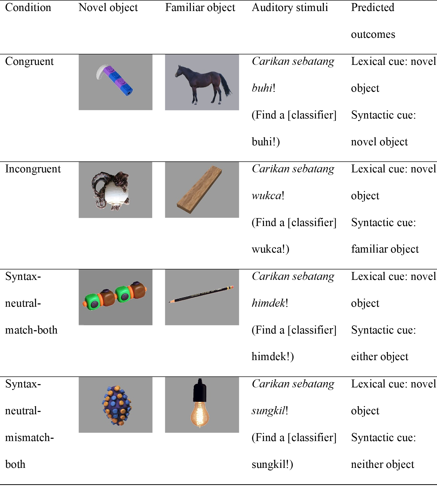

# For review only---DO NOT CITE

## Abstract 44

### Syntactic variation due to processing factors in Mandarin child-caregiver speech

During communication, children must often choose between alternative structures that can convey the same message (e.g., active vs. passive). The variation in the choice of structure is influenced by several factors in adult language, including the topicality or givenness of a referent, conceptual accessibility, the ease of retrieval of the referent’s label, priming due to prior occurrence, and the weight of the noun phrases (Bock, Irwin, & Davidson 2004]. But little is known about how these factors influence syntactic choices in naturalistic child-caregiver speech. 

Our study investigates the role of two processing factors—the weight of noun phrases and priming—in influencing syntactic choices in Mandarin child-caregiver speech.  We examine how these factors influence alternations between the SVO construction (e.g., ni chiwan fan ‘you eat-finish food’ ‘You eat up the food’) and the SOV ‘ba’ construction (e.g., ni ba fan chiwan ‘you BA food eat-finish’ ‘You eat up the food’) (Li & Thompson 1981). Across languages, ‘light’ constituents (e.g., containing fewer syllables) tend to occur earlier in an utterance, presumably because they can be processed faster than ‘heavy’ constituents (with more syllables) (Hawkins, 1994). Since the SOV ‘ba’ construction involves preposing the object NP, speakers may tend to produce the ‘ba’ construction with ‘light’ object NPs. Prior occurrence of the ‘ba’ construction in discourse may also encourage reuse of the same construction due to priming. Prior research shows that Mandarin-speaking adults’ use of the ‘ba’ construction is sensitive to object NP weight as well as prior occurrence in discourse (Liu 2007, Yao 2014). Although children acquiring Mandarin use both constructions early (Hus 2014, 2018), no research examines how priming and NP weight influence their construction choice.

We examined 1085 utterances produced by a mother-child dyad (age range: 1;07 to 3;04) in child-caregiver interactions (Tong corpus, CHILDES) (Deng & Yip 2018). We identified the 25 most frequent verbs used in the ‘ba’ construction and extracted all utterances containing these verbs in ‘ba’ constructions (n=222) and SVO constructions (n=863). The utterances were coded for speaker type (‘child’, ‘caregivers’), weight in syllables (‘1’, ‘2’, ‘3’, ‘4’, ‘5+’), and priming (‘prior use of ba in a 10-utterance window’, ‘no prior use of ba in a 10-utterance window’). Our findings revealed significant coefficients for priming and syllable weight, but not speaker type (see Figure 1 and Table 1). Model comparisons using likelihood ratio tests support the significant contribution of these two factors (p < .05). The interactions of the two variables with each other or with speaker type are not significant. Post-hoc comparisons show that ‘ba’ constructions are used significantly less often when the object NP has 2 syllables versus 1, 3, or 5+ syllables.

Our study demonstrates that the same processing factors that influence adult Mandarin speakers’ structural choices play a similar role in child and caregiver speech. Our findings extend experimental research demonstrating priming effects in children’s use of ‘ba’ constructions (Hsu 2019) to spontaneous production. But the non-linear effects of noun phrase weight suggest that ease of processing considerations may not be the only factor driving syntactic choice.

