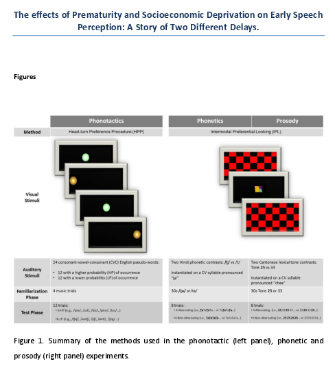

# For review only---DO NOT CITE

## Abstract 78

### The effects of Prematurity and Socioeconomic Deprivation on Early Speech Perception: A Story of Two Different Delays.

Two major developmental trajectories have been identified as markers of infants’ specialisation on their native language. First, there is an increase in infants’ ability to process native sounds and consequently, a preference emerges for the sequences that are either legal or have a high frequency of occurrence in their native language (e.g., Jusczyk, Cutler, & Redanz, 1993; Jusczyk, Luce, & Charles-Luce,  1994; Höhle,  Bijeljac-Babic, Herold, Weissenborn, & Nazzi, T. 2009). Second, infants’ ability to process non-native sounds decreases over time, a process known as perceptual narrowing (e.g., Werker, & Tees, 1984; Mattock, & Burnham, 2006). These processes of learning have been assumed to be “universal” (Arnett, 2008). However, the vast majority of developmental studies have relied on “convenience samples”, consisting of infants born full term and from higher-SES families, which are, for the most part, unrepresentative of the larger population (Henrich, Heine, & Norenzayan, 2010). There is thus no evidence as to how much the time course of learning is affected by maturational and environmental factors. 

The present project addresses this issue. To do so, we investigated early phonological development in cases where: a) maturation is following an altered timetable: infants born preterm; and b) the environment is different: infants from lower-socio-economic status families. The linguistic abilities of both populations have been found to lag well behind their advantaged peers during the school years. Preterm children and children from low-SES families show poorer auditory discrimination and memory, reading difficulties, poor vocabulary, a specific delay in verbal processing and reasoning, less complex expressive language and lower receptive understanding than their matched controls (e.g., for data on preterm children see: Jansson-Verkasalo et al., 2004; Guarini et al., 2009; 2010; Sansavini  et al., 2010; for data on low SES children see: Fernald, Marchman, & Weisleder, 2013; Farkas, & Beron, 2004; Halle, et al., 2009). 

Three longitudinal studies using the head-turn preference procedure and the Intermodal Preferential looking explored 76 English-learning infants’ phonetic, prosodic and phonotactic development at 7.5, 9, 10.5 and 12 months of age. The sample included 20 preterm infants from higher-SES families; 18 preterm infants from lower-SES families; 20 full-term infants from higher-SES and 18 full-term infants from lower-SES. Infants’ sensitivity to non-native Cantonese tones (i.e., Tones 25 and 33 instantiated on a CV syllable pronounced ‘‘chee”) and a consonant Hindi Contrast (i.e., /t̪/ dental stop vs /t/ retroflex stop, instantiated on a CV syllable pronounced “t̪a”’) were used to explore prosodic and phonetic development, respectively (see Fig. 1). Phonotactic development was explored using CVC English pseudo-words with either a high-probability or a low-probability of occurrence in the language. 

Linear mixed-effects models (i.e., lmer(TotalLook ~ SES * Term * Age * StimType + (Age\|SubjectID) + (1\|StimName))  showed no significant differences between the phonetic or the phonotactic development of the preterm and the full-term infants (see Fig. 2). However, a time-lag between preterm and full-term developmental timing for prosody was found. Socioeconomic status didn’t have a significant effect on prosodic development. Nevertheless, phonetic and phonotactic development were both affected by SES, infants from lower SES showed discrimination of non-native contrast and a preference for high-frequency sequences later than their more advantaged peers. Overall these results suggest that different constraints apply to the acquisition of different phonological subcomponents.

