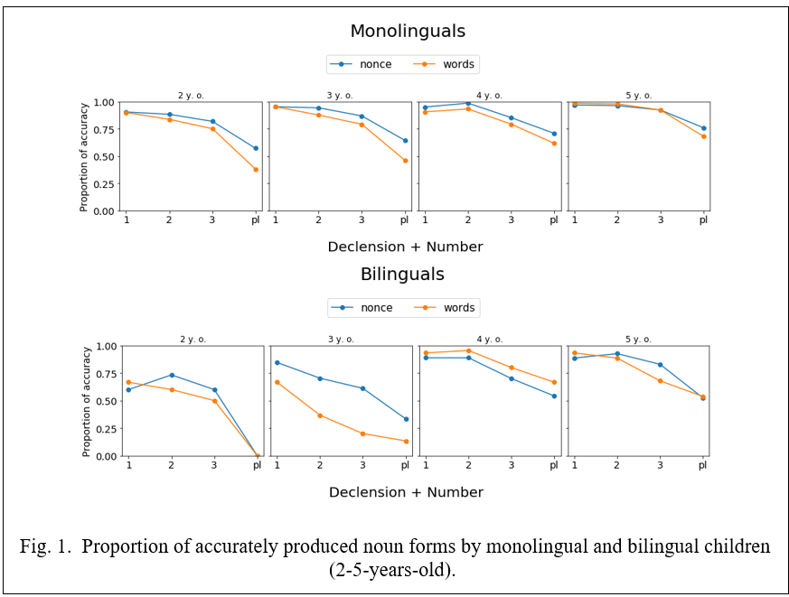

# For review only---DO NOT CITE

## Abstract 93

### Linguistic Effects on Two-Digits Numbers by Arab First Graders

This study uses the Arabic language numerical system, which is unique compared to other numerical systems. The numerical syntactic structure of two-digit numbers in Arabic differs mainly in its order of units and decades. Arabic reads and writes two-digit numbers from right to left, i.e. the unit digit precedes the decade digit (24 = four and twenty).

The current research investigates the transcoding process from the digits system to the verbal system, and vice versa, in first graders who speak Arabic. The objective of this study is to determine the extent to which that first graders acquire transcoding from a verbal number system to digit numeral system, and vice versa. Specifically, the study focuses on the effect of the lexical-syntactic structure on the patterns of errors by Arab first graders in two-digit numbers reading and writing from dictation.

In this study, the performance of first grade speakers of Arabic indicates that the number lexicons in Arabic are controlled in a highly effective manner, but the syntax is insufficiently commanded, as reflected in the type of systematic substitution errors in transcoding. Two-digit number reading and two-digit number writing from dictation is complex for first graders, especially in their two-digit numbers reading, and this complexity is more salient in two-digit numbers, which have a more evident numerical syntactic structure than numbers in which this numerical syntactic structure is less prominent (numbers 19-11) or even nonexistent (whole tens). As the proficiency and skills of first graders improve, their transcoding performance will improve to resemble their performance in two-digit numbers writing from dictation in terms of error rates (accuracy). This skill is important in reading and writing of numbers.

The current study made it possible to distinguish between predictions according to the transcoding task (reading or writing from dictation) and depending on models of number processing.

The current results are the first pertaining transcoding by Arab first graders and widen the research body of the developmental aspect of language and numerical cognition interaction.

